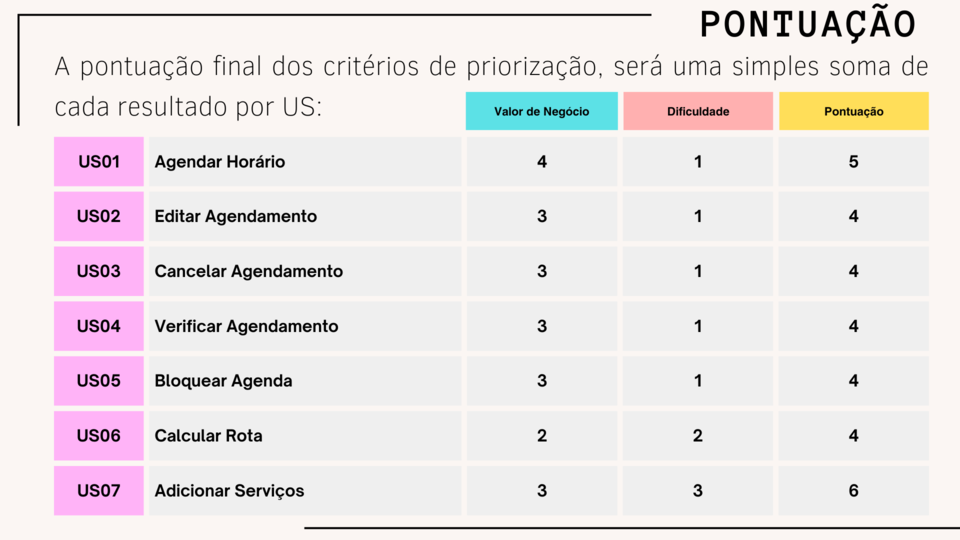
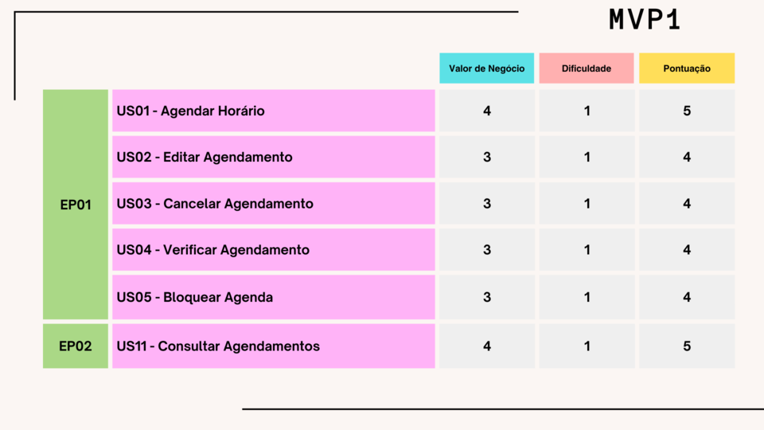

# Entregas da Unidade 02

## Slide apresentado sobre o Backlog do Projeto, juntamente com sua priorização, MVPs e alinhamento com objetivos

## Slide apresentado sobre a Validação e Verificação do projeto ArteNaMão do grupo GamaTech

.png)
.png)
.png)
.png)
.png)
.png)
.png)
.png)
.png)
.png)
.png)
.png)
.png)
.png)
.png)
.png)
.png)
.png)
.png)
.png)
.png)
.png)

## Vídeo de entrega da Unidade 02

<iframe width="960" height="540" src="https://www.youtube.com/embed/cYT3A0UYG4w" title="Entrega Unidade 2 - Pentágono Cabeludo" frameborder="0" allow="accelerometer; autoplay; clipboard-write; encrypted-media; gyroscope; picture-in-picture; web-share" allowfullscreen></iframe>

## Histórico de Revisão

| Data       | Versão |                                                      Descrição                                                            |    Autor     |
| :--------: | :----: | ----------------------------------------------------------------------------------------------------------------------------- | ------------ |
| 25/10/2023 | 1.0    | Criação da aba de entregas da unidade 2, adição dos slides do backlog do projeto, do VeR&VaL do GamaTech, e o vídeo de entrega da unidade | Vinícius    |
| 13/12/2023 | 1.1   | Retirada dos Iframes e atualização com imagens png dos slides, e centralizando o vídeo  | Guilherme de Sá        |