# Entregas da Unidade 04

## Atividade de Validação e Verificação do Diagrama de UC do BabyHoney

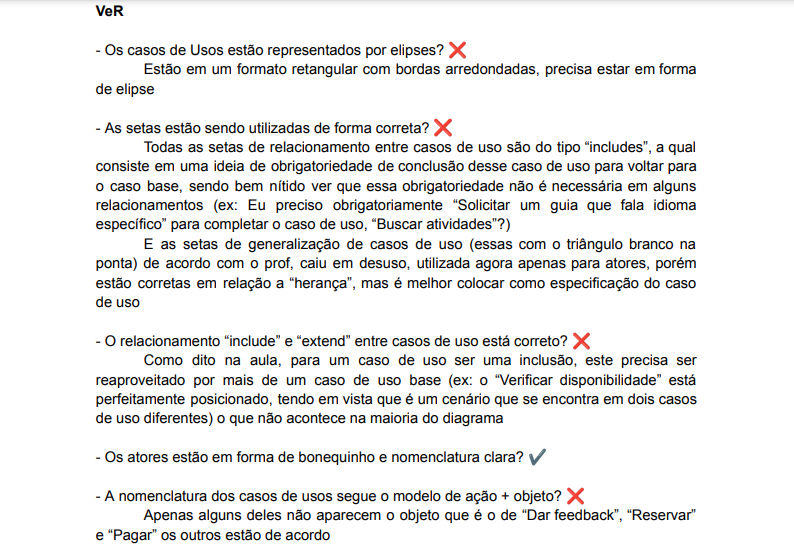
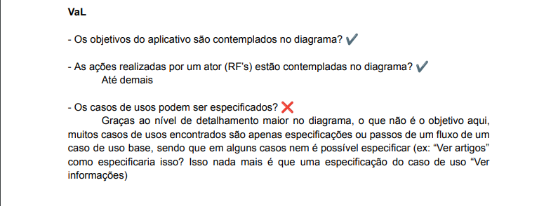

## Atividade de Validação e Verificação das Especificações dos UC's do TabeçaTeam

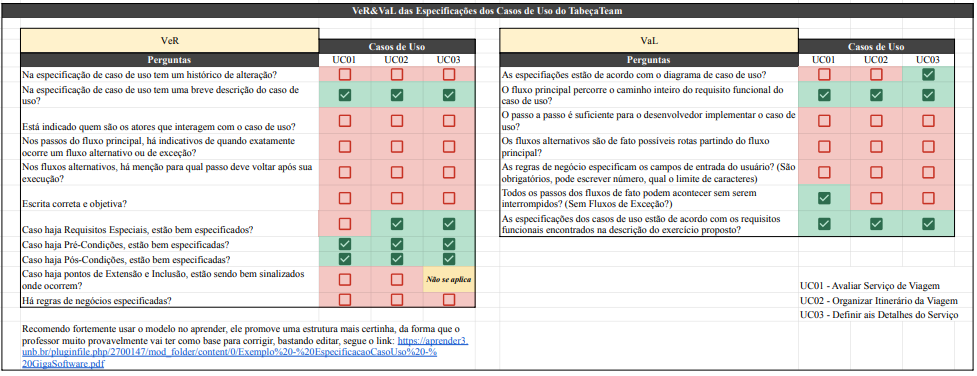

## Diagrama de Casos de Uso e Especificação de 3 deles
Fizemos um diagrama de casos de uso de um programa facilitador de viagens, o VoyageX. Identificamos os atores, e os requisitos funcionais e com isso montamos o seguinte diagrama.

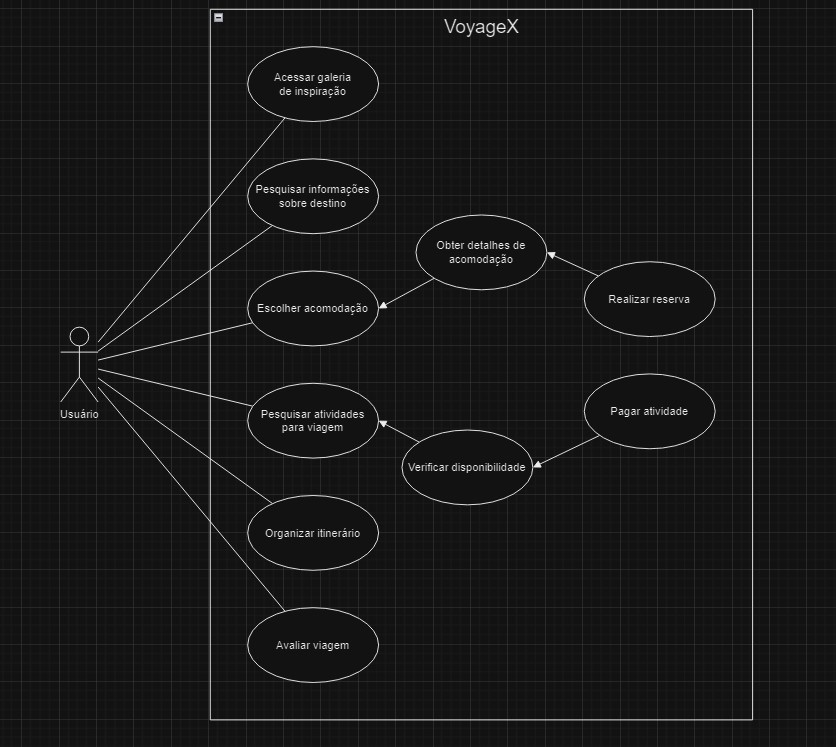

Escolhemos os seguintes casos de uso para fazer a especificação:

### UC01 - Acessa Galeria de Inspirações

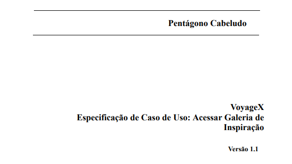
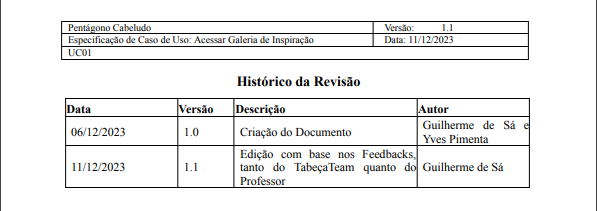
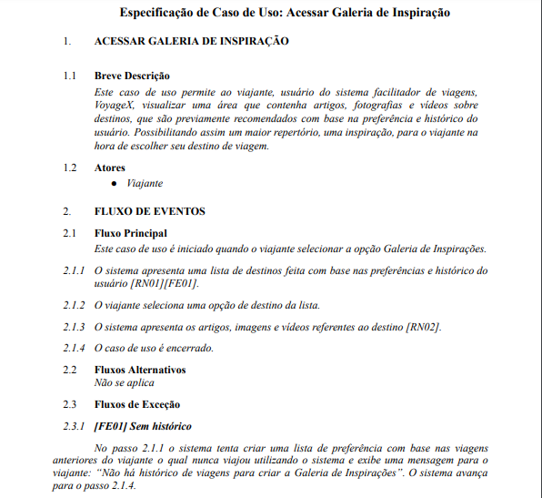
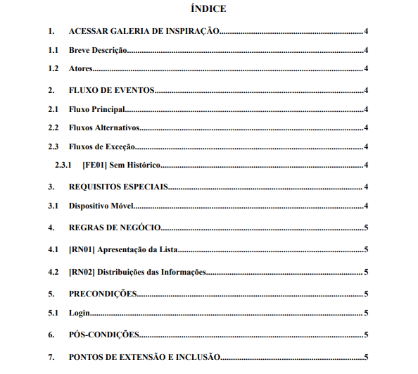
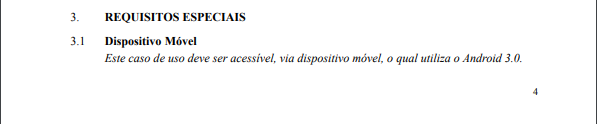
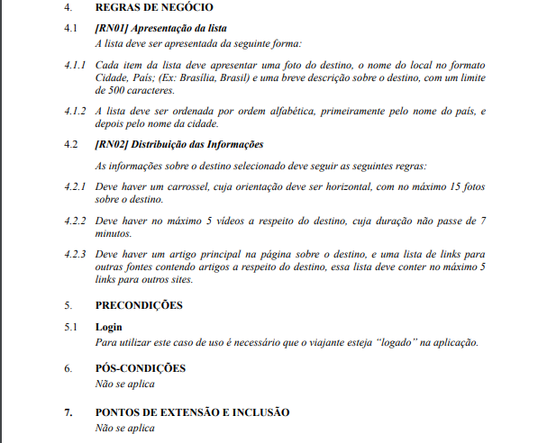

### UC02 - Avaliar Viagem

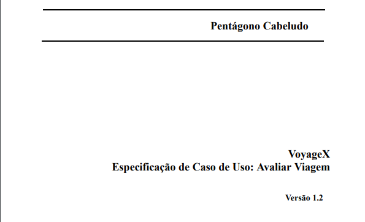
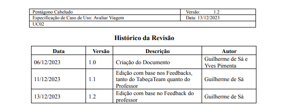
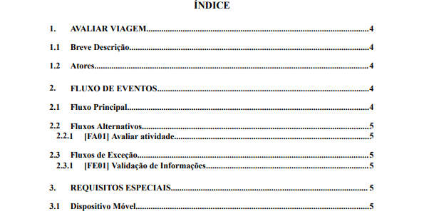
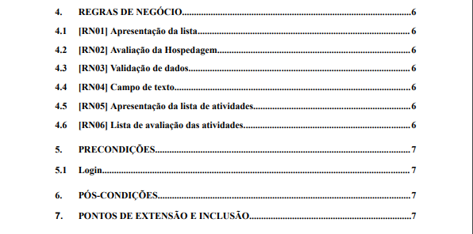
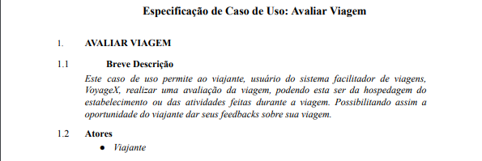
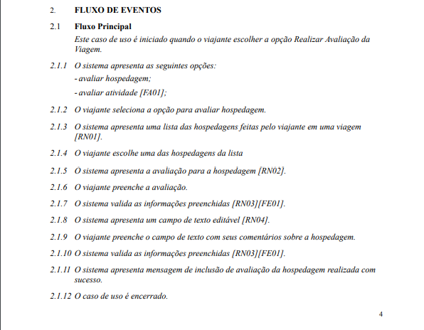
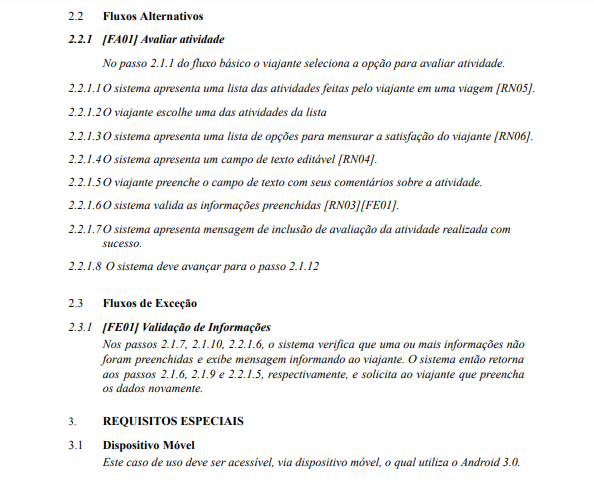
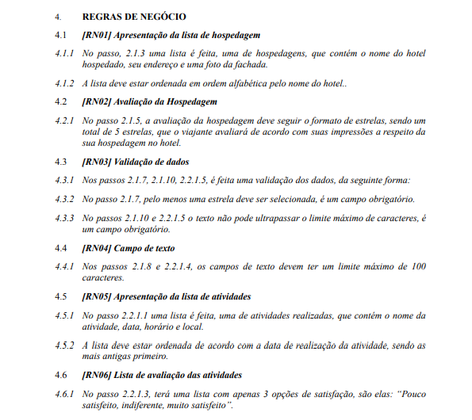
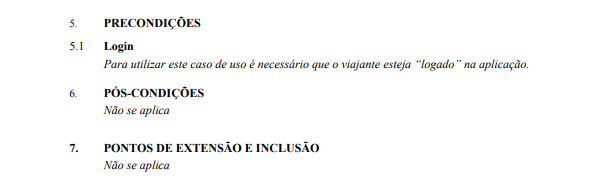

### UC03 - Gerenciar Acomodações da Viagem

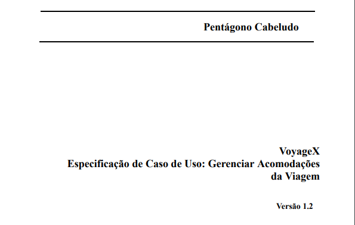
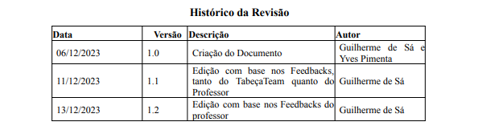
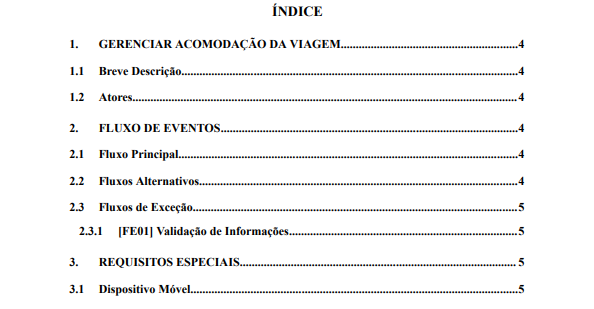
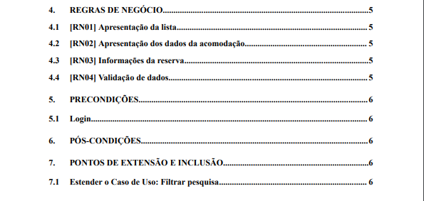
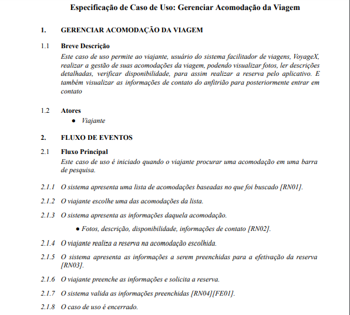
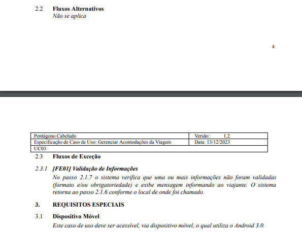
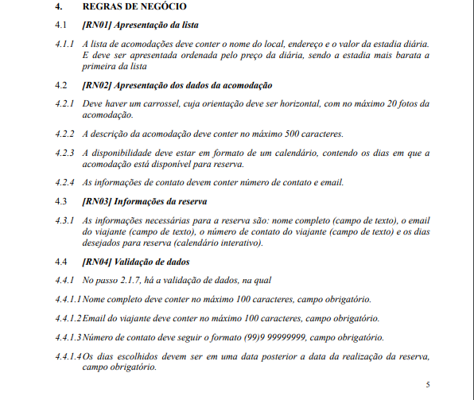
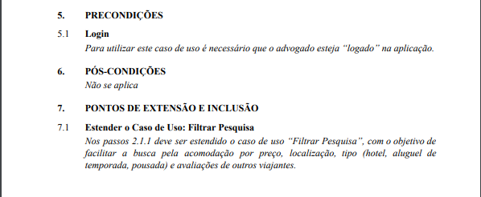

## Vídeo de entrega da Unidade 04

## Histórico de Revisão

| Data       | Versão |                                                      Descrição                                                            |    Autor     |
| :--------: | :----: | ----------------------------------------------------------------------------------------------------------------------------- | ------------ |
| 13/12/2023 | 1.0    | Criação da aba de entregas da unidade 4, adição dos Ver&Val do BabyHoney e TabeçaTeam, e a especificação dos casos de uso | Guilherme de Sá   |