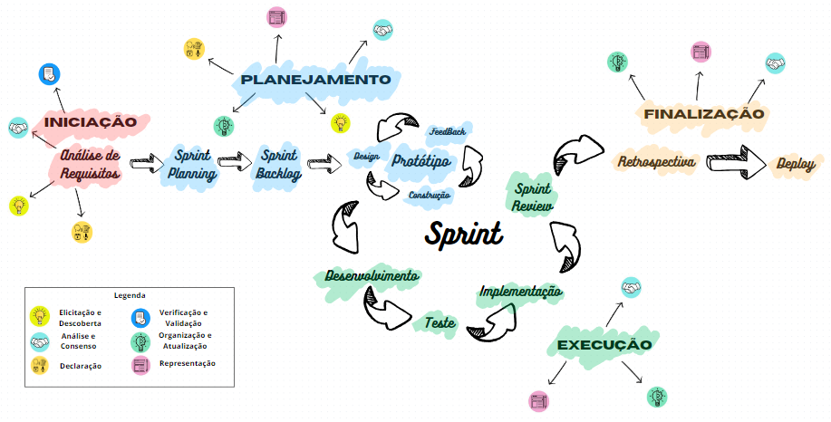
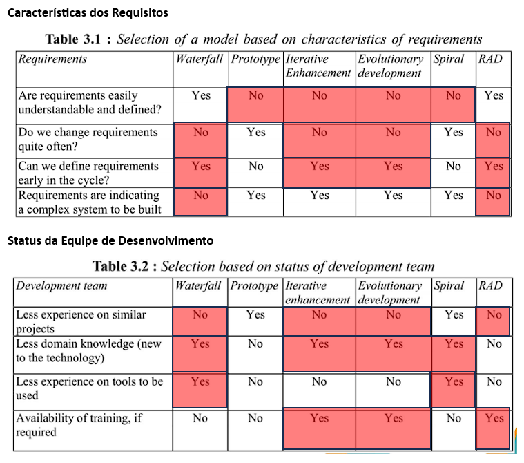
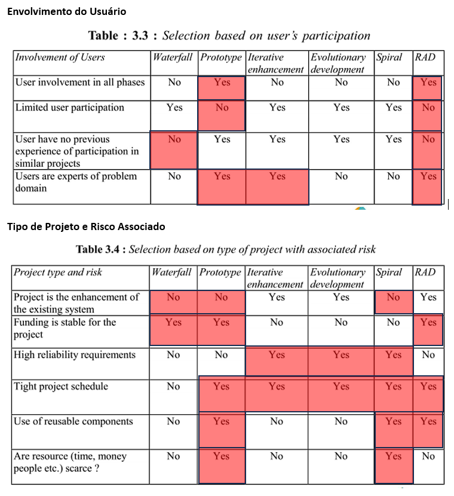
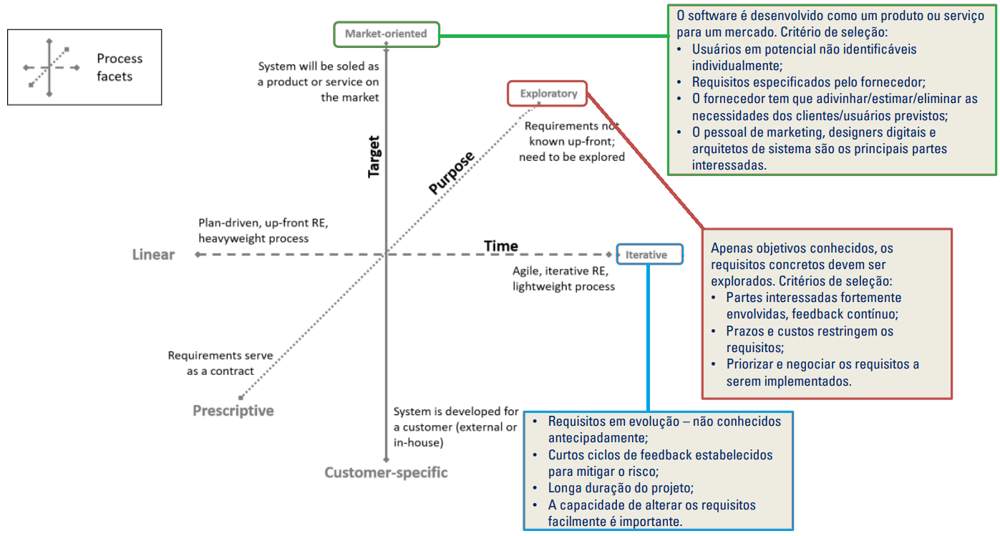

# Processo de Desenvolvimento de Software

Após análise em equipe, guiados pelo Framework de Gupta, escolhemos, à priori:  
Abordagem de desenvolvimento **Ágil**.  
Ciclo de Vida **Iterativo e Incremental**.  
Utilizaremos o **RAD** como framework de gerenciamento de projeto, juntamente aos seguintes artefatos do **Scrum**: **Organização do time, Sprints e Backlog da Sprint**.   

## Análise pelo Framework de Gupta

A partir dos pontos marcados:
<ul>
    <li> RAD – 12 </li>
    <li> Evolutivo – 8 </li>
    <li> Iterativo – 9 </li>
    <li> Prototype – 9 </li>
    <li> Waterfall – 9 </li>
    <li> Spiral – 8 </li>
</ul>

## Fluxo de trabalho

Neste processo, as ferramentas de comunicação serão o Discord e o Whatsapp para reuniões e mensagens rápidas e e-mail para mensagens mais formais, por exemplo, com o professor responsável pela matéria de requisitos de software.
O ambiente de programação é à preferência do desenvolvedor, portanto que apsse nos testes de forma autêntica e legítima.
Outras ferramentas a serem utilizadas podem incluir o diagrams.net para o desenvolvimento de diagramas, o GitHub para atividades de desenvolvimento e o Codepen, para o desenvolvimento Web.

<!--[if IE]><meta http-equiv="X-UA-Compatible" content="IE=5,IE=9" ><![endif]-->
<!DOCTYPE html>
<html>
<head>
<title>SCRAD.html</title>
<meta charset="utf-8"/>
</head>
<body>
<div class="mxgraph" style="max-width:100%;border:1px solid transparent;" data-mxgraph="{&quot;highlight&quot;:&quot;#0000ff&quot;,&quot;nav&quot;:true,&quot;resize&quot;:true,&quot;xml&quot;:&quot;&lt;mxfile host=\&quot;app.diagrams.net\&quot; modified=\&quot;2023-09-28T00:33:41.784Z\&quot; agent=\&quot;Mozilla/5.0 (Windows NT 10.0; Win64; x64) AppleWebKit/537.36 (KHTML, like Gecko) Chrome/116.0.0.0 Safari/537.36 OPR/102.0.0.0\&quot; etag=\&quot;JOF102O3eVPEdqt5rvpz\&quot; version=\&quot;21.8.2\&quot; type=\&quot;device\&quot;&gt;&lt;diagram name=\&quot;Página-1\&quot; id=\&quot;iyDe8_bb17neBRKtMWpz\&quot;&gt;&lt;mxGraphModel dx=\&quot;2786\&quot; dy=\&quot;1608\&quot; grid=\&quot;1\&quot; gridSize=\&quot;10\&quot; guides=\&quot;1\&quot; tooltips=\&quot;1\&quot; connect=\&quot;1\&quot; arrows=\&quot;1\&quot; fold=\&quot;1\&quot; page=\&quot;1\&quot; pageScale=\&quot;1\&quot; pageWidth=\&quot;1600\&quot; pageHeight=\&quot;1400\&quot; math=\&quot;0\&quot; shadow=\&quot;0\&quot;&gt;&lt;root&gt;&lt;mxCell id=\&quot;0\&quot;/&gt;&lt;mxCell id=\&quot;1\&quot; parent=\&quot;0\&quot;/&gt;&lt;mxCell id=\&quot;d5KTNiEJihlgiSSUe4ih-77\&quot; style=\&quot;edgeStyle=orthogonalEdgeStyle;rounded=0;orthogonalLoop=1;jettySize=auto;html=1;entryX=0;entryY=0.5;entryDx=0;entryDy=0;\&quot; parent=\&quot;1\&quot; edge=\&quot;1\&quot;&gt;&lt;mxGeometry relative=\&quot;1\&quot; as=\&quot;geometry\&quot;&gt;&lt;mxPoint x=\&quot;361\&quot; y=\&quot;415\&quot; as=\&quot;sourcePoint\&quot;/&gt;&lt;/mxGeometry&gt;&lt;/mxCell&gt;&lt;mxCell id=\&quot;d5KTNiEJihlgiSSUe4ih-71\&quot; style=\&quot;edgeStyle=orthogonalEdgeStyle;rounded=0;orthogonalLoop=1;jettySize=auto;html=1;entryX=0;entryY=0.5;entryDx=0;entryDy=0;\&quot; parent=\&quot;1\&quot; edge=\&quot;1\&quot;&gt;&lt;mxGeometry relative=\&quot;1\&quot; as=\&quot;geometry\&quot;&gt;&lt;mxPoint x=\&quot;241\&quot; y=\&quot;415\&quot; as=\&quot;targetPoint\&quot;/&gt;&lt;/mxGeometry&gt;&lt;/mxCell&gt;&lt;mxCell id=\&quot;d5KTNiEJihlgiSSUe4ih-78\&quot; style=\&quot;edgeStyle=orthogonalEdgeStyle;rounded=0;orthogonalLoop=1;jettySize=auto;html=1;entryX=0;entryY=0.5;entryDx=0;entryDy=0;\&quot; parent=\&quot;1\&quot; edge=\&quot;1\&quot;&gt;&lt;mxGeometry relative=\&quot;1\&quot; as=\&quot;geometry\&quot;&gt;&lt;mxPoint x=\&quot;561\&quot; y=\&quot;415\&quot; as=\&quot;targetPoint\&quot;/&gt;&lt;/mxGeometry&gt;&lt;/mxCell&gt;&lt;mxCell id=\&quot;d5KTNiEJihlgiSSUe4ih-79\&quot; style=\&quot;edgeStyle=orthogonalEdgeStyle;rounded=0;orthogonalLoop=1;jettySize=auto;html=1;entryX=0.5;entryY=0;entryDx=0;entryDy=0;entryPerimeter=0;endArrow=none;endFill=0;dashed=1;dashPattern=1 4;\&quot; parent=\&quot;1\&quot; edge=\&quot;1\&quot;&gt;&lt;mxGeometry relative=\&quot;1\&quot; as=\&quot;geometry\&quot;&gt;&lt;mxPoint x=\&quot;140\&quot; y=\&quot;470\&quot; as=\&quot;targetPoint\&quot;/&gt;&lt;/mxGeometry&gt;&lt;/mxCell&gt;&lt;mxCell id=\&quot;d5KTNiEJihlgiSSUe4ih-81\&quot; style=\&quot;edgeStyle=orthogonalEdgeStyle;rounded=0;orthogonalLoop=1;jettySize=auto;html=1;entryX=0.5;entryY=0;entryDx=0;entryDy=0;entryPerimeter=0;endArrow=none;endFill=0;dashed=1;dashPattern=1 4;\&quot; parent=\&quot;1\&quot; edge=\&quot;1\&quot;&gt;&lt;mxGeometry relative=\&quot;1\&quot; as=\&quot;geometry\&quot;&gt;&lt;mxPoint x=\&quot;301\&quot; y=\&quot;440\&quot; as=\&quot;sourcePoint\&quot;/&gt;&lt;/mxGeometry&gt;&lt;/mxCell&gt;&lt;mxCell id=\&quot;d5KTNiEJihlgiSSUe4ih-83\&quot; style=\&quot;edgeStyle=orthogonalEdgeStyle;rounded=0;orthogonalLoop=1;jettySize=auto;html=1;entryX=0.5;entryY=0;entryDx=0;entryDy=0;entryPerimeter=0;endArrow=none;endFill=0;dashed=1;dashPattern=1 4;\&quot; parent=\&quot;1\&quot; edge=\&quot;1\&quot;&gt;&lt;mxGeometry relative=\&quot;1\&quot; as=\&quot;geometry\&quot;&gt;&lt;mxPoint x=\&quot;461\&quot; y=\&quot;440\&quot; as=\&quot;sourcePoint\&quot;/&gt;&lt;/mxGeometry&gt;&lt;/mxCell&gt;&lt;mxCell id=\&quot;d5KTNiEJihlgiSSUe4ih-85\&quot; style=\&quot;edgeStyle=orthogonalEdgeStyle;rounded=0;orthogonalLoop=1;jettySize=auto;html=1;entryX=0.5;entryY=0;entryDx=0;entryDy=0;entryPerimeter=0;endArrow=none;endFill=0;dashed=1;dashPattern=1 4;\&quot; parent=\&quot;1\&quot; edge=\&quot;1\&quot;&gt;&lt;mxGeometry relative=\&quot;1\&quot; as=\&quot;geometry\&quot;&gt;&lt;mxPoint x=\&quot;621\&quot; y=\&quot;440\&quot; as=\&quot;sourcePoint\&quot;/&gt;&lt;/mxGeometry&gt;&lt;/mxCell&gt;&lt;mxCell id=\&quot;d5KTNiEJihlgiSSUe4ih-101\&quot; value=\&quot;INICIAÇÃO\&quot; style=\&quot;swimlane;childLayout=stackLayout;resizeParent=1;resizeParentMax=0;startSize=20;html=1;\&quot; parent=\&quot;1\&quot; vertex=\&quot;1\&quot;&gt;&lt;mxGeometry x=\&quot;40\&quot; y=\&quot;115\&quot; width=\&quot;720\&quot; height=\&quot;440\&quot; as=\&quot;geometry\&quot;/&gt;&lt;/mxCell&gt;&lt;mxCell id=\&quot;d5KTNiEJihlgiSSUe4ih-104\&quot; value=\&quot;Atividades de requisitos\&quot; style=\&quot;swimlane;startSize=20;html=1;\&quot; parent=\&quot;d5KTNiEJihlgiSSUe4ih-101\&quot; vertex=\&quot;1\&quot;&gt;&lt;mxGeometry y=\&quot;20\&quot; width=\&quot;360\&quot; height=\&quot;420\&quot; as=\&quot;geometry\&quot;/&gt;&lt;/mxCell&gt;&lt;mxCell id=\&quot;d5KTNiEJihlgiSSUe4ih-135\&quot; style=\&quot;edgeStyle=orthogonalEdgeStyle;rounded=0;orthogonalLoop=1;jettySize=auto;html=1;entryX=0.5;entryY=0;entryDx=0;entryDy=0;\&quot; parent=\&quot;d5KTNiEJihlgiSSUe4ih-104\&quot; source=\&quot;d5KTNiEJihlgiSSUe4ih-116\&quot; target=\&quot;d5KTNiEJihlgiSSUe4ih-123\&quot; edge=\&quot;1\&quot;&gt;&lt;mxGeometry relative=\&quot;1\&quot; as=\&quot;geometry\&quot;/&gt;&lt;/mxCell&gt;&lt;mxCell id=\&quot;d5KTNiEJihlgiSSUe4ih-116\&quot; value=\&quot;Elicitação e descoberta\&quot; style=\&quot;shape=process;whiteSpace=wrap;html=1;backgroundOutline=1;\&quot; parent=\&quot;d5KTNiEJihlgiSSUe4ih-104\&quot; vertex=\&quot;1\&quot;&gt;&lt;mxGeometry x=\&quot;200\&quot; y=\&quot;60\&quot; width=\&quot;120\&quot; height=\&quot;40\&quot; as=\&quot;geometry\&quot;/&gt;&lt;/mxCell&gt;&lt;mxCell id=\&quot;d5KTNiEJihlgiSSUe4ih-136\&quot; style=\&quot;edgeStyle=orthogonalEdgeStyle;rounded=0;orthogonalLoop=1;jettySize=auto;html=1;entryX=0.5;entryY=0;entryDx=0;entryDy=0;\&quot; parent=\&quot;d5KTNiEJihlgiSSUe4ih-104\&quot; source=\&quot;d5KTNiEJihlgiSSUe4ih-123\&quot; target=\&quot;d5KTNiEJihlgiSSUe4ih-124\&quot; edge=\&quot;1\&quot;&gt;&lt;mxGeometry relative=\&quot;1\&quot; as=\&quot;geometry\&quot;/&gt;&lt;/mxCell&gt;&lt;mxCell id=\&quot;d5KTNiEJihlgiSSUe4ih-123\&quot; value=\&quot;Análise e consenso\&quot; style=\&quot;shape=process;whiteSpace=wrap;html=1;backgroundOutline=1;\&quot; parent=\&quot;d5KTNiEJihlgiSSUe4ih-104\&quot; vertex=\&quot;1\&quot;&gt;&lt;mxGeometry x=\&quot;200\&quot; y=\&quot;160\&quot; width=\&quot;120\&quot; height=\&quot;40\&quot; as=\&quot;geometry\&quot;/&gt;&lt;/mxCell&gt;&lt;mxCell id=\&quot;d5KTNiEJihlgiSSUe4ih-137\&quot; style=\&quot;edgeStyle=orthogonalEdgeStyle;rounded=0;orthogonalLoop=1;jettySize=auto;html=1;entryX=0.5;entryY=0;entryDx=0;entryDy=0;\&quot; parent=\&quot;d5KTNiEJihlgiSSUe4ih-104\&quot; source=\&quot;d5KTNiEJihlgiSSUe4ih-124\&quot; target=\&quot;d5KTNiEJihlgiSSUe4ih-125\&quot; edge=\&quot;1\&quot;&gt;&lt;mxGeometry relative=\&quot;1\&quot; as=\&quot;geometry\&quot;/&gt;&lt;/mxCell&gt;&lt;mxCell id=\&quot;d5KTNiEJihlgiSSUe4ih-124\&quot; value=\&quot;Verificação e validação\&quot; style=\&quot;shape=process;whiteSpace=wrap;html=1;backgroundOutline=1;\&quot; parent=\&quot;d5KTNiEJihlgiSSUe4ih-104\&quot; vertex=\&quot;1\&quot;&gt;&lt;mxGeometry x=\&quot;200\&quot; y=\&quot;260\&quot; width=\&quot;120\&quot; height=\&quot;40\&quot; as=\&quot;geometry\&quot;/&gt;&lt;/mxCell&gt;&lt;mxCell id=\&quot;d5KTNiEJihlgiSSUe4ih-125\&quot; value=\&quot;Declaração\&quot; style=\&quot;shape=process;whiteSpace=wrap;html=1;backgroundOutline=1;\&quot; parent=\&quot;d5KTNiEJihlgiSSUe4ih-104\&quot; vertex=\&quot;1\&quot;&gt;&lt;mxGeometry x=\&quot;200\&quot; y=\&quot;340\&quot; width=\&quot;120\&quot; height=\&quot;40\&quot; as=\&quot;geometry\&quot;/&gt;&lt;/mxCell&gt;&lt;mxCell id=\&quot;d5KTNiEJihlgiSSUe4ih-143\&quot; value=\&quot;Geração do Backlog de produto\&quot; style=\&quot;verticalLabelPosition=middle;verticalAlign=middle;html=1;shape=mxgraph.basic.diag_snip_rect;dx=6;whiteSpace=wrap;labelPosition=center;align=center;\&quot; parent=\&quot;d5KTNiEJihlgiSSUe4ih-104\&quot; vertex=\&quot;1\&quot;&gt;&lt;mxGeometry x=\&quot;39.999999999999545\&quot; y=\&quot;340\&quot; width=\&quot;120\&quot; height=\&quot;40\&quot; as=\&quot;geometry\&quot;/&gt;&lt;/mxCell&gt;&lt;mxCell id=\&quot;d5KTNiEJihlgiSSUe4ih-148\&quot; style=\&quot;edgeStyle=orthogonalEdgeStyle;rounded=0;orthogonalLoop=1;jettySize=auto;html=1;entryX=1;entryY=0.5;entryDx=0;entryDy=0;entryPerimeter=0;dashed=1;dashPattern=1 4;endArrow=none;endFill=0;\&quot; parent=\&quot;d5KTNiEJihlgiSSUe4ih-104\&quot; source=\&quot;d5KTNiEJihlgiSSUe4ih-125\&quot; target=\&quot;d5KTNiEJihlgiSSUe4ih-143\&quot; edge=\&quot;1\&quot;&gt;&lt;mxGeometry relative=\&quot;1\&quot; as=\&quot;geometry\&quot;/&gt;&lt;/mxCell&gt;&lt;mxCell id=\&quot;d5KTNiEJihlgiSSUe4ih-142\&quot; value=\&quot;Revisão do problema\&quot; style=\&quot;verticalLabelPosition=middle;verticalAlign=middle;html=1;shape=mxgraph.basic.diag_snip_rect;dx=6;whiteSpace=wrap;labelPosition=center;align=center;\&quot; parent=\&quot;d5KTNiEJihlgiSSUe4ih-104\&quot; vertex=\&quot;1\&quot;&gt;&lt;mxGeometry x=\&quot;39.999999999999545\&quot; y=\&quot;260\&quot; width=\&quot;120\&quot; height=\&quot;40\&quot; as=\&quot;geometry\&quot;/&gt;&lt;/mxCell&gt;&lt;mxCell id=\&quot;d5KTNiEJihlgiSSUe4ih-147\&quot; style=\&quot;edgeStyle=orthogonalEdgeStyle;rounded=0;orthogonalLoop=1;jettySize=auto;html=1;entryX=1;entryY=0.5;entryDx=0;entryDy=0;entryPerimeter=0;endArrow=none;endFill=0;dashed=1;dashPattern=1 4;\&quot; parent=\&quot;d5KTNiEJihlgiSSUe4ih-104\&quot; source=\&quot;d5KTNiEJihlgiSSUe4ih-124\&quot; target=\&quot;d5KTNiEJihlgiSSUe4ih-142\&quot; edge=\&quot;1\&quot;&gt;&lt;mxGeometry relative=\&quot;1\&quot; as=\&quot;geometry\&quot;/&gt;&lt;/mxCell&gt;&lt;mxCell id=\&quot;d5KTNiEJihlgiSSUe4ih-141\&quot; value=\&quot;Identificação de problemas\&quot; style=\&quot;verticalLabelPosition=middle;verticalAlign=middle;html=1;shape=mxgraph.basic.diag_snip_rect;dx=6;whiteSpace=wrap;labelPosition=center;align=center;\&quot; parent=\&quot;d5KTNiEJihlgiSSUe4ih-104\&quot; vertex=\&quot;1\&quot;&gt;&lt;mxGeometry x=\&quot;39.999999999999545\&quot; y=\&quot;190\&quot; width=\&quot;120\&quot; height=\&quot;40\&quot; as=\&quot;geometry\&quot;/&gt;&lt;/mxCell&gt;&lt;mxCell id=\&quot;d5KTNiEJihlgiSSUe4ih-146\&quot; style=\&quot;edgeStyle=orthogonalEdgeStyle;rounded=0;orthogonalLoop=1;jettySize=auto;html=1;entryX=1;entryY=0.5;entryDx=0;entryDy=0;entryPerimeter=0;dashed=1;dashPattern=1 4;endArrow=none;endFill=0;\&quot; parent=\&quot;d5KTNiEJihlgiSSUe4ih-104\&quot; source=\&quot;d5KTNiEJihlgiSSUe4ih-123\&quot; target=\&quot;d5KTNiEJihlgiSSUe4ih-141\&quot; edge=\&quot;1\&quot;&gt;&lt;mxGeometry relative=\&quot;1\&quot; as=\&quot;geometry\&quot;/&gt;&lt;/mxCell&gt;&lt;mxCell id=\&quot;d5KTNiEJihlgiSSUe4ih-140\&quot; value=\&quot;Comunicação oral&amp;lt;br&amp;gt;entre as partes\&quot; style=\&quot;verticalLabelPosition=middle;verticalAlign=middle;html=1;shape=mxgraph.basic.diag_snip_rect;dx=6;whiteSpace=wrap;labelPosition=center;align=center;\&quot; parent=\&quot;d5KTNiEJihlgiSSUe4ih-104\&quot; vertex=\&quot;1\&quot;&gt;&lt;mxGeometry x=\&quot;39.999999999999545\&quot; y=\&quot;130\&quot; width=\&quot;120\&quot; height=\&quot;40\&quot; as=\&quot;geometry\&quot;/&gt;&lt;/mxCell&gt;&lt;mxCell id=\&quot;d5KTNiEJihlgiSSUe4ih-145\&quot; style=\&quot;edgeStyle=orthogonalEdgeStyle;rounded=0;orthogonalLoop=1;jettySize=auto;html=1;entryX=1;entryY=0.5;entryDx=0;entryDy=0;entryPerimeter=0;endArrow=none;endFill=0;dashed=1;dashPattern=1 4;\&quot; parent=\&quot;d5KTNiEJihlgiSSUe4ih-104\&quot; source=\&quot;d5KTNiEJihlgiSSUe4ih-123\&quot; target=\&quot;d5KTNiEJihlgiSSUe4ih-140\&quot; edge=\&quot;1\&quot;&gt;&lt;mxGeometry relative=\&quot;1\&quot; as=\&quot;geometry\&quot;/&gt;&lt;/mxCell&gt;&lt;mxCell id=\&quot;d5KTNiEJihlgiSSUe4ih-139\&quot; value=\&quot;Entrevista\&quot; style=\&quot;verticalLabelPosition=middle;verticalAlign=middle;html=1;shape=mxgraph.basic.diag_snip_rect;dx=6;whiteSpace=wrap;labelPosition=center;align=center;\&quot; parent=\&quot;d5KTNiEJihlgiSSUe4ih-104\&quot; vertex=\&quot;1\&quot;&gt;&lt;mxGeometry x=\&quot;39.999999999999545\&quot; y=\&quot;60\&quot; width=\&quot;120\&quot; height=\&quot;40\&quot; as=\&quot;geometry\&quot;/&gt;&lt;/mxCell&gt;&lt;mxCell id=\&quot;d5KTNiEJihlgiSSUe4ih-144\&quot; style=\&quot;edgeStyle=orthogonalEdgeStyle;rounded=0;orthogonalLoop=1;jettySize=auto;html=1;entryX=1;entryY=0.5;entryDx=0;entryDy=0;entryPerimeter=0;endArrow=none;endFill=0;dashed=1;dashPattern=1 4;\&quot; parent=\&quot;d5KTNiEJihlgiSSUe4ih-104\&quot; source=\&quot;d5KTNiEJihlgiSSUe4ih-116\&quot; target=\&quot;d5KTNiEJihlgiSSUe4ih-139\&quot; edge=\&quot;1\&quot;&gt;&lt;mxGeometry relative=\&quot;1\&quot; as=\&quot;geometry\&quot;/&gt;&lt;/mxCell&gt;&lt;mxCell id=\&quot;d5KTNiEJihlgiSSUe4ih-102\&quot; value=\&quot;Processo\&quot; style=\&quot;swimlane;startSize=20;html=1;\&quot; parent=\&quot;d5KTNiEJihlgiSSUe4ih-101\&quot; vertex=\&quot;1\&quot;&gt;&lt;mxGeometry x=\&quot;360\&quot; y=\&quot;20\&quot; width=\&quot;360\&quot; height=\&quot;420\&quot; as=\&quot;geometry\&quot;/&gt;&lt;/mxCell&gt;&lt;mxCell id=\&quot;ZM4Gqm6ygzUISWmwPOkk-68\&quot; style=\&quot;edgeStyle=orthogonalEdgeStyle;rounded=0;orthogonalLoop=1;jettySize=auto;html=1;entryX=0.5;entryY=0;entryDx=0;entryDy=0;\&quot; edge=\&quot;1\&quot; parent=\&quot;d5KTNiEJihlgiSSUe4ih-102\&quot; source=\&quot;d5KTNiEJihlgiSSUe4ih-117\&quot; target=\&quot;d5KTNiEJihlgiSSUe4ih-112\&quot;&gt;&lt;mxGeometry relative=\&quot;1\&quot; as=\&quot;geometry\&quot;/&gt;&lt;/mxCell&gt;&lt;mxCell id=\&quot;d5KTNiEJihlgiSSUe4ih-117\&quot; value=\&quot;Identificação do problema\&quot; style=\&quot;whiteSpace=wrap;html=1;\&quot; parent=\&quot;d5KTNiEJihlgiSSUe4ih-102\&quot; vertex=\&quot;1\&quot;&gt;&lt;mxGeometry x=\&quot;200\&quot; y=\&quot;60\&quot; width=\&quot;120\&quot; height=\&quot;40\&quot; as=\&quot;geometry\&quot;/&gt;&lt;/mxCell&gt;&lt;mxCell id=\&quot;ZM4Gqm6ygzUISWmwPOkk-72\&quot; style=\&quot;edgeStyle=orthogonalEdgeStyle;rounded=0;orthogonalLoop=1;jettySize=auto;html=1;entryX=1;entryY=0.5;entryDx=0;entryDy=0;\&quot; edge=\&quot;1\&quot; parent=\&quot;d5KTNiEJihlgiSSUe4ih-102\&quot; source=\&quot;d5KTNiEJihlgiSSUe4ih-112\&quot; target=\&quot;ZM4Gqm6ygzUISWmwPOkk-71\&quot;&gt;&lt;mxGeometry relative=\&quot;1\&quot; as=\&quot;geometry\&quot;/&gt;&lt;/mxCell&gt;&lt;mxCell id=\&quot;d5KTNiEJihlgiSSUe4ih-112\&quot; value=\&quot;Definição da solução\&quot; style=\&quot;rounded=0;whiteSpace=wrap;html=1;\&quot; parent=\&quot;d5KTNiEJihlgiSSUe4ih-102\&quot; vertex=\&quot;1\&quot;&gt;&lt;mxGeometry x=\&quot;200\&quot; y=\&quot;140\&quot; width=\&quot;120\&quot; height=\&quot;40\&quot; as=\&quot;geometry\&quot;/&gt;&lt;/mxCell&gt;&lt;mxCell id=\&quot;d5KTNiEJihlgiSSUe4ih-118\&quot; style=\&quot;edgeStyle=orthogonalEdgeStyle;rounded=0;orthogonalLoop=1;jettySize=auto;html=1;entryX=0;entryY=0.5;entryDx=0;entryDy=0;\&quot; parent=\&quot;d5KTNiEJihlgiSSUe4ih-102\&quot; source=\&quot;d5KTNiEJihlgiSSUe4ih-113\&quot; target=\&quot;d5KTNiEJihlgiSSUe4ih-117\&quot; edge=\&quot;1\&quot;&gt;&lt;mxGeometry relative=\&quot;1\&quot; as=\&quot;geometry\&quot;/&gt;&lt;/mxCell&gt;&lt;mxCell id=\&quot;d5KTNiEJihlgiSSUe4ih-113\&quot; value=\&quot;&amp;lt;br&amp;gt;&amp;lt;br&amp;gt;Product Owner\&quot; style=\&quot;shape=actor;whiteSpace=wrap;html=1;labelPosition=center;verticalLabelPosition=middle;align=center;verticalAlign=middle;\&quot; parent=\&quot;d5KTNiEJihlgiSSUe4ih-102\&quot; vertex=\&quot;1\&quot;&gt;&lt;mxGeometry x=\&quot;75\&quot; y=\&quot;45\&quot; width=\&quot;50\&quot; height=\&quot;70\&quot; as=\&quot;geometry\&quot;/&gt;&lt;/mxCell&gt;&lt;mxCell id=\&quot;d5KTNiEJihlgiSSUe4ih-114\&quot; value=\&quot;Reunião com o cliente\&quot; style=\&quot;rounded=0;whiteSpace=wrap;html=1;\&quot; parent=\&quot;d5KTNiEJihlgiSSUe4ih-102\&quot; vertex=\&quot;1\&quot;&gt;&lt;mxGeometry x=\&quot;40\&quot; y=\&quot;220\&quot; width=\&quot;120\&quot; height=\&quot;40\&quot; as=\&quot;geometry\&quot;/&gt;&lt;/mxCell&gt;&lt;mxCell id=\&quot;ZM4Gqm6ygzUISWmwPOkk-83\&quot; style=\&quot;edgeStyle=orthogonalEdgeStyle;rounded=0;orthogonalLoop=1;jettySize=auto;html=1;entryX=0;entryY=0.5;entryDx=0;entryDy=0;\&quot; edge=\&quot;1\&quot; parent=\&quot;d5KTNiEJihlgiSSUe4ih-102\&quot; source=\&quot;d5KTNiEJihlgiSSUe4ih-115\&quot; target=\&quot;d5KTNiEJihlgiSSUe4ih-149\&quot;&gt;&lt;mxGeometry relative=\&quot;1\&quot; as=\&quot;geometry\&quot;/&gt;&lt;/mxCell&gt;&lt;mxCell id=\&quot;d5KTNiEJihlgiSSUe4ih-115\&quot; value=\&quot;Backlog do produto\&quot; style=\&quot;whiteSpace=wrap;html=1;shape=mxgraph.basic.document\&quot; parent=\&quot;d5KTNiEJihlgiSSUe4ih-102\&quot; vertex=\&quot;1\&quot;&gt;&lt;mxGeometry x=\&quot;67.37\&quot; y=\&quot;307.5\&quot; width=\&quot;65.25\&quot; height=\&quot;70\&quot; as=\&quot;geometry\&quot;/&gt;&lt;/mxCell&gt;&lt;mxCell id=\&quot;ZM4Gqm6ygzUISWmwPOkk-73\&quot; style=\&quot;edgeStyle=orthogonalEdgeStyle;rounded=0;orthogonalLoop=1;jettySize=auto;html=1;entryX=0.5;entryY=0;entryDx=0;entryDy=0;\&quot; edge=\&quot;1\&quot; parent=\&quot;d5KTNiEJihlgiSSUe4ih-102\&quot; source=\&quot;ZM4Gqm6ygzUISWmwPOkk-71\&quot; target=\&quot;d5KTNiEJihlgiSSUe4ih-114\&quot;&gt;&lt;mxGeometry relative=\&quot;1\&quot; as=\&quot;geometry\&quot;/&gt;&lt;/mxCell&gt;&lt;mxCell id=\&quot;ZM4Gqm6ygzUISWmwPOkk-71\&quot; value=\&quot;Definição do produto\&quot; style=\&quot;rounded=0;whiteSpace=wrap;html=1;\&quot; vertex=\&quot;1\&quot; parent=\&quot;d5KTNiEJihlgiSSUe4ih-102\&quot;&gt;&lt;mxGeometry x=\&quot;40\&quot; y=\&quot;140\&quot; width=\&quot;120\&quot; height=\&quot;40\&quot; as=\&quot;geometry\&quot;/&gt;&lt;/mxCell&gt;&lt;mxCell id=\&quot;ZM4Gqm6ygzUISWmwPOkk-78\&quot; value=\&quot;&amp;lt;br&amp;gt;Cliente\&quot; style=\&quot;shape=actor;whiteSpace=wrap;html=1;labelPosition=center;verticalLabelPosition=middle;align=center;verticalAlign=middle;\&quot; vertex=\&quot;1\&quot; parent=\&quot;d5KTNiEJihlgiSSUe4ih-102\&quot;&gt;&lt;mxGeometry x=\&quot;235\&quot; y=\&quot;205\&quot; width=\&quot;50\&quot; height=\&quot;70\&quot; as=\&quot;geometry\&quot;/&gt;&lt;/mxCell&gt;&lt;mxCell id=\&quot;ZM4Gqm6ygzUISWmwPOkk-79\&quot; style=\&quot;edgeStyle=orthogonalEdgeStyle;rounded=0;orthogonalLoop=1;jettySize=auto;html=1;entryX=0.1;entryY=0.5;entryDx=0;entryDy=0;entryPerimeter=0;dashed=1;dashPattern=1 4;endArrow=none;endFill=0;\&quot; edge=\&quot;1\&quot; parent=\&quot;d5KTNiEJihlgiSSUe4ih-102\&quot; source=\&quot;d5KTNiEJihlgiSSUe4ih-114\&quot; target=\&quot;ZM4Gqm6ygzUISWmwPOkk-78\&quot;&gt;&lt;mxGeometry relative=\&quot;1\&quot; as=\&quot;geometry\&quot;/&gt;&lt;/mxCell&gt;&lt;mxCell id=\&quot;ZM4Gqm6ygzUISWmwPOkk-80\&quot; value=\&quot;Validação\&quot; style=\&quot;edgeLabel;html=1;align=center;verticalAlign=middle;resizable=0;points=[];\&quot; vertex=\&quot;1\&quot; connectable=\&quot;0\&quot; parent=\&quot;ZM4Gqm6ygzUISWmwPOkk-79\&quot;&gt;&lt;mxGeometry x=\&quot;-0.2368\&quot; y=\&quot;3\&quot; relative=\&quot;1\&quot; as=\&quot;geometry\&quot;&gt;&lt;mxPoint x=\&quot;5\&quot; y=\&quot;3\&quot; as=\&quot;offset\&quot;/&gt;&lt;/mxGeometry&gt;&lt;/mxCell&gt;&lt;mxCell id=\&quot;d5KTNiEJihlgiSSUe4ih-149\&quot; value=\&quot;Fim da iniciação\&quot; style=\&quot;ellipse;whiteSpace=wrap;html=1;aspect=fixed;\&quot; parent=\&quot;d5KTNiEJihlgiSSUe4ih-102\&quot; vertex=\&quot;1\&quot;&gt;&lt;mxGeometry x=\&quot;222.5\&quot; y=\&quot;305\&quot; width=\&quot;75\&quot; height=\&quot;75\&quot; as=\&quot;geometry\&quot;/&gt;&lt;/mxCell&gt;&lt;mxCell id=\&quot;ZM4Gqm6ygzUISWmwPOkk-84\&quot; style=\&quot;edgeStyle=orthogonalEdgeStyle;rounded=0;orthogonalLoop=1;jettySize=auto;html=1;entryX=0.5;entryY=0;entryDx=0;entryDy=0;entryPerimeter=0;\&quot; edge=\&quot;1\&quot; parent=\&quot;d5KTNiEJihlgiSSUe4ih-102\&quot; source=\&quot;d5KTNiEJihlgiSSUe4ih-114\&quot; target=\&quot;d5KTNiEJihlgiSSUe4ih-115\&quot;&gt;&lt;mxGeometry relative=\&quot;1\&quot; as=\&quot;geometry\&quot;/&gt;&lt;/mxCell&gt;&lt;mxCell id=\&quot;ZM4Gqm6ygzUISWmwPOkk-235\&quot; style=\&quot;edgeStyle=orthogonalEdgeStyle;rounded=0;orthogonalLoop=1;jettySize=auto;html=1;entryX=0.5;entryY=0;entryDx=0;entryDy=0;startArrow=classic;startFill=1;\&quot; edge=\&quot;1\&quot; parent=\&quot;1\&quot; source=\&quot;d5KTNiEJihlgiSSUe4ih-152\&quot; target=\&quot;VbnypxqdxSzLKb9kgyLd-1\&quot;&gt;&lt;mxGeometry relative=\&quot;1\&quot; as=\&quot;geometry\&quot;&gt;&lt;Array as=\&quot;points\&quot;&gt;&lt;mxPoint x=\&quot;1200\&quot; y=\&quot;675\&quot;/&gt;&lt;mxPoint x=\&quot;400\&quot; y=\&quot;675\&quot;/&gt;&lt;/Array&gt;&lt;/mxGeometry&gt;&lt;/mxCell&gt;&lt;mxCell id=\&quot;d5KTNiEJihlgiSSUe4ih-152\&quot; value=\&quot;PLANEJAMENTO\&quot; style=\&quot;swimlane;childLayout=stackLayout;resizeParent=1;resizeParentMax=0;startSize=20;html=1;\&quot; parent=\&quot;1\&quot; vertex=\&quot;1\&quot;&gt;&lt;mxGeometry x=\&quot;840\&quot; y=\&quot;45\&quot; width=\&quot;720\&quot; height=\&quot;580\&quot; as=\&quot;geometry\&quot;/&gt;&lt;/mxCell&gt;&lt;mxCell id=\&quot;d5KTNiEJihlgiSSUe4ih-153\&quot; value=\&quot;Atividades de requisitos\&quot; style=\&quot;swimlane;startSize=20;html=1;\&quot; parent=\&quot;d5KTNiEJihlgiSSUe4ih-152\&quot; vertex=\&quot;1\&quot;&gt;&lt;mxGeometry y=\&quot;20\&quot; width=\&quot;360\&quot; height=\&quot;560\&quot; as=\&quot;geometry\&quot;/&gt;&lt;/mxCell&gt;&lt;mxCell id=\&quot;VbnypxqdxSzLKb9kgyLd-49\&quot; style=\&quot;edgeStyle=orthogonalEdgeStyle;rounded=0;orthogonalLoop=1;jettySize=auto;html=1;entryX=0;entryY=0.5;entryDx=0;entryDy=0;dashed=1;dashPattern=1 4;endArrow=none;endFill=0;\&quot; parent=\&quot;d5KTNiEJihlgiSSUe4ih-153\&quot; source=\&quot;VbnypxqdxSzLKb9kgyLd-47\&quot; target=\&quot;VbnypxqdxSzLKb9kgyLd-48\&quot; edge=\&quot;1\&quot;&gt;&lt;mxGeometry relative=\&quot;1\&quot; as=\&quot;geometry\&quot;/&gt;&lt;/mxCell&gt;&lt;mxCell id=\&quot;VbnypxqdxSzLKb9kgyLd-47\&quot; value=\&quot;Revisão do Backlog de produto\&quot; style=\&quot;verticalLabelPosition=middle;verticalAlign=middle;html=1;shape=mxgraph.basic.diag_snip_rect;dx=6;whiteSpace=wrap;labelPosition=center;align=center;\&quot; parent=\&quot;d5KTNiEJihlgiSSUe4ih-153\&quot; vertex=\&quot;1\&quot;&gt;&lt;mxGeometry x=\&quot;29.98\&quot; y=\&quot;100\&quot; width=\&quot;120\&quot; height=\&quot;40\&quot; as=\&quot;geometry\&quot;/&gt;&lt;/mxCell&gt;&lt;mxCell id=\&quot;VbnypxqdxSzLKb9kgyLd-55\&quot; style=\&quot;edgeStyle=orthogonalEdgeStyle;rounded=0;orthogonalLoop=1;jettySize=auto;html=1;entryX=0.5;entryY=0;entryDx=0;entryDy=0;\&quot; parent=\&quot;d5KTNiEJihlgiSSUe4ih-153\&quot; source=\&quot;VbnypxqdxSzLKb9kgyLd-48\&quot; target=\&quot;VbnypxqdxSzLKb9kgyLd-54\&quot; edge=\&quot;1\&quot;&gt;&lt;mxGeometry relative=\&quot;1\&quot; as=\&quot;geometry\&quot;/&gt;&lt;/mxCell&gt;&lt;mxCell id=\&quot;VbnypxqdxSzLKb9kgyLd-48\&quot; value=\&quot;Organização e atualização\&quot; style=\&quot;shape=process;whiteSpace=wrap;html=1;backgroundOutline=1;\&quot; parent=\&quot;d5KTNiEJihlgiSSUe4ih-153\&quot; vertex=\&quot;1\&quot;&gt;&lt;mxGeometry x=\&quot;189.98000000000044\&quot; y=\&quot;100\&quot; width=\&quot;120\&quot; height=\&quot;40\&quot; as=\&quot;geometry\&quot;/&gt;&lt;/mxCell&gt;&lt;mxCell id=\&quot;VbnypxqdxSzLKb9kgyLd-53\&quot; value=\&quot;Geração do Backlog da Sprint\&quot; style=\&quot;verticalLabelPosition=middle;verticalAlign=middle;html=1;shape=mxgraph.basic.diag_snip_rect;dx=6;whiteSpace=wrap;labelPosition=center;align=center;\&quot; parent=\&quot;d5KTNiEJihlgiSSUe4ih-153\&quot; vertex=\&quot;1\&quot;&gt;&lt;mxGeometry x=\&quot;29.98\&quot; y=\&quot;180\&quot; width=\&quot;120\&quot; height=\&quot;40\&quot; as=\&quot;geometry\&quot;/&gt;&lt;/mxCell&gt;&lt;mxCell id=\&quot;VbnypxqdxSzLKb9kgyLd-59\&quot; style=\&quot;edgeStyle=orthogonalEdgeStyle;rounded=0;orthogonalLoop=1;jettySize=auto;html=1;entryX=0.5;entryY=0;entryDx=0;entryDy=0;\&quot; parent=\&quot;d5KTNiEJihlgiSSUe4ih-153\&quot; source=\&quot;VbnypxqdxSzLKb9kgyLd-54\&quot; target=\&quot;VbnypxqdxSzLKb9kgyLd-57\&quot; edge=\&quot;1\&quot;&gt;&lt;mxGeometry relative=\&quot;1\&quot; as=\&quot;geometry\&quot;/&gt;&lt;/mxCell&gt;&lt;mxCell id=\&quot;VbnypxqdxSzLKb9kgyLd-54\&quot; value=\&quot;Declaração\&quot; style=\&quot;shape=process;whiteSpace=wrap;html=1;backgroundOutline=1;\&quot; parent=\&quot;d5KTNiEJihlgiSSUe4ih-153\&quot; vertex=\&quot;1\&quot;&gt;&lt;mxGeometry x=\&quot;189.98000000000044\&quot; y=\&quot;180\&quot; width=\&quot;120\&quot; height=\&quot;40\&quot; as=\&quot;geometry\&quot;/&gt;&lt;/mxCell&gt;&lt;mxCell id=\&quot;VbnypxqdxSzLKb9kgyLd-52\&quot; style=\&quot;edgeStyle=orthogonalEdgeStyle;rounded=0;orthogonalLoop=1;jettySize=auto;html=1;entryX=0;entryY=0.5;entryDx=0;entryDy=0;dashed=1;dashPattern=1 4;endArrow=none;endFill=0;\&quot; parent=\&quot;d5KTNiEJihlgiSSUe4ih-153\&quot; source=\&quot;VbnypxqdxSzLKb9kgyLd-53\&quot; target=\&quot;VbnypxqdxSzLKb9kgyLd-54\&quot; edge=\&quot;1\&quot;&gt;&lt;mxGeometry relative=\&quot;1\&quot; as=\&quot;geometry\&quot;/&gt;&lt;/mxCell&gt;&lt;mxCell id=\&quot;VbnypxqdxSzLKb9kgyLd-56\&quot; value=\&quot;Criação do protótipo\&quot; style=\&quot;verticalLabelPosition=middle;verticalAlign=middle;html=1;shape=mxgraph.basic.diag_snip_rect;dx=6;whiteSpace=wrap;labelPosition=center;align=center;\&quot; parent=\&quot;d5KTNiEJihlgiSSUe4ih-153\&quot; vertex=\&quot;1\&quot;&gt;&lt;mxGeometry x=\&quot;29.98\&quot; y=\&quot;260\&quot; width=\&quot;120\&quot; height=\&quot;40\&quot; as=\&quot;geometry\&quot;/&gt;&lt;/mxCell&gt;&lt;mxCell id=\&quot;ZM4Gqm6ygzUISWmwPOkk-144\&quot; style=\&quot;edgeStyle=orthogonalEdgeStyle;rounded=0;orthogonalLoop=1;jettySize=auto;html=1;entryX=0.5;entryY=0;entryDx=0;entryDy=0;\&quot; edge=\&quot;1\&quot; parent=\&quot;d5KTNiEJihlgiSSUe4ih-153\&quot; source=\&quot;VbnypxqdxSzLKb9kgyLd-57\&quot; target=\&quot;VbnypxqdxSzLKb9kgyLd-68\&quot;&gt;&lt;mxGeometry relative=\&quot;1\&quot; as=\&quot;geometry\&quot;/&gt;&lt;/mxCell&gt;&lt;mxCell id=\&quot;VbnypxqdxSzLKb9kgyLd-57\&quot; value=\&quot;Representação\&quot; style=\&quot;shape=process;whiteSpace=wrap;html=1;backgroundOutline=1;\&quot; parent=\&quot;d5KTNiEJihlgiSSUe4ih-153\&quot; vertex=\&quot;1\&quot;&gt;&lt;mxGeometry x=\&quot;189.98000000000044\&quot; y=\&quot;260\&quot; width=\&quot;120\&quot; height=\&quot;40\&quot; as=\&quot;geometry\&quot;/&gt;&lt;/mxCell&gt;&lt;mxCell id=\&quot;VbnypxqdxSzLKb9kgyLd-58\&quot; style=\&quot;edgeStyle=orthogonalEdgeStyle;rounded=0;orthogonalLoop=1;jettySize=auto;html=1;entryX=0;entryY=0.5;entryDx=0;entryDy=0;dashed=1;dashPattern=1 4;endArrow=none;endFill=0;\&quot; parent=\&quot;d5KTNiEJihlgiSSUe4ih-153\&quot; source=\&quot;VbnypxqdxSzLKb9kgyLd-56\&quot; target=\&quot;VbnypxqdxSzLKb9kgyLd-57\&quot; edge=\&quot;1\&quot;&gt;&lt;mxGeometry relative=\&quot;1\&quot; as=\&quot;geometry\&quot;/&gt;&lt;/mxCell&gt;&lt;mxCell id=\&quot;VbnypxqdxSzLKb9kgyLd-67\&quot; value=\&quot;Feedback do cliente\&quot; style=\&quot;verticalLabelPosition=middle;verticalAlign=middle;html=1;shape=mxgraph.basic.diag_snip_rect;dx=6;whiteSpace=wrap;labelPosition=center;align=center;\&quot; parent=\&quot;d5KTNiEJihlgiSSUe4ih-153\&quot; vertex=\&quot;1\&quot;&gt;&lt;mxGeometry x=\&quot;29.98\&quot; y=\&quot;340\&quot; width=\&quot;120\&quot; height=\&quot;40\&quot; as=\&quot;geometry\&quot;/&gt;&lt;/mxCell&gt;&lt;mxCell id=\&quot;ZM4Gqm6ygzUISWmwPOkk-228\&quot; style=\&quot;edgeStyle=orthogonalEdgeStyle;rounded=0;orthogonalLoop=1;jettySize=auto;html=1;entryX=0.5;entryY=0;entryDx=0;entryDy=0;\&quot; edge=\&quot;1\&quot; parent=\&quot;d5KTNiEJihlgiSSUe4ih-153\&quot; source=\&quot;VbnypxqdxSzLKb9kgyLd-68\&quot; target=\&quot;ZM4Gqm6ygzUISWmwPOkk-145\&quot;&gt;&lt;mxGeometry relative=\&quot;1\&quot; as=\&quot;geometry\&quot;/&gt;&lt;/mxCell&gt;&lt;mxCell id=\&quot;VbnypxqdxSzLKb9kgyLd-68\&quot; value=\&quot;Análise e consenso\&quot; style=\&quot;shape=process;whiteSpace=wrap;html=1;backgroundOutline=1;\&quot; parent=\&quot;d5KTNiEJihlgiSSUe4ih-153\&quot; vertex=\&quot;1\&quot;&gt;&lt;mxGeometry x=\&quot;189.98000000000044\&quot; y=\&quot;340\&quot; width=\&quot;120\&quot; height=\&quot;40\&quot; as=\&quot;geometry\&quot;/&gt;&lt;/mxCell&gt;&lt;mxCell id=\&quot;VbnypxqdxSzLKb9kgyLd-71\&quot; style=\&quot;edgeStyle=orthogonalEdgeStyle;rounded=0;orthogonalLoop=1;jettySize=auto;html=1;entryX=1;entryY=0.5;entryDx=0;entryDy=0;entryPerimeter=0;dashed=1;dashPattern=1 4;endArrow=none;endFill=0;\&quot; parent=\&quot;d5KTNiEJihlgiSSUe4ih-153\&quot; source=\&quot;VbnypxqdxSzLKb9kgyLd-68\&quot; target=\&quot;VbnypxqdxSzLKb9kgyLd-67\&quot; edge=\&quot;1\&quot;&gt;&lt;mxGeometry relative=\&quot;1\&quot; as=\&quot;geometry\&quot;/&gt;&lt;/mxCell&gt;&lt;mxCell id=\&quot;ZM4Gqm6ygzUISWmwPOkk-229\&quot; style=\&quot;edgeStyle=orthogonalEdgeStyle;rounded=0;orthogonalLoop=1;jettySize=auto;html=1;entryX=0.5;entryY=0;entryDx=0;entryDy=0;\&quot; edge=\&quot;1\&quot; parent=\&quot;d5KTNiEJihlgiSSUe4ih-153\&quot; source=\&quot;ZM4Gqm6ygzUISWmwPOkk-145\&quot; target=\&quot;VbnypxqdxSzLKb9kgyLd-48\&quot;&gt;&lt;mxGeometry relative=\&quot;1\&quot; as=\&quot;geometry\&quot;&gt;&lt;Array as=\&quot;points\&quot;&gt;&lt;mxPoint x=\&quot;329.98\&quot; y=\&quot;440\&quot;/&gt;&lt;mxPoint x=\&quot;329.98\&quot; y=\&quot;80\&quot;/&gt;&lt;mxPoint x=\&quot;249.98\&quot; y=\&quot;80\&quot;/&gt;&lt;/Array&gt;&lt;/mxGeometry&gt;&lt;/mxCell&gt;&lt;mxCell id=\&quot;ZM4Gqm6ygzUISWmwPOkk-145\&quot; value=\&quot;Elicitação e descoberta\&quot; style=\&quot;shape=process;whiteSpace=wrap;html=1;backgroundOutline=1;\&quot; vertex=\&quot;1\&quot; parent=\&quot;d5KTNiEJihlgiSSUe4ih-153\&quot;&gt;&lt;mxGeometry x=\&quot;189.98000000000044\&quot; y=\&quot;420\&quot; width=\&quot;120\&quot; height=\&quot;40\&quot; as=\&quot;geometry\&quot;/&gt;&lt;/mxCell&gt;&lt;mxCell id=\&quot;ZM4Gqm6ygzUISWmwPOkk-146\&quot; value=\&quot;Feedback negativo do cliente\&quot; style=\&quot;verticalLabelPosition=middle;verticalAlign=middle;html=1;shape=mxgraph.basic.diag_snip_rect;dx=6;whiteSpace=wrap;labelPosition=center;align=center;\&quot; vertex=\&quot;1\&quot; parent=\&quot;d5KTNiEJihlgiSSUe4ih-153\&quot;&gt;&lt;mxGeometry x=\&quot;29.98\&quot; y=\&quot;420\&quot; width=\&quot;120\&quot; height=\&quot;40\&quot; as=\&quot;geometry\&quot;/&gt;&lt;/mxCell&gt;&lt;mxCell id=\&quot;ZM4Gqm6ygzUISWmwPOkk-147\&quot; style=\&quot;edgeStyle=orthogonalEdgeStyle;rounded=0;orthogonalLoop=1;jettySize=auto;html=1;entryX=1;entryY=0.5;entryDx=0;entryDy=0;entryPerimeter=0;dashed=1;dashPattern=1 4;endArrow=none;endFill=0;\&quot; edge=\&quot;1\&quot; parent=\&quot;d5KTNiEJihlgiSSUe4ih-153\&quot; source=\&quot;ZM4Gqm6ygzUISWmwPOkk-145\&quot; target=\&quot;ZM4Gqm6ygzUISWmwPOkk-146\&quot;&gt;&lt;mxGeometry relative=\&quot;1\&quot; as=\&quot;geometry\&quot;/&gt;&lt;/mxCell&gt;&lt;mxCell id=\&quot;d5KTNiEJihlgiSSUe4ih-169\&quot; value=\&quot;Processo\&quot; style=\&quot;swimlane;startSize=20;html=1;\&quot; parent=\&quot;d5KTNiEJihlgiSSUe4ih-152\&quot; vertex=\&quot;1\&quot;&gt;&lt;mxGeometry x=\&quot;360\&quot; y=\&quot;20\&quot; width=\&quot;360\&quot; height=\&quot;560\&quot; as=\&quot;geometry\&quot;/&gt;&lt;/mxCell&gt;&lt;mxCell id=\&quot;ZM4Gqm6ygzUISWmwPOkk-86\&quot; value=\&quot;&amp;lt;br&amp;gt;&amp;lt;br&amp;gt;Product Owner\&quot; style=\&quot;shape=actor;whiteSpace=wrap;html=1;labelPosition=center;verticalLabelPosition=middle;align=center;verticalAlign=middle;\&quot; vertex=\&quot;1\&quot; parent=\&quot;d5KTNiEJihlgiSSUe4ih-169\&quot;&gt;&lt;mxGeometry x=\&quot;70\&quot; y=\&quot;40\&quot; width=\&quot;50\&quot; height=\&quot;70\&quot; as=\&quot;geometry\&quot;/&gt;&lt;/mxCell&gt;&lt;mxCell id=\&quot;ZM4Gqm6ygzUISWmwPOkk-85\&quot; value=\&quot;Revisão do Backlog de produto\&quot; style=\&quot;whiteSpace=wrap;html=1;shape=mxgraph.basic.document\&quot; vertex=\&quot;1\&quot; parent=\&quot;d5KTNiEJihlgiSSUe4ih-169\&quot;&gt;&lt;mxGeometry x=\&quot;230\&quot; y=\&quot;40\&quot; width=\&quot;70\&quot; height=\&quot;70\&quot; as=\&quot;geometry\&quot;/&gt;&lt;/mxCell&gt;&lt;mxCell id=\&quot;ZM4Gqm6ygzUISWmwPOkk-87\&quot; style=\&quot;edgeStyle=orthogonalEdgeStyle;rounded=0;orthogonalLoop=1;jettySize=auto;html=1;entryX=0;entryY=0.5;entryDx=0;entryDy=0;entryPerimeter=0;\&quot; edge=\&quot;1\&quot; parent=\&quot;d5KTNiEJihlgiSSUe4ih-169\&quot; source=\&quot;ZM4Gqm6ygzUISWmwPOkk-86\&quot; target=\&quot;ZM4Gqm6ygzUISWmwPOkk-85\&quot;&gt;&lt;mxGeometry relative=\&quot;1\&quot; as=\&quot;geometry\&quot;/&gt;&lt;/mxCell&gt;&lt;mxCell id=\&quot;ZM4Gqm6ygzUISWmwPOkk-91\&quot; style=\&quot;edgeStyle=orthogonalEdgeStyle;rounded=0;orthogonalLoop=1;jettySize=auto;html=1;entryX=0.5;entryY=0;entryDx=0;entryDy=0;\&quot; edge=\&quot;1\&quot; parent=\&quot;d5KTNiEJihlgiSSUe4ih-169\&quot; source=\&quot;ZM4Gqm6ygzUISWmwPOkk-88\&quot; target=\&quot;ZM4Gqm6ygzUISWmwPOkk-89\&quot;&gt;&lt;mxGeometry relative=\&quot;1\&quot; as=\&quot;geometry\&quot;/&gt;&lt;/mxCell&gt;&lt;mxCell id=\&quot;ZM4Gqm6ygzUISWmwPOkk-88\&quot; value=\&quot;Backlog da Sprint\&quot; style=\&quot;whiteSpace=wrap;html=1;shape=mxgraph.basic.document\&quot; vertex=\&quot;1\&quot; parent=\&quot;d5KTNiEJihlgiSSUe4ih-169\&quot;&gt;&lt;mxGeometry x=\&quot;230\&quot; y=\&quot;150\&quot; width=\&quot;70\&quot; height=\&quot;70\&quot; as=\&quot;geometry\&quot;/&gt;&lt;/mxCell&gt;&lt;mxCell id=\&quot;ZM4Gqm6ygzUISWmwPOkk-93\&quot; style=\&quot;edgeStyle=orthogonalEdgeStyle;rounded=0;orthogonalLoop=1;jettySize=auto;html=1;entryX=0.5;entryY=0;entryDx=0;entryDy=0;\&quot; edge=\&quot;1\&quot; parent=\&quot;d5KTNiEJihlgiSSUe4ih-169\&quot; source=\&quot;ZM4Gqm6ygzUISWmwPOkk-89\&quot; target=\&quot;VbnypxqdxSzLKb9kgyLd-18\&quot;&gt;&lt;mxGeometry relative=\&quot;1\&quot; as=\&quot;geometry\&quot;/&gt;&lt;/mxCell&gt;&lt;mxCell id=\&quot;ZM4Gqm6ygzUISWmwPOkk-89\&quot; value=\&quot;&amp;lt;br&amp;gt;&amp;lt;br&amp;gt;Devs\&quot; style=\&quot;shape=actor;whiteSpace=wrap;html=1;labelPosition=center;verticalLabelPosition=middle;align=center;verticalAlign=middle;\&quot; vertex=\&quot;1\&quot; parent=\&quot;d5KTNiEJihlgiSSUe4ih-169\&quot;&gt;&lt;mxGeometry x=\&quot;240\&quot; y=\&quot;260\&quot; width=\&quot;50\&quot; height=\&quot;70\&quot; as=\&quot;geometry\&quot;/&gt;&lt;/mxCell&gt;&lt;mxCell id=\&quot;VbnypxqdxSzLKb9kgyLd-18\&quot; value=\&quot;Prototipação\&quot; style=\&quot;whiteSpace=wrap;html=1;\&quot; parent=\&quot;d5KTNiEJihlgiSSUe4ih-169\&quot; vertex=\&quot;1\&quot;&gt;&lt;mxGeometry x=\&quot;205\&quot; y=\&quot;365\&quot; width=\&quot;120\&quot; height=\&quot;40\&quot; as=\&quot;geometry\&quot;/&gt;&lt;/mxCell&gt;&lt;mxCell id=\&quot;ZM4Gqm6ygzUISWmwPOkk-94\&quot; style=\&quot;edgeStyle=orthogonalEdgeStyle;rounded=0;orthogonalLoop=1;jettySize=auto;html=1;entryX=0;entryY=0.5;entryDx=0;entryDy=0;entryPerimeter=0;\&quot; edge=\&quot;1\&quot; parent=\&quot;d5KTNiEJihlgiSSUe4ih-169\&quot; source=\&quot;ZM4Gqm6ygzUISWmwPOkk-86\&quot; target=\&quot;ZM4Gqm6ygzUISWmwPOkk-88\&quot;&gt;&lt;mxGeometry relative=\&quot;1\&quot; as=\&quot;geometry\&quot;/&gt;&lt;/mxCell&gt;&lt;mxCell id=\&quot;ZM4Gqm6ygzUISWmwPOkk-97\&quot; style=\&quot;edgeStyle=orthogonalEdgeStyle;rounded=0;orthogonalLoop=1;jettySize=auto;html=1;entryX=0.5;entryY=1;entryDx=0;entryDy=0;dashed=1;dashPattern=1 4;\&quot; edge=\&quot;1\&quot; parent=\&quot;d5KTNiEJihlgiSSUe4ih-169\&quot; source=\&quot;ZM4Gqm6ygzUISWmwPOkk-95\&quot; target=\&quot;ZM4Gqm6ygzUISWmwPOkk-86\&quot;&gt;&lt;mxGeometry relative=\&quot;1\&quot; as=\&quot;geometry\&quot;/&gt;&lt;/mxCell&gt;&lt;mxCell id=\&quot;ZM4Gqm6ygzUISWmwPOkk-98\&quot; value=\&quot;Não aprovação\&quot; style=\&quot;edgeLabel;html=1;align=center;verticalAlign=middle;resizable=0;points=[];\&quot; vertex=\&quot;1\&quot; connectable=\&quot;0\&quot; parent=\&quot;ZM4Gqm6ygzUISWmwPOkk-97\&quot;&gt;&lt;mxGeometry x=\&quot;0.2345\&quot; y=\&quot;-2\&quot; relative=\&quot;1\&quot; as=\&quot;geometry\&quot;&gt;&lt;mxPoint x=\&quot;-2\&quot; y=\&quot;18\&quot; as=\&quot;offset\&quot;/&gt;&lt;/mxGeometry&gt;&lt;/mxCell&gt;&lt;mxCell id=\&quot;ZM4Gqm6ygzUISWmwPOkk-102\&quot; style=\&quot;edgeStyle=orthogonalEdgeStyle;rounded=0;orthogonalLoop=1;jettySize=auto;html=1;entryX=0;entryY=0.5;entryDx=0;entryDy=0;dashed=1;dashPattern=1 4;\&quot; edge=\&quot;1\&quot; parent=\&quot;d5KTNiEJihlgiSSUe4ih-169\&quot; source=\&quot;ZM4Gqm6ygzUISWmwPOkk-95\&quot; target=\&quot;ZM4Gqm6ygzUISWmwPOkk-99\&quot;&gt;&lt;mxGeometry relative=\&quot;1\&quot; as=\&quot;geometry\&quot;&gt;&lt;Array as=\&quot;points\&quot;&gt;&lt;mxPoint x=\&quot;95\&quot; y=\&quot;490\&quot;/&gt;&lt;/Array&gt;&lt;/mxGeometry&gt;&lt;/mxCell&gt;&lt;mxCell id=\&quot;ZM4Gqm6ygzUISWmwPOkk-103\&quot; value=\&quot;Aprovação\&quot; style=\&quot;edgeLabel;html=1;align=center;verticalAlign=middle;resizable=0;points=[];\&quot; vertex=\&quot;1\&quot; connectable=\&quot;0\&quot; parent=\&quot;ZM4Gqm6ygzUISWmwPOkk-102\&quot;&gt;&lt;mxGeometry x=\&quot;0.0641\&quot; y=\&quot;1\&quot; relative=\&quot;1\&quot; as=\&quot;geometry\&quot;&gt;&lt;mxPoint x=\&quot;14\&quot; y=\&quot;1\&quot; as=\&quot;offset\&quot;/&gt;&lt;/mxGeometry&gt;&lt;/mxCell&gt;&lt;mxCell id=\&quot;ZM4Gqm6ygzUISWmwPOkk-95\&quot; value=\&quot;&amp;lt;br&amp;gt;&amp;lt;br&amp;gt;Cliente\&quot; style=\&quot;shape=actor;whiteSpace=wrap;html=1;labelPosition=center;verticalLabelPosition=middle;align=center;verticalAlign=middle;\&quot; vertex=\&quot;1\&quot; parent=\&quot;d5KTNiEJihlgiSSUe4ih-169\&quot;&gt;&lt;mxGeometry x=\&quot;70\&quot; y=\&quot;350\&quot; width=\&quot;50\&quot; height=\&quot;70\&quot; as=\&quot;geometry\&quot;/&gt;&lt;/mxCell&gt;&lt;mxCell id=\&quot;ZM4Gqm6ygzUISWmwPOkk-96\&quot; style=\&quot;edgeStyle=orthogonalEdgeStyle;rounded=0;orthogonalLoop=1;jettySize=auto;html=1;entryX=0.9;entryY=0.5;entryDx=0;entryDy=0;entryPerimeter=0;\&quot; edge=\&quot;1\&quot; parent=\&quot;d5KTNiEJihlgiSSUe4ih-169\&quot; source=\&quot;VbnypxqdxSzLKb9kgyLd-18\&quot; target=\&quot;ZM4Gqm6ygzUISWmwPOkk-95\&quot;&gt;&lt;mxGeometry relative=\&quot;1\&quot; as=\&quot;geometry\&quot;/&gt;&lt;/mxCell&gt;&lt;mxCell id=\&quot;ZM4Gqm6ygzUISWmwPOkk-99\&quot; value=\&quot;Fim do planejamento\&quot; style=\&quot;ellipse;whiteSpace=wrap;html=1;aspect=fixed;\&quot; vertex=\&quot;1\&quot; parent=\&quot;d5KTNiEJihlgiSSUe4ih-169\&quot;&gt;&lt;mxGeometry x=\&quot;225\&quot; y=\&quot;450\&quot; width=\&quot;80\&quot; height=\&quot;80\&quot; as=\&quot;geometry\&quot;/&gt;&lt;/mxCell&gt;&lt;mxCell id=\&quot;VbnypxqdxSzLKb9kgyLd-1\&quot; value=\&quot;EXECUÇÃO\&quot; style=\&quot;swimlane;childLayout=stackLayout;resizeParent=1;resizeParentMax=0;startSize=20;html=1;\&quot; parent=\&quot;1\&quot; vertex=\&quot;1\&quot;&gt;&lt;mxGeometry x=\&quot;40\&quot; y=\&quot;735\&quot; width=\&quot;720\&quot; height=\&quot;620\&quot; as=\&quot;geometry\&quot;/&gt;&lt;/mxCell&gt;&lt;mxCell id=\&quot;VbnypxqdxSzLKb9kgyLd-2\&quot; value=\&quot;Atividades de requisitos\&quot; style=\&quot;swimlane;startSize=20;html=1;\&quot; parent=\&quot;VbnypxqdxSzLKb9kgyLd-1\&quot; vertex=\&quot;1\&quot;&gt;&lt;mxGeometry y=\&quot;20\&quot; width=\&quot;360\&quot; height=\&quot;600\&quot; as=\&quot;geometry\&quot;/&gt;&lt;/mxCell&gt;&lt;mxCell id=\&quot;ZM4Gqm6ygzUISWmwPOkk-131\&quot; value=\&quot;Resultado da Sprint\&quot; style=\&quot;verticalLabelPosition=middle;verticalAlign=middle;html=1;shape=mxgraph.basic.diag_snip_rect;dx=6;whiteSpace=wrap;labelPosition=center;align=center;\&quot; vertex=\&quot;1\&quot; parent=\&quot;VbnypxqdxSzLKb9kgyLd-2\&quot;&gt;&lt;mxGeometry x=\&quot;40\&quot; y=\&quot;201.25\&quot; width=\&quot;120\&quot; height=\&quot;40\&quot; as=\&quot;geometry\&quot;/&gt;&lt;/mxCell&gt;&lt;mxCell id=\&quot;ZM4Gqm6ygzUISWmwPOkk-227\&quot; style=\&quot;edgeStyle=orthogonalEdgeStyle;rounded=0;orthogonalLoop=1;jettySize=auto;html=1;entryX=0.5;entryY=0;entryDx=0;entryDy=0;\&quot; edge=\&quot;1\&quot; parent=\&quot;VbnypxqdxSzLKb9kgyLd-2\&quot; source=\&quot;ZM4Gqm6ygzUISWmwPOkk-133\&quot; target=\&quot;ZM4Gqm6ygzUISWmwPOkk-140\&quot;&gt;&lt;mxGeometry relative=\&quot;1\&quot; as=\&quot;geometry\&quot;/&gt;&lt;/mxCell&gt;&lt;mxCell id=\&quot;ZM4Gqm6ygzUISWmwPOkk-133\&quot; value=\&quot;Representação\&quot; style=\&quot;shape=process;whiteSpace=wrap;html=1;backgroundOutline=1;\&quot; vertex=\&quot;1\&quot; parent=\&quot;VbnypxqdxSzLKb9kgyLd-2\&quot;&gt;&lt;mxGeometry x=\&quot;200.00000000000045\&quot; y=\&quot;201.25\&quot; width=\&quot;120\&quot; height=\&quot;40\&quot; as=\&quot;geometry\&quot;/&gt;&lt;/mxCell&gt;&lt;mxCell id=\&quot;ZM4Gqm6ygzUISWmwPOkk-134\&quot; style=\&quot;edgeStyle=orthogonalEdgeStyle;rounded=0;orthogonalLoop=1;jettySize=auto;html=1;entryX=0;entryY=0.5;entryDx=0;entryDy=0;dashed=1;dashPattern=1 4;endArrow=none;endFill=0;\&quot; edge=\&quot;1\&quot; parent=\&quot;VbnypxqdxSzLKb9kgyLd-2\&quot; source=\&quot;ZM4Gqm6ygzUISWmwPOkk-131\&quot; target=\&quot;ZM4Gqm6ygzUISWmwPOkk-133\&quot;&gt;&lt;mxGeometry relative=\&quot;1\&quot; as=\&quot;geometry\&quot;/&gt;&lt;/mxCell&gt;&lt;mxCell id=\&quot;ZM4Gqm6ygzUISWmwPOkk-139\&quot; value=\&quot;Feedback do cliente\&quot; style=\&quot;verticalLabelPosition=middle;verticalAlign=middle;html=1;shape=mxgraph.basic.diag_snip_rect;dx=6;whiteSpace=wrap;labelPosition=center;align=center;\&quot; vertex=\&quot;1\&quot; parent=\&quot;VbnypxqdxSzLKb9kgyLd-2\&quot;&gt;&lt;mxGeometry x=\&quot;40\&quot; y=\&quot;276.25\&quot; width=\&quot;120\&quot; height=\&quot;40\&quot; as=\&quot;geometry\&quot;/&gt;&lt;/mxCell&gt;&lt;mxCell id=\&quot;ZM4Gqm6ygzUISWmwPOkk-232\&quot; style=\&quot;edgeStyle=orthogonalEdgeStyle;rounded=0;orthogonalLoop=1;jettySize=auto;html=1;entryX=0.5;entryY=0;entryDx=0;entryDy=0;\&quot; edge=\&quot;1\&quot; parent=\&quot;VbnypxqdxSzLKb9kgyLd-2\&quot; source=\&quot;ZM4Gqm6ygzUISWmwPOkk-140\&quot; target=\&quot;ZM4Gqm6ygzUISWmwPOkk-231\&quot;&gt;&lt;mxGeometry relative=\&quot;1\&quot; as=\&quot;geometry\&quot;/&gt;&lt;/mxCell&gt;&lt;mxCell id=\&quot;ZM4Gqm6ygzUISWmwPOkk-140\&quot; value=\&quot;Análise e consenso\&quot; style=\&quot;shape=process;whiteSpace=wrap;html=1;backgroundOutline=1;\&quot; vertex=\&quot;1\&quot; parent=\&quot;VbnypxqdxSzLKb9kgyLd-2\&quot;&gt;&lt;mxGeometry x=\&quot;200.00000000000045\&quot; y=\&quot;276.25\&quot; width=\&quot;120\&quot; height=\&quot;40\&quot; as=\&quot;geometry\&quot;/&gt;&lt;/mxCell&gt;&lt;mxCell id=\&quot;ZM4Gqm6ygzUISWmwPOkk-141\&quot; style=\&quot;edgeStyle=orthogonalEdgeStyle;rounded=0;orthogonalLoop=1;jettySize=auto;html=1;entryX=1;entryY=0.5;entryDx=0;entryDy=0;entryPerimeter=0;dashed=1;dashPattern=1 4;endArrow=none;endFill=0;\&quot; edge=\&quot;1\&quot; parent=\&quot;VbnypxqdxSzLKb9kgyLd-2\&quot; source=\&quot;ZM4Gqm6ygzUISWmwPOkk-140\&quot; target=\&quot;ZM4Gqm6ygzUISWmwPOkk-139\&quot;&gt;&lt;mxGeometry relative=\&quot;1\&quot; as=\&quot;geometry\&quot;/&gt;&lt;/mxCell&gt;&lt;mxCell id=\&quot;ZM4Gqm6ygzUISWmwPOkk-231\&quot; value=\&quot;Organização e atualização\&quot; style=\&quot;shape=process;whiteSpace=wrap;html=1;backgroundOutline=1;\&quot; vertex=\&quot;1\&quot; parent=\&quot;VbnypxqdxSzLKb9kgyLd-2\&quot;&gt;&lt;mxGeometry x=\&quot;200.00000000000045\&quot; y=\&quot;358.75\&quot; width=\&quot;120\&quot; height=\&quot;40\&quot; as=\&quot;geometry\&quot;/&gt;&lt;/mxCell&gt;&lt;mxCell id=\&quot;ZM4Gqm6ygzUISWmwPOkk-234\&quot; style=\&quot;edgeStyle=orthogonalEdgeStyle;rounded=0;orthogonalLoop=1;jettySize=auto;html=1;entryX=0;entryY=0.5;entryDx=0;entryDy=0;endArrow=none;endFill=0;dashed=1;dashPattern=1 4;\&quot; edge=\&quot;1\&quot; parent=\&quot;VbnypxqdxSzLKb9kgyLd-2\&quot; source=\&quot;ZM4Gqm6ygzUISWmwPOkk-233\&quot; target=\&quot;ZM4Gqm6ygzUISWmwPOkk-231\&quot;&gt;&lt;mxGeometry relative=\&quot;1\&quot; as=\&quot;geometry\&quot;/&gt;&lt;/mxCell&gt;&lt;mxCell id=\&quot;ZM4Gqm6ygzUISWmwPOkk-233\&quot; value=\&quot;Revisão da sprint\&quot; style=\&quot;verticalLabelPosition=middle;verticalAlign=middle;html=1;shape=mxgraph.basic.diag_snip_rect;dx=6;whiteSpace=wrap;labelPosition=center;align=center;\&quot; vertex=\&quot;1\&quot; parent=\&quot;VbnypxqdxSzLKb9kgyLd-2\&quot;&gt;&lt;mxGeometry x=\&quot;40\&quot; y=\&quot;358.75\&quot; width=\&quot;120\&quot; height=\&quot;40\&quot; as=\&quot;geometry\&quot;/&gt;&lt;/mxCell&gt;&lt;mxCell id=\&quot;VbnypxqdxSzLKb9kgyLd-3\&quot; value=\&quot;Processo\&quot; style=\&quot;swimlane;startSize=20;html=1;\&quot; parent=\&quot;VbnypxqdxSzLKb9kgyLd-1\&quot; vertex=\&quot;1\&quot;&gt;&lt;mxGeometry x=\&quot;360\&quot; y=\&quot;20\&quot; width=\&quot;360\&quot; height=\&quot;600\&quot; as=\&quot;geometry\&quot;/&gt;&lt;/mxCell&gt;&lt;mxCell id=\&quot;ZM4Gqm6ygzUISWmwPOkk-109\&quot; style=\&quot;edgeStyle=orthogonalEdgeStyle;rounded=0;orthogonalLoop=1;jettySize=auto;html=1;entryX=1;entryY=0.5;entryDx=0;entryDy=0;\&quot; edge=\&quot;1\&quot; parent=\&quot;VbnypxqdxSzLKb9kgyLd-3\&quot; source=\&quot;ZM4Gqm6ygzUISWmwPOkk-4\&quot; target=\&quot;ZM4Gqm6ygzUISWmwPOkk-12\&quot;&gt;&lt;mxGeometry relative=\&quot;1\&quot; as=\&quot;geometry\&quot;/&gt;&lt;/mxCell&gt;&lt;mxCell id=\&quot;ZM4Gqm6ygzUISWmwPOkk-4\&quot; value=\&quot;Atividades da Sprint\&quot; style=\&quot;whiteSpace=wrap;html=1;\&quot; vertex=\&quot;1\&quot; parent=\&quot;VbnypxqdxSzLKb9kgyLd-3\&quot;&gt;&lt;mxGeometry x=\&quot;200\&quot; y=\&quot;147.5\&quot; width=\&quot;120\&quot; height=\&quot;40\&quot; as=\&quot;geometry\&quot;/&gt;&lt;/mxCell&gt;&lt;mxCell id=\&quot;ZM4Gqm6ygzUISWmwPOkk-112\&quot; style=\&quot;edgeStyle=orthogonalEdgeStyle;rounded=0;orthogonalLoop=1;jettySize=auto;html=1;\&quot; edge=\&quot;1\&quot; parent=\&quot;VbnypxqdxSzLKb9kgyLd-3\&quot; source=\&quot;ZM4Gqm6ygzUISWmwPOkk-12\&quot; target=\&quot;ZM4Gqm6ygzUISWmwPOkk-14\&quot;&gt;&lt;mxGeometry relative=\&quot;1\&quot; as=\&quot;geometry\&quot;/&gt;&lt;/mxCell&gt;&lt;mxCell id=\&quot;ZM4Gqm6ygzUISWmwPOkk-12\&quot; value=\&quot;Desenvolvimento\&quot; style=\&quot;whiteSpace=wrap;html=1;\&quot; vertex=\&quot;1\&quot; parent=\&quot;VbnypxqdxSzLKb9kgyLd-3\&quot;&gt;&lt;mxGeometry x=\&quot;40\&quot; y=\&quot;147.5\&quot; width=\&quot;120\&quot; height=\&quot;40\&quot; as=\&quot;geometry\&quot;/&gt;&lt;/mxCell&gt;&lt;mxCell id=\&quot;ZM4Gqm6ygzUISWmwPOkk-115\&quot; style=\&quot;edgeStyle=orthogonalEdgeStyle;rounded=0;orthogonalLoop=1;jettySize=auto;html=1;entryX=0.5;entryY=0;entryDx=0;entryDy=0;\&quot; edge=\&quot;1\&quot; parent=\&quot;VbnypxqdxSzLKb9kgyLd-3\&quot; source=\&quot;ZM4Gqm6ygzUISWmwPOkk-14\&quot; target=\&quot;ZM4Gqm6ygzUISWmwPOkk-18\&quot;&gt;&lt;mxGeometry relative=\&quot;1\&quot; as=\&quot;geometry\&quot;/&gt;&lt;/mxCell&gt;&lt;mxCell id=\&quot;ZM4Gqm6ygzUISWmwPOkk-14\&quot; value=\&quot;Teste\&quot; style=\&quot;whiteSpace=wrap;html=1;\&quot; vertex=\&quot;1\&quot; parent=\&quot;VbnypxqdxSzLKb9kgyLd-3\&quot;&gt;&lt;mxGeometry x=\&quot;40\&quot; y=\&quot;237.5\&quot; width=\&quot;120\&quot; height=\&quot;40\&quot; as=\&quot;geometry\&quot;/&gt;&lt;/mxCell&gt;&lt;mxCell id=\&quot;ZM4Gqm6ygzUISWmwPOkk-119\&quot; style=\&quot;edgeStyle=orthogonalEdgeStyle;rounded=0;orthogonalLoop=1;jettySize=auto;html=1;entryX=0.5;entryY=0;entryDx=0;entryDy=0;\&quot; edge=\&quot;1\&quot; parent=\&quot;VbnypxqdxSzLKb9kgyLd-3\&quot; source=\&quot;ZM4Gqm6ygzUISWmwPOkk-18\&quot; target=\&quot;ZM4Gqm6ygzUISWmwPOkk-118\&quot;&gt;&lt;mxGeometry relative=\&quot;1\&quot; as=\&quot;geometry\&quot;/&gt;&lt;/mxCell&gt;&lt;mxCell id=\&quot;ZM4Gqm6ygzUISWmwPOkk-18\&quot; value=\&quot;Produto da Sprint\&quot; style=\&quot;whiteSpace=wrap;html=1;\&quot; vertex=\&quot;1\&quot; parent=\&quot;VbnypxqdxSzLKb9kgyLd-3\&quot;&gt;&lt;mxGeometry x=\&quot;40\&quot; y=\&quot;327.5\&quot; width=\&quot;120\&quot; height=\&quot;40\&quot; as=\&quot;geometry\&quot;/&gt;&lt;/mxCell&gt;&lt;mxCell id=\&quot;ZM4Gqm6ygzUISWmwPOkk-110\&quot; style=\&quot;edgeStyle=orthogonalEdgeStyle;rounded=0;orthogonalLoop=1;jettySize=auto;html=1;entryX=0.5;entryY=0;entryDx=0;entryDy=0;dashed=1;dashPattern=1 4;\&quot; edge=\&quot;1\&quot; parent=\&quot;VbnypxqdxSzLKb9kgyLd-3\&quot; source=\&quot;ZM4Gqm6ygzUISWmwPOkk-104\&quot; target=\&quot;ZM4Gqm6ygzUISWmwPOkk-12\&quot;&gt;&lt;mxGeometry relative=\&quot;1\&quot; as=\&quot;geometry\&quot;/&gt;&lt;/mxCell&gt;&lt;mxCell id=\&quot;ZM4Gqm6ygzUISWmwPOkk-111\&quot; value=\&quot;Suporte\&quot; style=\&quot;edgeLabel;html=1;align=center;verticalAlign=middle;resizable=0;points=[];\&quot; vertex=\&quot;1\&quot; connectable=\&quot;0\&quot; parent=\&quot;ZM4Gqm6ygzUISWmwPOkk-110\&quot;&gt;&lt;mxGeometry x=\&quot;-0.3\&quot; y=\&quot;-2\&quot; relative=\&quot;1\&quot; as=\&quot;geometry\&quot;&gt;&lt;mxPoint x=\&quot;3\&quot; y=\&quot;4\&quot; as=\&quot;offset\&quot;/&gt;&lt;/mxGeometry&gt;&lt;/mxCell&gt;&lt;mxCell id=\&quot;ZM4Gqm6ygzUISWmwPOkk-104\&quot; value=\&quot;&amp;lt;br&amp;gt;&amp;lt;br&amp;gt;Scrum Master\&quot; style=\&quot;shape=actor;whiteSpace=wrap;html=1;labelPosition=center;verticalLabelPosition=middle;align=center;verticalAlign=middle;\&quot; vertex=\&quot;1\&quot; parent=\&quot;VbnypxqdxSzLKb9kgyLd-3\&quot;&gt;&lt;mxGeometry x=\&quot;75\&quot; y=\&quot;27.5\&quot; width=\&quot;50\&quot; height=\&quot;70\&quot; as=\&quot;geometry\&quot;/&gt;&lt;/mxCell&gt;&lt;mxCell id=\&quot;ZM4Gqm6ygzUISWmwPOkk-108\&quot; style=\&quot;edgeStyle=orthogonalEdgeStyle;rounded=0;orthogonalLoop=1;jettySize=auto;html=1;entryX=0.5;entryY=0;entryDx=0;entryDy=0;\&quot; edge=\&quot;1\&quot; parent=\&quot;VbnypxqdxSzLKb9kgyLd-3\&quot; source=\&quot;ZM4Gqm6ygzUISWmwPOkk-105\&quot; target=\&quot;ZM4Gqm6ygzUISWmwPOkk-4\&quot;&gt;&lt;mxGeometry relative=\&quot;1\&quot; as=\&quot;geometry\&quot;/&gt;&lt;/mxCell&gt;&lt;mxCell id=\&quot;ZM4Gqm6ygzUISWmwPOkk-105\&quot; value=\&quot;&amp;lt;br&amp;gt;&amp;lt;br&amp;gt;Devs\&quot; style=\&quot;shape=actor;whiteSpace=wrap;html=1;labelPosition=center;verticalLabelPosition=middle;align=center;verticalAlign=middle;\&quot; vertex=\&quot;1\&quot; parent=\&quot;VbnypxqdxSzLKb9kgyLd-3\&quot;&gt;&lt;mxGeometry x=\&quot;235\&quot; y=\&quot;27.5\&quot; width=\&quot;50\&quot; height=\&quot;70\&quot; as=\&quot;geometry\&quot;/&gt;&lt;/mxCell&gt;&lt;mxCell id=\&quot;ZM4Gqm6ygzUISWmwPOkk-106\&quot; style=\&quot;edgeStyle=orthogonalEdgeStyle;rounded=0;orthogonalLoop=1;jettySize=auto;html=1;entryX=0.1;entryY=0.5;entryDx=0;entryDy=0;entryPerimeter=0;dashed=1;dashPattern=1 4;\&quot; edge=\&quot;1\&quot; parent=\&quot;VbnypxqdxSzLKb9kgyLd-3\&quot; source=\&quot;ZM4Gqm6ygzUISWmwPOkk-104\&quot; target=\&quot;ZM4Gqm6ygzUISWmwPOkk-105\&quot;&gt;&lt;mxGeometry relative=\&quot;1\&quot; as=\&quot;geometry\&quot;/&gt;&lt;/mxCell&gt;&lt;mxCell id=\&quot;ZM4Gqm6ygzUISWmwPOkk-107\&quot; value=\&quot;Suporte\&quot; style=\&quot;edgeLabel;html=1;align=center;verticalAlign=middle;resizable=0;points=[];\&quot; vertex=\&quot;1\&quot; connectable=\&quot;0\&quot; parent=\&quot;ZM4Gqm6ygzUISWmwPOkk-106\&quot;&gt;&lt;mxGeometry x=\&quot;-0.1893\&quot; y=\&quot;-1\&quot; relative=\&quot;1\&quot; as=\&quot;geometry\&quot;&gt;&lt;mxPoint x=\&quot;9\&quot; y=\&quot;-1\&quot; as=\&quot;offset\&quot;/&gt;&lt;/mxGeometry&gt;&lt;/mxCell&gt;&lt;mxCell id=\&quot;ZM4Gqm6ygzUISWmwPOkk-116\&quot; style=\&quot;edgeStyle=orthogonalEdgeStyle;rounded=0;orthogonalLoop=1;jettySize=auto;html=1;entryX=1;entryY=0.5;entryDx=0;entryDy=0;dashed=1;dashPattern=1 4;\&quot; edge=\&quot;1\&quot; parent=\&quot;VbnypxqdxSzLKb9kgyLd-3\&quot; source=\&quot;ZM4Gqm6ygzUISWmwPOkk-113\&quot; target=\&quot;ZM4Gqm6ygzUISWmwPOkk-18\&quot;&gt;&lt;mxGeometry relative=\&quot;1\&quot; as=\&quot;geometry\&quot;&gt;&lt;Array as=\&quot;points\&quot;&gt;&lt;mxPoint x=\&quot;260\&quot; y=\&quot;347.5\&quot;/&gt;&lt;/Array&gt;&lt;/mxGeometry&gt;&lt;/mxCell&gt;&lt;mxCell id=\&quot;ZM4Gqm6ygzUISWmwPOkk-117\&quot; value=\&quot;Feedback\&quot; style=\&quot;edgeLabel;html=1;align=center;verticalAlign=middle;resizable=0;points=[];\&quot; vertex=\&quot;1\&quot; connectable=\&quot;0\&quot; parent=\&quot;ZM4Gqm6ygzUISWmwPOkk-116\&quot;&gt;&lt;mxGeometry x=\&quot;0.271\&quot; y=\&quot;-2\&quot; relative=\&quot;1\&quot; as=\&quot;geometry\&quot;&gt;&lt;mxPoint y=\&quot;1\&quot; as=\&quot;offset\&quot;/&gt;&lt;/mxGeometry&gt;&lt;/mxCell&gt;&lt;mxCell id=\&quot;ZM4Gqm6ygzUISWmwPOkk-113\&quot; value=\&quot;&amp;lt;br&amp;gt;&amp;lt;br&amp;gt;Cliente\&quot; style=\&quot;shape=actor;whiteSpace=wrap;html=1;labelPosition=center;verticalLabelPosition=middle;align=center;verticalAlign=middle;\&quot; vertex=\&quot;1\&quot; parent=\&quot;VbnypxqdxSzLKb9kgyLd-3\&quot;&gt;&lt;mxGeometry x=\&quot;235\&quot; y=\&quot;222.5\&quot; width=\&quot;50\&quot; height=\&quot;70\&quot; as=\&quot;geometry\&quot;/&gt;&lt;/mxCell&gt;&lt;mxCell id=\&quot;ZM4Gqm6ygzUISWmwPOkk-122\&quot; style=\&quot;edgeStyle=orthogonalEdgeStyle;rounded=0;orthogonalLoop=1;jettySize=auto;html=1;\&quot; edge=\&quot;1\&quot; parent=\&quot;VbnypxqdxSzLKb9kgyLd-3\&quot; source=\&quot;ZM4Gqm6ygzUISWmwPOkk-118\&quot; target=\&quot;ZM4Gqm6ygzUISWmwPOkk-121\&quot;&gt;&lt;mxGeometry relative=\&quot;1\&quot; as=\&quot;geometry\&quot;/&gt;&lt;/mxCell&gt;&lt;mxCell id=\&quot;ZM4Gqm6ygzUISWmwPOkk-118\&quot; value=\&quot;Implementação\&quot; style=\&quot;whiteSpace=wrap;html=1;\&quot; vertex=\&quot;1\&quot; parent=\&quot;VbnypxqdxSzLKb9kgyLd-3\&quot;&gt;&lt;mxGeometry x=\&quot;40\&quot; y=\&quot;417.5\&quot; width=\&quot;120\&quot; height=\&quot;40\&quot; as=\&quot;geometry\&quot;/&gt;&lt;/mxCell&gt;&lt;mxCell id=\&quot;ZM4Gqm6ygzUISWmwPOkk-143\&quot; style=\&quot;edgeStyle=orthogonalEdgeStyle;rounded=0;orthogonalLoop=1;jettySize=auto;html=1;entryX=1;entryY=0.5;entryDx=0;entryDy=0;\&quot; edge=\&quot;1\&quot; parent=\&quot;VbnypxqdxSzLKb9kgyLd-3\&quot; source=\&quot;ZM4Gqm6ygzUISWmwPOkk-121\&quot; target=\&quot;ZM4Gqm6ygzUISWmwPOkk-142\&quot;&gt;&lt;mxGeometry relative=\&quot;1\&quot; as=\&quot;geometry\&quot;/&gt;&lt;/mxCell&gt;&lt;mxCell id=\&quot;ZM4Gqm6ygzUISWmwPOkk-121\&quot; value=\&quot;Revisão da Sprint\&quot; style=\&quot;whiteSpace=wrap;html=1;\&quot; vertex=\&quot;1\&quot; parent=\&quot;VbnypxqdxSzLKb9kgyLd-3\&quot;&gt;&lt;mxGeometry x=\&quot;200\&quot; y=\&quot;417.5\&quot; width=\&quot;120\&quot; height=\&quot;40\&quot; as=\&quot;geometry\&quot;/&gt;&lt;/mxCell&gt;&lt;mxCell id=\&quot;ZM4Gqm6ygzUISWmwPOkk-142\&quot; value=\&quot;Fim da Sprint\&quot; style=\&quot;ellipse;whiteSpace=wrap;html=1;aspect=fixed;\&quot; vertex=\&quot;1\&quot; parent=\&quot;VbnypxqdxSzLKb9kgyLd-3\&quot;&gt;&lt;mxGeometry x=\&quot;140\&quot; y=\&quot;492.5\&quot; width=\&quot;80\&quot; height=\&quot;80\&quot; as=\&quot;geometry\&quot;/&gt;&lt;/mxCell&gt;&lt;mxCell id=\&quot;VbnypxqdxSzLKb9kgyLd-7\&quot; value=\&quot;Finalização\&quot; style=\&quot;swimlane;childLayout=stackLayout;resizeParent=1;resizeParentMax=0;startSize=20;html=1;\&quot; parent=\&quot;1\&quot; vertex=\&quot;1\&quot;&gt;&lt;mxGeometry x=\&quot;840.0000000000005\&quot; y=\&quot;750\&quot; width=\&quot;720\&quot; height=\&quot;590\&quot; as=\&quot;geometry\&quot;/&gt;&lt;/mxCell&gt;&lt;mxCell id=\&quot;VbnypxqdxSzLKb9kgyLd-8\&quot; value=\&quot;Atividades de requisitos\&quot; style=\&quot;swimlane;startSize=20;html=1;\&quot; parent=\&quot;VbnypxqdxSzLKb9kgyLd-7\&quot; vertex=\&quot;1\&quot;&gt;&lt;mxGeometry y=\&quot;20\&quot; width=\&quot;360\&quot; height=\&quot;570\&quot; as=\&quot;geometry\&quot;/&gt;&lt;/mxCell&gt;&lt;mxCell id=\&quot;ZM4Gqm6ygzUISWmwPOkk-213\&quot; value=\&quot;Apresentação do sistema\&quot; style=\&quot;verticalLabelPosition=middle;verticalAlign=middle;html=1;shape=mxgraph.basic.diag_snip_rect;dx=6;whiteSpace=wrap;labelPosition=center;align=center;\&quot; vertex=\&quot;1\&quot; parent=\&quot;VbnypxqdxSzLKb9kgyLd-8\&quot;&gt;&lt;mxGeometry x=\&quot;39.999999999999545\&quot; y=\&quot;185\&quot; width=\&quot;120\&quot; height=\&quot;40\&quot; as=\&quot;geometry\&quot;/&gt;&lt;/mxCell&gt;&lt;mxCell id=\&quot;ZM4Gqm6ygzUISWmwPOkk-215\&quot; value=\&quot;Representação\&quot; style=\&quot;shape=process;whiteSpace=wrap;html=1;backgroundOutline=1;\&quot; vertex=\&quot;1\&quot; parent=\&quot;VbnypxqdxSzLKb9kgyLd-8\&quot;&gt;&lt;mxGeometry x=\&quot;200\&quot; y=\&quot;185\&quot; width=\&quot;120\&quot; height=\&quot;40\&quot; as=\&quot;geometry\&quot;/&gt;&lt;/mxCell&gt;&lt;mxCell id=\&quot;ZM4Gqm6ygzUISWmwPOkk-216\&quot; style=\&quot;edgeStyle=orthogonalEdgeStyle;rounded=0;orthogonalLoop=1;jettySize=auto;html=1;entryX=0;entryY=0.5;entryDx=0;entryDy=0;dashed=1;dashPattern=1 4;endArrow=none;endFill=0;\&quot; edge=\&quot;1\&quot; parent=\&quot;VbnypxqdxSzLKb9kgyLd-8\&quot; source=\&quot;ZM4Gqm6ygzUISWmwPOkk-213\&quot; target=\&quot;ZM4Gqm6ygzUISWmwPOkk-215\&quot;&gt;&lt;mxGeometry relative=\&quot;1\&quot; as=\&quot;geometry\&quot;/&gt;&lt;/mxCell&gt;&lt;mxCell id=\&quot;ZM4Gqm6ygzUISWmwPOkk-217\&quot; value=\&quot;Feedback do cliente\&quot; style=\&quot;verticalLabelPosition=middle;verticalAlign=middle;html=1;shape=mxgraph.basic.diag_snip_rect;dx=6;whiteSpace=wrap;labelPosition=center;align=center;\&quot; vertex=\&quot;1\&quot; parent=\&quot;VbnypxqdxSzLKb9kgyLd-8\&quot;&gt;&lt;mxGeometry x=\&quot;39.999999999999545\&quot; y=\&quot;305\&quot; width=\&quot;120\&quot; height=\&quot;40\&quot; as=\&quot;geometry\&quot;/&gt;&lt;/mxCell&gt;&lt;mxCell id=\&quot;ZM4Gqm6ygzUISWmwPOkk-219\&quot; value=\&quot;Análise e consenso\&quot; style=\&quot;shape=process;whiteSpace=wrap;html=1;backgroundOutline=1;\&quot; vertex=\&quot;1\&quot; parent=\&quot;VbnypxqdxSzLKb9kgyLd-8\&quot;&gt;&lt;mxGeometry x=\&quot;200\&quot; y=\&quot;265\&quot; width=\&quot;120\&quot; height=\&quot;40\&quot; as=\&quot;geometry\&quot;/&gt;&lt;/mxCell&gt;&lt;mxCell id=\&quot;ZM4Gqm6ygzUISWmwPOkk-214\&quot; style=\&quot;edgeStyle=orthogonalEdgeStyle;rounded=0;orthogonalLoop=1;jettySize=auto;html=1;entryX=0.5;entryY=0;entryDx=0;entryDy=0;\&quot; edge=\&quot;1\&quot; parent=\&quot;VbnypxqdxSzLKb9kgyLd-8\&quot; source=\&quot;ZM4Gqm6ygzUISWmwPOkk-215\&quot; target=\&quot;ZM4Gqm6ygzUISWmwPOkk-219\&quot;&gt;&lt;mxGeometry relative=\&quot;1\&quot; as=\&quot;geometry\&quot;/&gt;&lt;/mxCell&gt;&lt;mxCell id=\&quot;ZM4Gqm6ygzUISWmwPOkk-220\&quot; style=\&quot;edgeStyle=orthogonalEdgeStyle;rounded=0;orthogonalLoop=1;jettySize=auto;html=1;entryX=0;entryY=0.5;entryDx=0;entryDy=0;dashed=1;dashPattern=1 4;endArrow=none;endFill=0;\&quot; edge=\&quot;1\&quot; parent=\&quot;VbnypxqdxSzLKb9kgyLd-8\&quot; source=\&quot;ZM4Gqm6ygzUISWmwPOkk-217\&quot; target=\&quot;ZM4Gqm6ygzUISWmwPOkk-219\&quot;&gt;&lt;mxGeometry relative=\&quot;1\&quot; as=\&quot;geometry\&quot;/&gt;&lt;/mxCell&gt;&lt;mxCell id=\&quot;ZM4Gqm6ygzUISWmwPOkk-222\&quot; value=\&quot;Organização e atualização\&quot; style=\&quot;shape=process;whiteSpace=wrap;html=1;backgroundOutline=1;\&quot; vertex=\&quot;1\&quot; parent=\&quot;VbnypxqdxSzLKb9kgyLd-8\&quot;&gt;&lt;mxGeometry x=\&quot;200\&quot; y=\&quot;345\&quot; width=\&quot;120\&quot; height=\&quot;40\&quot; as=\&quot;geometry\&quot;/&gt;&lt;/mxCell&gt;&lt;mxCell id=\&quot;ZM4Gqm6ygzUISWmwPOkk-218\&quot; style=\&quot;edgeStyle=orthogonalEdgeStyle;rounded=0;orthogonalLoop=1;jettySize=auto;html=1;entryX=0.5;entryY=0;entryDx=0;entryDy=0;\&quot; edge=\&quot;1\&quot; parent=\&quot;VbnypxqdxSzLKb9kgyLd-8\&quot; source=\&quot;ZM4Gqm6ygzUISWmwPOkk-219\&quot; target=\&quot;ZM4Gqm6ygzUISWmwPOkk-222\&quot;&gt;&lt;mxGeometry relative=\&quot;1\&quot; as=\&quot;geometry\&quot;/&gt;&lt;/mxCell&gt;&lt;mxCell id=\&quot;ZM4Gqm6ygzUISWmwPOkk-230\&quot; style=\&quot;edgeStyle=orthogonalEdgeStyle;rounded=0;orthogonalLoop=1;jettySize=auto;html=1;entryX=1;entryY=0.5;entryDx=0;entryDy=0;entryPerimeter=0;dashed=1;dashPattern=1 4;endArrow=none;endFill=0;\&quot; edge=\&quot;1\&quot; parent=\&quot;VbnypxqdxSzLKb9kgyLd-8\&quot; source=\&quot;ZM4Gqm6ygzUISWmwPOkk-222\&quot; target=\&quot;ZM4Gqm6ygzUISWmwPOkk-217\&quot;&gt;&lt;mxGeometry relative=\&quot;1\&quot; as=\&quot;geometry\&quot;/&gt;&lt;/mxCell&gt;&lt;mxCell id=\&quot;VbnypxqdxSzLKb9kgyLd-9\&quot; value=\&quot;Processo\&quot; style=\&quot;swimlane;startSize=20;html=1;\&quot; parent=\&quot;VbnypxqdxSzLKb9kgyLd-7\&quot; vertex=\&quot;1\&quot;&gt;&lt;mxGeometry x=\&quot;360\&quot; y=\&quot;20\&quot; width=\&quot;360\&quot; height=\&quot;570\&quot; as=\&quot;geometry\&quot;/&gt;&lt;/mxCell&gt;&lt;mxCell id=\&quot;ZM4Gqm6ygzUISWmwPOkk-195\&quot; style=\&quot;edgeStyle=orthogonalEdgeStyle;rounded=0;orthogonalLoop=1;jettySize=auto;html=1;entryX=0.5;entryY=0;entryDx=0;entryDy=0;dashed=1;dashPattern=1 4;\&quot; edge=\&quot;1\&quot; parent=\&quot;VbnypxqdxSzLKb9kgyLd-9\&quot; source=\&quot;ZM4Gqm6ygzUISWmwPOkk-150\&quot; target=\&quot;ZM4Gqm6ygzUISWmwPOkk-159\&quot;&gt;&lt;mxGeometry relative=\&quot;1\&quot; as=\&quot;geometry\&quot;/&gt;&lt;/mxCell&gt;&lt;mxCell id=\&quot;ZM4Gqm6ygzUISWmwPOkk-196\&quot; value=\&quot;Necessidade de&amp;lt;br&amp;gt;ajustes\&quot; style=\&quot;edgeLabel;html=1;align=center;verticalAlign=middle;resizable=0;points=[];\&quot; vertex=\&quot;1\&quot; connectable=\&quot;0\&quot; parent=\&quot;ZM4Gqm6ygzUISWmwPOkk-195\&quot;&gt;&lt;mxGeometry x=\&quot;-0.1879\&quot; y=\&quot;1\&quot; relative=\&quot;1\&quot; as=\&quot;geometry\&quot;&gt;&lt;mxPoint as=\&quot;offset\&quot;/&gt;&lt;/mxGeometry&gt;&lt;/mxCell&gt;&lt;mxCell id=\&quot;ZM4Gqm6ygzUISWmwPOkk-150\&quot; value=\&quot;&amp;lt;br&amp;gt;&amp;lt;br&amp;gt;Product&amp;lt;br&amp;gt;Owner\&quot; style=\&quot;shape=actor;whiteSpace=wrap;html=1;labelPosition=center;verticalLabelPosition=middle;align=center;verticalAlign=middle;\&quot; vertex=\&quot;1\&quot; parent=\&quot;VbnypxqdxSzLKb9kgyLd-9\&quot;&gt;&lt;mxGeometry x=\&quot;72.5\&quot; y=\&quot;42.5\&quot; width=\&quot;50\&quot; height=\&quot;70\&quot; as=\&quot;geometry\&quot;/&gt;&lt;/mxCell&gt;&lt;mxCell id=\&quot;ZM4Gqm6ygzUISWmwPOkk-198\&quot; style=\&quot;edgeStyle=orthogonalEdgeStyle;rounded=0;orthogonalLoop=1;jettySize=auto;html=1;entryX=0.5;entryY=0;entryDx=0;entryDy=0;\&quot; edge=\&quot;1\&quot; parent=\&quot;VbnypxqdxSzLKb9kgyLd-9\&quot; source=\&quot;ZM4Gqm6ygzUISWmwPOkk-159\&quot; target=\&quot;ZM4Gqm6ygzUISWmwPOkk-181\&quot;&gt;&lt;mxGeometry relative=\&quot;1\&quot; as=\&quot;geometry\&quot;/&gt;&lt;/mxCell&gt;&lt;mxCell id=\&quot;ZM4Gqm6ygzUISWmwPOkk-159\&quot; value=\&quot;&amp;lt;br&amp;gt;&amp;lt;br&amp;gt;Devs\&quot; style=\&quot;shape=actor;whiteSpace=wrap;html=1;labelPosition=center;verticalLabelPosition=middle;align=center;verticalAlign=middle;\&quot; vertex=\&quot;1\&quot; parent=\&quot;VbnypxqdxSzLKb9kgyLd-9\&quot;&gt;&lt;mxGeometry x=\&quot;72.5\&quot; y=\&quot;187.5\&quot; width=\&quot;50\&quot; height=\&quot;70\&quot; as=\&quot;geometry\&quot;/&gt;&lt;/mxCell&gt;&lt;mxCell id=\&quot;ZM4Gqm6ygzUISWmwPOkk-199\&quot; style=\&quot;edgeStyle=orthogonalEdgeStyle;rounded=0;orthogonalLoop=1;jettySize=auto;html=1;entryX=0.5;entryY=0;entryDx=0;entryDy=0;\&quot; edge=\&quot;1\&quot; parent=\&quot;VbnypxqdxSzLKb9kgyLd-9\&quot; source=\&quot;ZM4Gqm6ygzUISWmwPOkk-181\&quot; target=\&quot;ZM4Gqm6ygzUISWmwPOkk-197\&quot;&gt;&lt;mxGeometry relative=\&quot;1\&quot; as=\&quot;geometry\&quot;/&gt;&lt;/mxCell&gt;&lt;mxCell id=\&quot;ZM4Gqm6ygzUISWmwPOkk-181\&quot; value=\&quot;Ajustes finais\&quot; style=\&quot;whiteSpace=wrap;html=1;\&quot; vertex=\&quot;1\&quot; parent=\&quot;VbnypxqdxSzLKb9kgyLd-9\&quot;&gt;&lt;mxGeometry x=\&quot;37.499999999999545\&quot; y=\&quot;297.5\&quot; width=\&quot;120\&quot; height=\&quot;40\&quot; as=\&quot;geometry\&quot;/&gt;&lt;/mxCell&gt;&lt;mxCell id=\&quot;ZM4Gqm6ygzUISWmwPOkk-192\&quot; value=\&quot;&amp;lt;br&amp;gt;&amp;lt;br&amp;gt;Cliente\&quot; style=\&quot;shape=actor;whiteSpace=wrap;html=1;labelPosition=center;verticalLabelPosition=middle;align=center;verticalAlign=middle;\&quot; vertex=\&quot;1\&quot; parent=\&quot;VbnypxqdxSzLKb9kgyLd-9\&quot;&gt;&lt;mxGeometry x=\&quot;237.49999999999955\&quot; y=\&quot;42.5\&quot; width=\&quot;50\&quot; height=\&quot;70\&quot; as=\&quot;geometry\&quot;/&gt;&lt;/mxCell&gt;&lt;mxCell id=\&quot;ZM4Gqm6ygzUISWmwPOkk-193\&quot; style=\&quot;edgeStyle=orthogonalEdgeStyle;rounded=0;orthogonalLoop=1;jettySize=auto;html=1;entryX=0.1;entryY=0.5;entryDx=0;entryDy=0;entryPerimeter=0;startArrow=classic;startFill=1;\&quot; edge=\&quot;1\&quot; parent=\&quot;VbnypxqdxSzLKb9kgyLd-9\&quot; source=\&quot;ZM4Gqm6ygzUISWmwPOkk-150\&quot; target=\&quot;ZM4Gqm6ygzUISWmwPOkk-192\&quot;&gt;&lt;mxGeometry relative=\&quot;1\&quot; as=\&quot;geometry\&quot;/&gt;&lt;/mxCell&gt;&lt;mxCell id=\&quot;ZM4Gqm6ygzUISWmwPOkk-194\&quot; value=\&quot;Validação&amp;lt;br&amp;gt;do sistema\&quot; style=\&quot;edgeLabel;html=1;align=center;verticalAlign=middle;resizable=0;points=[];\&quot; vertex=\&quot;1\&quot; connectable=\&quot;0\&quot; parent=\&quot;ZM4Gqm6ygzUISWmwPOkk-193\&quot;&gt;&lt;mxGeometry x=\&quot;-0.1008\&quot; y=\&quot;1\&quot; relative=\&quot;1\&quot; as=\&quot;geometry\&quot;&gt;&lt;mxPoint x=\&quot;3\&quot; y=\&quot;2\&quot; as=\&quot;offset\&quot;/&gt;&lt;/mxGeometry&gt;&lt;/mxCell&gt;&lt;mxCell id=\&quot;ZM4Gqm6ygzUISWmwPOkk-202\&quot; style=\&quot;edgeStyle=orthogonalEdgeStyle;rounded=0;orthogonalLoop=1;jettySize=auto;html=1;entryX=0;entryY=0.5;entryDx=0;entryDy=0;\&quot; edge=\&quot;1\&quot; parent=\&quot;VbnypxqdxSzLKb9kgyLd-9\&quot; source=\&quot;ZM4Gqm6ygzUISWmwPOkk-197\&quot; target=\&quot;ZM4Gqm6ygzUISWmwPOkk-200\&quot;&gt;&lt;mxGeometry relative=\&quot;1\&quot; as=\&quot;geometry\&quot;/&gt;&lt;/mxCell&gt;&lt;mxCell id=\&quot;ZM4Gqm6ygzUISWmwPOkk-197\&quot; value=\&quot;Teste\&quot; style=\&quot;whiteSpace=wrap;html=1;\&quot; vertex=\&quot;1\&quot; parent=\&quot;VbnypxqdxSzLKb9kgyLd-9\&quot;&gt;&lt;mxGeometry x=\&quot;37.499999999999545\&quot; y=\&quot;377.5\&quot; width=\&quot;120\&quot; height=\&quot;40\&quot; as=\&quot;geometry\&quot;/&gt;&lt;/mxCell&gt;&lt;mxCell id=\&quot;ZM4Gqm6ygzUISWmwPOkk-201\&quot; style=\&quot;edgeStyle=orthogonalEdgeStyle;rounded=0;orthogonalLoop=1;jettySize=auto;html=1;entryX=0.5;entryY=1;entryDx=0;entryDy=0;\&quot; edge=\&quot;1\&quot; parent=\&quot;VbnypxqdxSzLKb9kgyLd-9\&quot; source=\&quot;ZM4Gqm6ygzUISWmwPOkk-200\&quot; target=\&quot;ZM4Gqm6ygzUISWmwPOkk-192\&quot;&gt;&lt;mxGeometry relative=\&quot;1\&quot; as=\&quot;geometry\&quot;/&gt;&lt;/mxCell&gt;&lt;mxCell id=\&quot;ZM4Gqm6ygzUISWmwPOkk-207\&quot; style=\&quot;edgeStyle=orthogonalEdgeStyle;rounded=0;orthogonalLoop=1;jettySize=auto;html=1;entryX=0.5;entryY=0;entryDx=0;entryDy=0;\&quot; edge=\&quot;1\&quot; parent=\&quot;VbnypxqdxSzLKb9kgyLd-9\&quot; source=\&quot;ZM4Gqm6ygzUISWmwPOkk-200\&quot; target=\&quot;ZM4Gqm6ygzUISWmwPOkk-204\&quot;&gt;&lt;mxGeometry relative=\&quot;1\&quot; as=\&quot;geometry\&quot;/&gt;&lt;/mxCell&gt;&lt;mxCell id=\&quot;ZM4Gqm6ygzUISWmwPOkk-200\&quot; value=\&quot;Sistema ajustado\&quot; style=\&quot;whiteSpace=wrap;html=1;\&quot; vertex=\&quot;1\&quot; parent=\&quot;VbnypxqdxSzLKb9kgyLd-9\&quot;&gt;&lt;mxGeometry x=\&quot;202.49999999999955\&quot; y=\&quot;377.5\&quot; width=\&quot;120\&quot; height=\&quot;40\&quot; as=\&quot;geometry\&quot;/&gt;&lt;/mxCell&gt;&lt;mxCell id=\&quot;ZM4Gqm6ygzUISWmwPOkk-205\&quot; style=\&quot;edgeStyle=orthogonalEdgeStyle;rounded=0;orthogonalLoop=1;jettySize=auto;html=1;entryX=1;entryY=0.5;entryDx=0;entryDy=0;\&quot; edge=\&quot;1\&quot; parent=\&quot;VbnypxqdxSzLKb9kgyLd-9\&quot; source=\&quot;ZM4Gqm6ygzUISWmwPOkk-204\&quot; target=\&quot;ZM4Gqm6ygzUISWmwPOkk-184\&quot;&gt;&lt;mxGeometry relative=\&quot;1\&quot; as=\&quot;geometry\&quot;/&gt;&lt;/mxCell&gt;&lt;mxCell id=\&quot;ZM4Gqm6ygzUISWmwPOkk-204\&quot; value=\&quot;Sistema aprovado\&quot; style=\&quot;whiteSpace=wrap;html=1;\&quot; vertex=\&quot;1\&quot; parent=\&quot;VbnypxqdxSzLKb9kgyLd-9\&quot;&gt;&lt;mxGeometry x=\&quot;202.49999999999955\&quot; y=\&quot;467.5\&quot; width=\&quot;120\&quot; height=\&quot;40\&quot; as=\&quot;geometry\&quot;/&gt;&lt;/mxCell&gt;&lt;mxCell id=\&quot;ZM4Gqm6ygzUISWmwPOkk-184\&quot; value=\&quot;Fim do projeto\&quot; style=\&quot;ellipse;whiteSpace=wrap;html=1;aspect=fixed;\&quot; vertex=\&quot;1\&quot; parent=\&quot;VbnypxqdxSzLKb9kgyLd-9\&quot;&gt;&lt;mxGeometry x=\&quot;57.499999999999545\&quot; y=\&quot;447.5\&quot; width=\&quot;80\&quot; height=\&quot;80\&quot; as=\&quot;geometry\&quot;/&gt;&lt;/mxCell&gt;&lt;mxCell id=\&quot;ZM4Gqm6ygzUISWmwPOkk-66\&quot; style=\&quot;edgeStyle=orthogonalEdgeStyle;rounded=0;orthogonalLoop=1;jettySize=auto;html=1;entryX=0;entryY=0.5;entryDx=0;entryDy=0;\&quot; edge=\&quot;1\&quot; parent=\&quot;1\&quot; source=\&quot;d5KTNiEJihlgiSSUe4ih-102\&quot; target=\&quot;d5KTNiEJihlgiSSUe4ih-153\&quot;&gt;&lt;mxGeometry relative=\&quot;1\&quot; as=\&quot;geometry\&quot;/&gt;&lt;/mxCell&gt;&lt;mxCell id=\&quot;ZM4Gqm6ygzUISWmwPOkk-148\&quot; style=\&quot;edgeStyle=orthogonalEdgeStyle;rounded=0;orthogonalLoop=1;jettySize=auto;html=1;entryX=0;entryY=0.5;entryDx=0;entryDy=0;\&quot; edge=\&quot;1\&quot; parent=\&quot;1\&quot; source=\&quot;VbnypxqdxSzLKb9kgyLd-3\&quot; target=\&quot;VbnypxqdxSzLKb9kgyLd-8\&quot;&gt;&lt;mxGeometry relative=\&quot;1\&quot; as=\&quot;geometry\&quot;/&gt;&lt;/mxCell&gt;&lt;/root&gt;&lt;/mxGraphModel&gt;&lt;/diagram&gt;&lt;/mxfile&gt;&quot;,&quot;toolbar&quot;:&quot;pages zoom layers lightbox&quot;,&quot;page&quot;:0}">

</body>
</html>

## Facetas do Processo de ER

Identificamos nosso processo de Engenharia de Requisitos como pertencente ao campo **Processo Participativo**.
O modelo Participativo é ideal para:
<ul>
    <li> Quando o Cliente e o Fornecedor colaboram estreitamente, forte envolvimento das partes envolvidas; </li>
    <li> Backlog do produto com histórias de usuário e protótipos; </li>
    <li> Interação contínua entre as partes. </li>
</ul>

## Histórico de Revisão

| Data       | Versão |                                                          Descrição                                                            |    Autor     |
| :--------: | :----: | ----------------------------------------------------------------------------------------------------------------------------- | ------------ |
| 17/09/2023 | 1.0    | Definição da Abordagem, do Ciclo de Vida e do Processo a ser utilizado. Documentação no pages.                                | Todos        |
| 27/09/2023 | 1.1    | Atualização da faceta do processo de engenharia de requisitos e adição do fluxo de trabalho do processo de desenvolvimento.   | Guilherme    |
