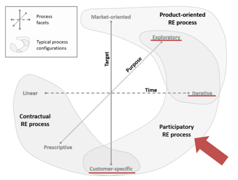

# Processo de Desenvolvimento de Software

Após análise em equipe, guiados pelo Framework de Gupta, escolhemos, à priori, utilizar o **RAD** como framework de gerenciamento de projeto, juntamente aos seguintes artefatos do **Scrum**: **Organização do time, Sprints e Backlog da Sprint**. 

## Análise pelo Framework de Gupta

A partir dos pontos marcados:
<ul>
    <li> RAD – 12 </li>
    <li> Evolutivo – 8 </li>
    <li> Iterativo – 9 </li>
    <li> Prototype – 9 </li>
    <li> Waterfall – 9 </li>
    <li> Spiral – 8 </li>
</ul>

## Facetas do Processo de ER

Identificamos nosso processo de Engenharia de Requisitos como pertencente ao campo **Orientado a Produto**:

## Histórico de Revisão

| Data       | Versão |                                                          Descrição                                                            |    Autor     |
| :--------: | :----: | ----------------------------------------------------------------------------------------------------------------------------- | ------------ |
| 17/09/2023 | 1.0    | Definição da Abordagem, do Ciclo de Vida e do Processo a ser utilizado. Documentação no pages.                                | Todos        |
