Foi feito um documento com base nas conversas com a Cliente para definir como seria a identidade visual do site, item esse contemplado no backlog como o RNF02, que diz respeito a Usabilidade (O produto deverá seguir a identidade visual do salão (paleta de cores, logomarca, banners).  

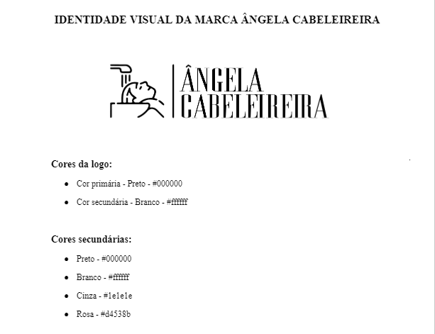
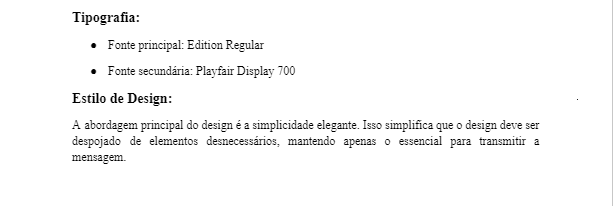
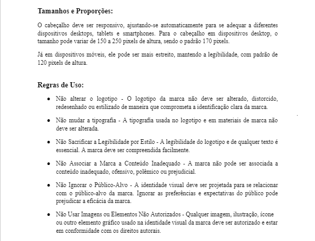
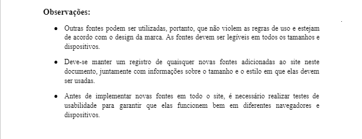

## Prototipação das Telas do MVP1

Seguindo o documento de identidade visual, foram feitos protótipos das telas que serão desevolvidas para cumprir com as USs do MVP1.  

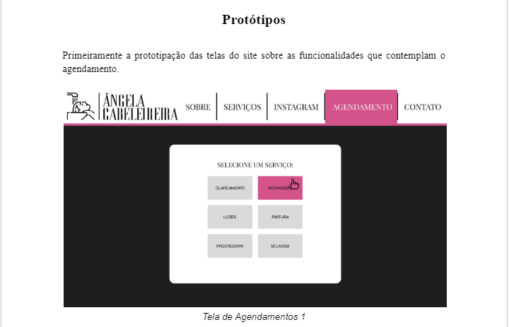
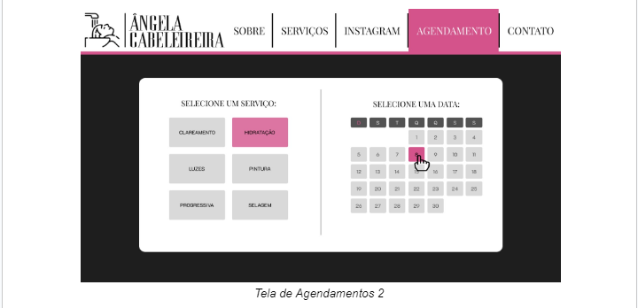
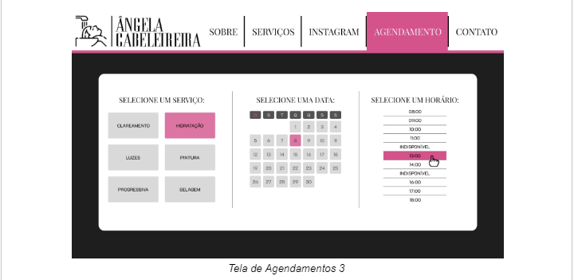
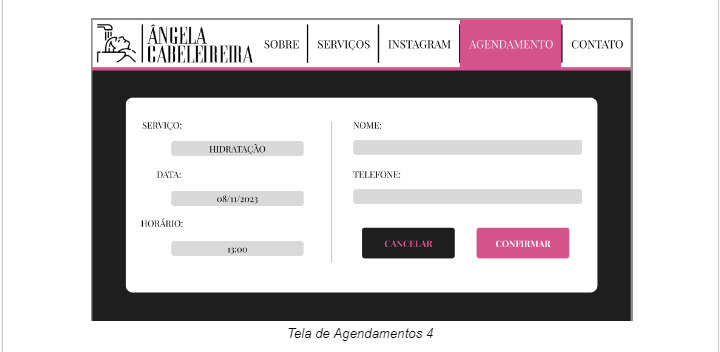
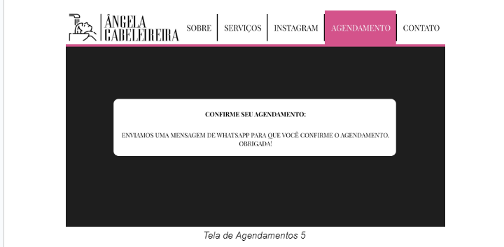
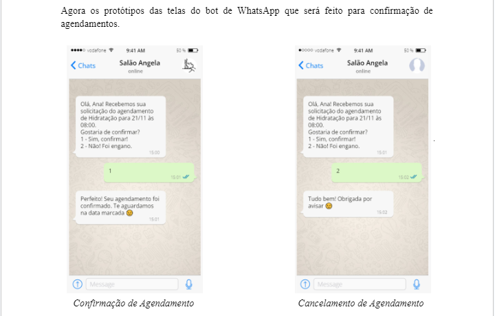
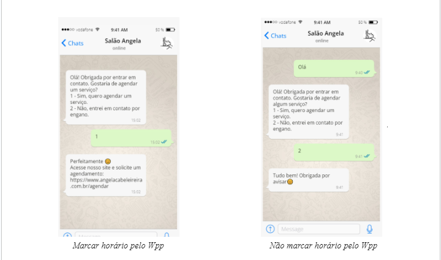

## Plano de Navegação das Telas do MVP1

A seguir, o plano de navegação que está contemplado no RNF05, (Seguir o plano de navegação de telas) do projeto.

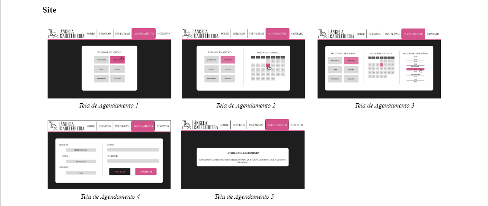
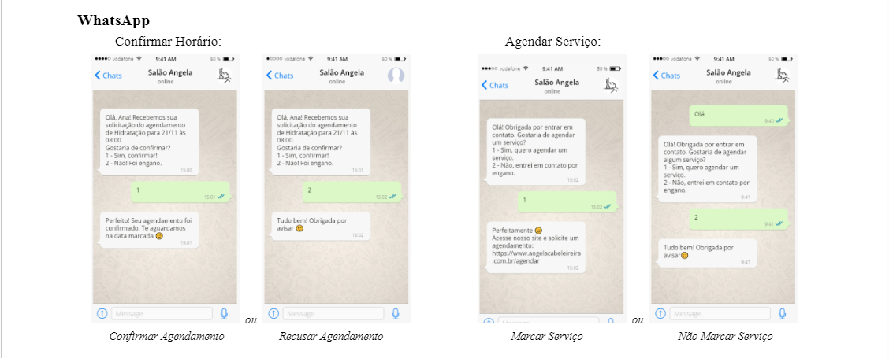

## Histórico de Revisão

| Data       | Versão |                                                      Descrição                                                            |    Autor     |
| :--------: | :----: | ----------------------------------------------------------------------------------------------------------------------------- | ------------ |
| 22/11/2023 | 1.0    | Criação da aba de documentos da identidade visual do projeto, adição do documento de identidade visual, protótipos e plano de navegação de telas | Guilherme de Sá      |
| 13/12/2023 | 1.1   | Retirada dos Iframes e atualização com imagens png dos documentos  | Guilherme de Sá        |

