## Relatório de Situação do Projeto
Um relatório em planilha de cada quinzena desde o começo do projeto mostrando todas as atividades que foram feitas referentes ao projeto e a disciplina em parelelo, para ter uma noção de onde se encontra o projeto. Nas colunas, uma coluna de check, que mostra se a tarefa foi ou não feita, seu detalhamento, os responsáveis pela atividade, e por fim seu tipo, que segue a legenda logo abaixo.  
Essa planilha é atualizada constantemente à medida que o projeto vai mudando de situação, sendo acrescentadas novas atividades ou dando check nas atividades pendentes.Esse documento apresenta também as atividades extra projeto pois estas tiveram impacto significativo no desevolvimento do projeto em si, por causa do tempo e esforço que custaram. 

Legenda utilizada na tabela:

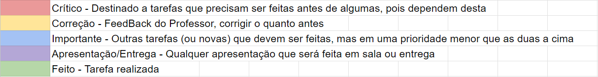

A seguir a lista das tarefas de cada quinzena:  

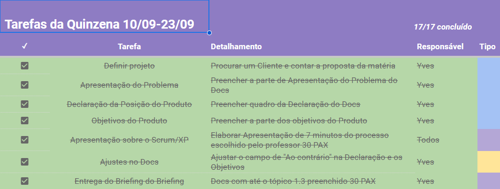
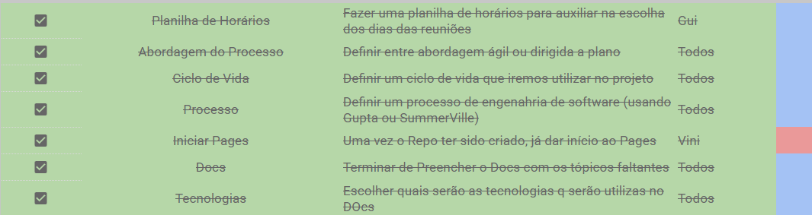
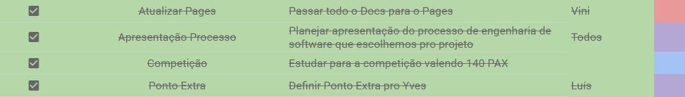
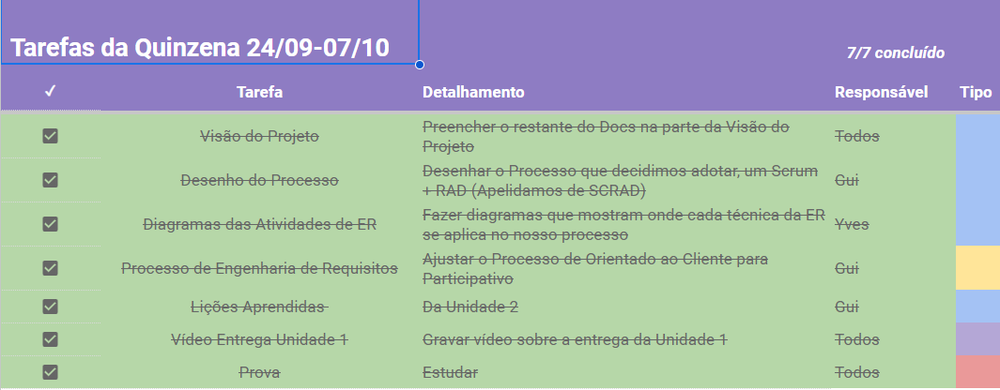
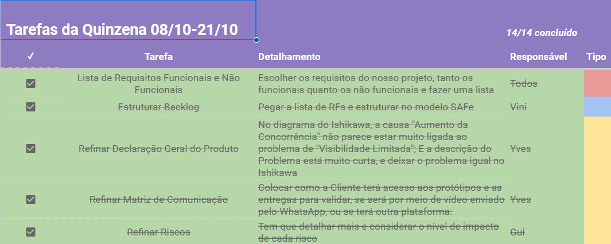
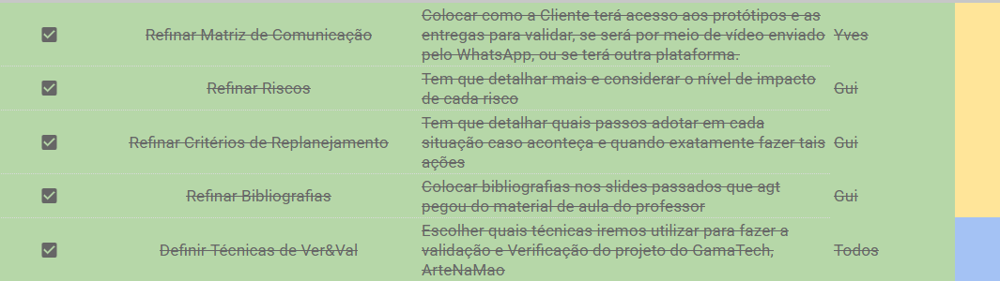
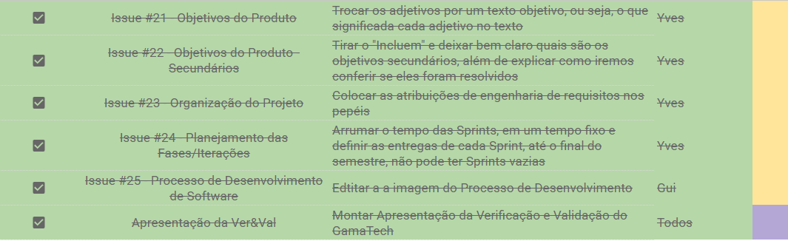
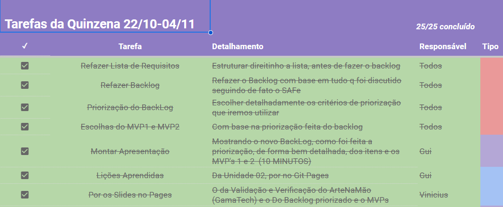
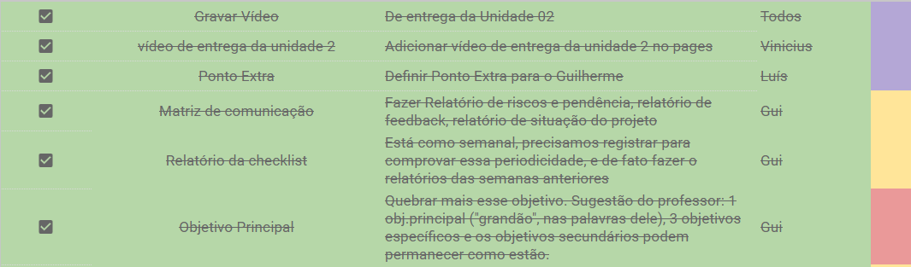
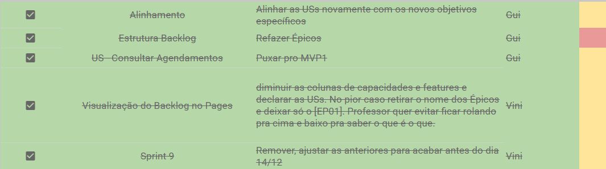
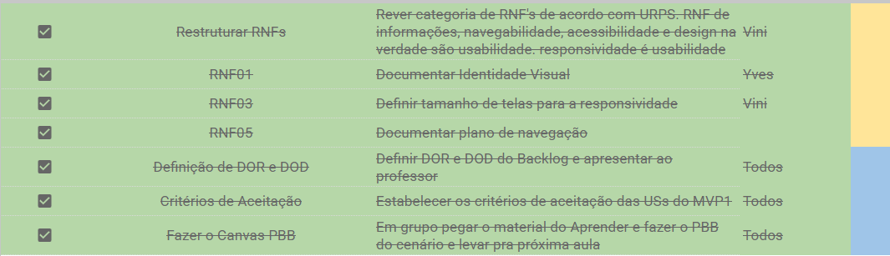
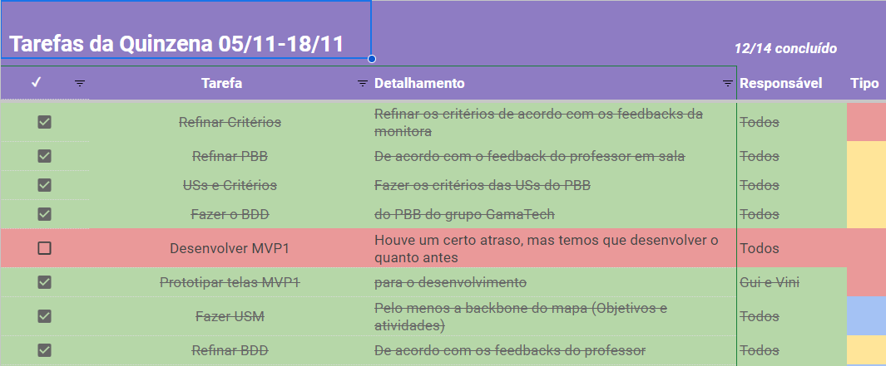
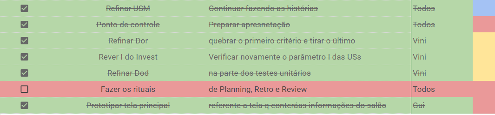
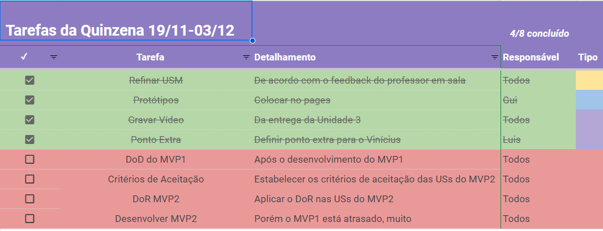
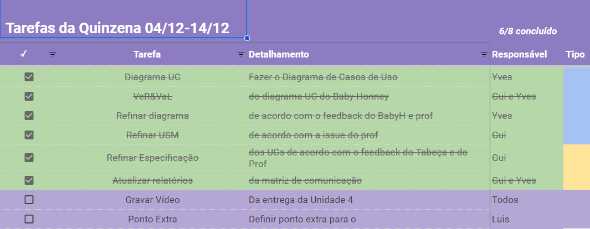

## Relatório de Riscos do Projeto
Um relatório de riscos destacando três eventos significativos ao longo do projeto, avaliando seu impacto em termos de grau de risco, que é categorizado como ALTO, MÉDIO ou BAIXO, conforme a legenda abaixo.

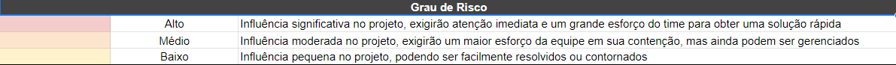
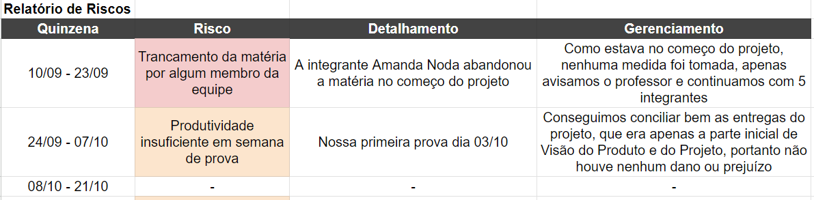
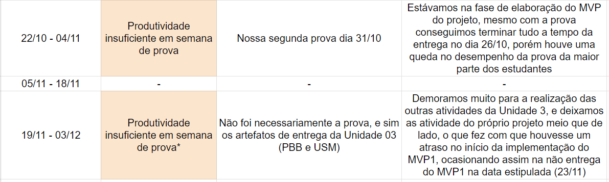

## Relatório de FeedBack da Cliente
Esta seção tem o propósito de documentar e analisar o feedback do cliente, obtido
durante as conversas entre o Product Owner e o cliente sobre o desenvolvimento do site para
o salão Ângela Cabeleireira. Ele busca consolidar as percepções do cliente em relação ao
design, funcionalidades e conteúdo do site, fornecendo uma base estruturada para melhorias e
aprimoramentos. O objetivo final é garantir que o produto atenda às expectativas do cliente e
alcance os objetivos estabelecidos para o projeto.  

### Resumo Executivo

Dentro da abordagem, metodologia e processo de desenvolvimento de software adotados pela
equipe Pentágono Cabeludo, o SCRUM/RAD enfoca principalmente a prototipagem das
funcionalidades listadas no backlog de produto deste projeto. Desde o início, o cliente é
informado de que a equipe buscará criar protótipos de alta fidelidade ao longo do
desenvolvimento do projeto. 
Após a identificação dos requisitos iniciais e a criação do backlog do produto, a equipe de
desenvolvimento elabora propostas de protótipos para cada iteração das Sprints. Esses
protótipos são então enviados ao Product Owner por meio da plataforma FIGMA. 
Após a aprovação pelo Product Owner, os protótipos são compartilhados com o cliente
através de mensagens instantâneas no WhatsApp. A partir desse ponto, o cliente avalia as
propostas da equipe e fornece feedback, que pode ser tanto positivo quanto negativo. 
Os feedbacks positivos consistem em considerações feitas pelo cliente que indicam os pontos
que atendem às expectativas do produto. Por outro lado, os feedbacks negativos destacam as
falhas em relação às expectativas do cliente. 
Para que um protótipo seja considerado aprovado, é necessário que o cliente o aprove
integralmente. Caso o protótipo esteja incompleto ou não esteja de acordo com as
expectativas do cliente, o feedback é considerado negativo e é encaminhado de volta à equipe
de desenvolvimento. Esta equipe, por sua vez, trabalha nos pontos de melhoria indicados. 
Se não houver necessidade de alterações ou ajustes, o feedback é considerado positivo, e o
protótipo passa a ser um modelo a ser seguido integralmente pela equipe de desenvolvimento
durante a produção da Sprint. 

### Primeira representação

A primeira representação foi da tela inicial da plataforma; consistiu em um esboço feito a
caneta contendo as principais informações e funcionalidades do site. Este foi criado com o
propósito de obter uma visão geral do site e compreender as expectativas do cliente. O
feedback do cliente foi, em geral, positivo; no entanto, foram destacadas algumas áreas de
melhoria e pontos que poderiam ser aprimorados e adaptados. 

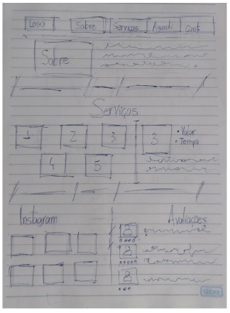

Os pontos positivos deste modelo estão relacionados a facilidade de visualização e
localização de todos os elementos da página, além de sua conformidade com as regras gerais
de identidade visual da marca. 
As áreas de melhoria identificadas incluem a posição de diversos elementos na tela,
especialmente os relacionados aos serviços e ao Instagram. O cliente também destaca a
ausência da informação sobre a localização do salão como um ponto a ser aprimorado. 
O processo de representação da página inicial do site foi pausado, já que houve uma urgência
maior na entrega do primeiro MVP. 

### Representação do primeiro MVP

Levando em consideração o feedback da primeira entrega, além das cores, fontes e tamanhos
determinados no documento de identidade visual da marca, esta representação busca formar
especificamente o sistema de agendamento do site. 

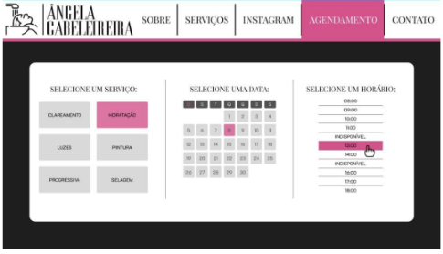
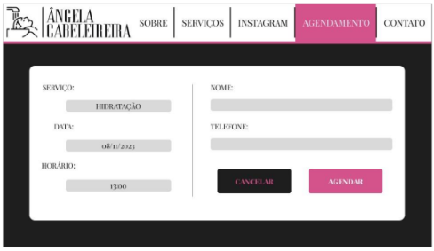

A proposta deste modelo foi muito bem recebida pelo cliente, resultando em uma aprovação
total. Desta forma, a equipe de desenvolvimento deve proceder com a implementação deste
protótipo no sistema.

## Histórico de Revisão

| Data       | Versão |                                                      Descrição                                                            |    Autor     |
| :--------: | :----: | ----------------------------------------------------------------------------------------------------------------------------- | ------------ |
| 05/11/2023 | 1.0    | Criação da aba de relatórios do projeto, adição da lista de tarefas | Guilherme de Sá        |
| 22/11/2023 | 1.1    | Adição dos relatórios de riscos, situação do projeto e feedback  | Guilherme de Sá        |
| 11/12/2023 | 1.2   | Retirada dos Iframes e atualização com imagens png das planilhas  | Guilherme de Sá        |
| 12/12/2023 | 1.3   | Centralizando as imagens  | Guilherme de Sá        |