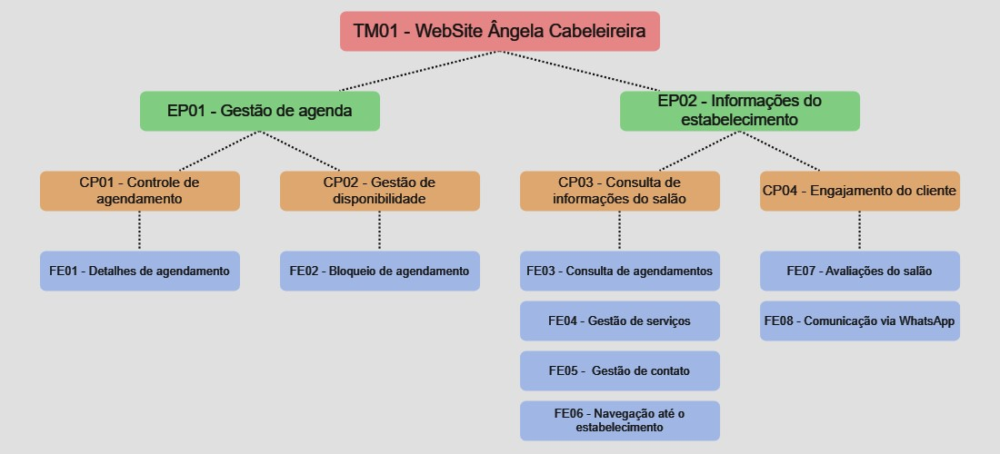

# Backlog do Produto

## Requisitos Funcionais
Estrutura de Backlog do produto - Scaled Agile Framework (SAFe):

<table border=1 style='border-collapse:collapse;table-layout:fixed;'>
  <thead>
    <tr>
      <th scolspan="4" align="center">Personas</th>
    </tr>
  </thead>
  <tbody>
    <tr>
      <td align="center" style='vertical-align:middle;'>Cliente</td>
      <td>Pessoa que utiliza os serviços do salão de beleza. Interessado em agendar serviços, visualizar informações sobre serviços oferecidos, avaliar o salão, receber comunicações sobre agendamentos, entre outras necessidades relacionadas à experiência como cliente.</td>
    </tr>
    <tr>
      <td align="center" style='vertical-align:middle;'>Gerente</td>
      <td>Pessoa responsável pela administração e operação do salão de beleza. Suas preocupações incluem a gestão da agenda, a adição e remoção de serviços, acompanhamento de avaliações dos clientes, entre outras tarefas relacionadas à administração do salão.</td>
    </tr>
    <tr>
      <td align="center" style='vertical-align:middle;'>Usuário</td>
      <td>É tanto o cliente, quanto o gerente do salão. Tem acesso às funcionalidades destinadas a ambas as personas.</td>
    </tr>
  </tbody>
</table>

<table border=1 style='border-collapse:collapse;table-layout:fixed;'>
<thead>
  <tr>
    <th colspan="4" align="center">TM01 - Website Ângela Cabeleireira</th>
  </tr>
</thead>
<tbody>
  <tr>
    <td align="center" style='vertical-align:middle;'>ÉPICOS</td>
    <td align="center" style='vertical-align:middle;'>CAPACIDADES</td>
    <td align="center" style='vertical-align:middle;'>FEATURES</td>
    <td align="center" style='vertical-align:middle;'>USER STORIES</td>
  </tr>
  <tr>
    <td rowspan="5" style="vertical-align: middle;">EP01</td>
    <td rowspan="3" style="vertical-align: middle;">CP01 - Controle de agendamento</td>
    <td rowspan="3" style="vertical-align: middle;">FE01 - Detalhes de agendamento</td>
    <td>US01 - Como usuário, quero agendar um horário no salão, para receber um serviço.</td>
  </tr>
  <tr>
    <td>US02 - Como usuário, quero retirar um agendamento, para liberar espaço na agenda do salão.</td>
  </tr>
  <tr>
    <td>US03 - Como usuário, quero verificar meus agendamentos, para acompanhar os dias e horários marcados no salão.</td>
  </tr>
  <tr>
    <td rowspan="2" style="vertical-align: middle;">CP02 - Gestão de disponibilidade</td>
    <td rowspan="2" style="vertical-align: middle;">FE02 - Bloqueio de agendamento</td>
    <td>US04 - Como gerente, quero bloquear determinados dias e horários da agenda, para impossibilitar o agendamento referente.</td>
  </tr>
  <tr>
    <td>US05 - Como gerente, quero limitar períodos de agendamento, para ter controle do número de clientes agendados.</td>
  </tr>
  <tr>
    <td rowspan="15" style="vertical-align: middle;">EP02</td>
    <td rowspan="9" style="vertical-align: middle;">CP03 - Consulta de informações do salão</td>
    <td rowspan="2" style="vertical-align: middle;">FE03 - Consulta de agendamentos</td>
    <td>US06 - Como cliente, quero visualizar os horários disponíveis para agendamento em um dia específico, para escolher o melhor horário para o serviço.</td>
  </tr>
  <tr>
    <td>US07 - Como gerente, quero visualizar todos os agendamentos realizados, para ter um controle de serviços.</td>
  </tr>
  <tr>
    <td rowspan="3" style="vertical-align: middle;">FE04 - Gestão de serviços</td>
    <td>US08 - Como gerente, quero registrar serviços na plataforma, para que os clientes sabiam o que está disponível.</td>
  </tr>
  <tr>
    <td>US09 - Como gerente, quero editar serviços existentes, para atualizar detalhes.</td>
  </tr>
  <tr>
    <td>US10 - Como gerente, quero retirar serviços existentes, para que deixe de ser uma opção disponível.</td>
  </tr>
  <tr>
    <td rowspan="2" style="vertical-align: middle;">FE05 - Gestão de contato</td>
    <td>US11 - Como gerente, quero registrar informações de contato do salão, para disponibilizar novas maneiras de entrar em contato com o salão.</td>
  </tr>
  <tr>
    <td>US12 - Como gerente, quero remover informações de contato do salão, para remover dados incorretos.</td>
  </tr>
  <tr>
    <td rowspan="2" style="vertical-align: middle;">FE06 - Navegação até o estabelecimento</td>
    <td>US13 - Como cliente, quero visualizar uma rota da minha localização até o estabelecimento, para saber o caminho até o salão.</td>
  </tr>
  <tr>
    <td>US14 - Como cliente, quero visualizar pontos de referência próximos ao estabelecimento, para facilitar a viagem até o salão.</td>
  </tr>
  <tr>
    <td rowspan="6" style="vertical-align: middle;">CP04 - Engajamento do cliente</td>
    <td rowspan="3" style="vertical-align: middle;">FE07 - Avaliações do salão</td>
    <td>US15 - Como cliente, quero atribuir uma classificação por estrelas ao serviço do salão, para refletir minha satisfação geral.</td>
  </tr>
  <tr>
    <td>US16 - Como cliente, quero escrever um comentário sobre minha experiência no salão, para compartilhar detalhes específicos do serviço.</td>
  </tr>
  <tr>
    <td>US17 - Como cliente, quero ter a opção de manter minha avaliação anônima, para que minha opinião seja confidencial.</td>
  </tr>
  <tr>
    <td rowspan="3" style="vertical-align: middle;">FE08 - Comunicação via WhatsApp</td>
    <td>US18 - Como cliente, quero receber lembretes de agendamentos via WhatsApp, para não esquecer dos serviços agendados.</td>
  </tr>
  <tr>
    <td>US19 - Como cliente, quero receber detalhes dos serviços agendados via WhatsApp, para saber exatamente o que foi marcado.</td>
  </tr>
  <tr>
    <td>US20 - Como cliente, quero receber a opção de confirmar meus agendamentos via WhatsApp, para garantir que minhas reservas estejam confirmadas.</td>
  </tr>
</tbody>
</table>

## Requisitos Não Funcionais

Os requisitos não funcionais foram identificados de acordo com o modelo `URPS+`.

| Número | Tipo            | Declaração                                                                                                                                       |
| :----: | --------------- | ------------------------------------------------------------------------------------------------------------------------------------------------ |
| RNF01  | Suportabilidade | Deve ser compatível com os principais navegadores Web em suas versões a partir de 2023: Chrome 109, Edge 109, Opera 94, Safari 16.3, FireFox 108 |
| RNF02  | Usabilidade     | O produto deverá seguir a identidade visual do salão (paleta de cores, logomarca, banners).                                                      |
| RNF03  | Usabilidade     | O site deve ser responsivo a tamanhos de tela de dispositivos desktop e mobile                                                                   |
| RNF04  | Usabilidade     | Deve ser acessível para usuários com dificuldades visuais, seguindo as diretrizes de acessibilidade da web (WCAG)                                |
| RNF05  | Usabilidade     | Seguir o plano de navegação de telas estabelecido                                                                                                |
| RNF06  | Usabilidade     | O site deve conter as informações de contato, localização, postagens do Instagram e avaliações                                                   |

## Critérios de priorização

Utilizaremos os seguintes critérios de priorização:

### Valor de Negócio

(Business Value) Significa quanto é a contribuição para o produto final, inclui impacto financeiro, satisfação de cliente e benefícios para o negócio. Varia de 1 a 4, da seguinte forma:

<ol>
    <li>A US fornece um valor mínimo de negócio, ou seja, a funcionalidade resolve apenas uma pequena fração do problema.</li>
    <li>A US fornece um valor razoável de negócio, ou seja, a funcionalidade propõe resolver uma parte do problema.</li>
    <li>A US fornece um alto valor de negócio, ou seja, a funcionalidade resolve boa parte do problema.</li>
    <li>A US fornece um valor considerável de negócio, ou seja, a funcionalidade é indispensável para a solução do problema.</li>
</ol>

### Dificuldade

(Difficulty) Significa a dificuldade técnica e operacional de desenvolver uma funcionalidade. Varia de 1 a 3, da seguinte forma:

<ol>
    <li>A US apresenta um alto grau de dificuldade técnica, ou seja, requer um maior esforço para desenvolver a funcionalidade e uma maior competência</li>
    <li>A US apresenta um médio grau de dificuldade técnica, ou seja, a funcionalidade não é tão difícil de ser implementada, porém requer certa atenção</li>
    <li>A US apresenta um baixo grau de dificuldade técnica, ou seja, não é necessário tanto esforço para desenvolver a funcionalidade, com uma competência baixa, ou mediana é possível fazer</li>
</ol>

A pontuação final dos critérios de priorização, será uma simples soma de cada resultado por épico:  
`vn + d = p`

<table border=0 style='border-collapse:collapse;'>
  <col span=5>
  <tr>
    <td></td>
    <td></td>
    <td>Valor de Negócio</td>
    <td>Dificuldade</td>
    <td>Pontuação</td>
  </tr>
  <tr>
    <td>EP01</td>
    <td>Gestão de agenda</td>
    <td align=center>4</td>
    <td align=center>1</td>
    <td align=center>5</td>
  </tr>
  <tr>
    <td>EP02</td>
    <td>Informações do estabelecimento</td>
    <td align=center>2</td>
    <td align=center>3</td>
    <td align=center>5</td>
  </tr>
</table>

O mesmo método será aplicado para cada US:  
`vn + d = p`

<table border=0 style='border-collapse:collapse;'>
  <col span=5>
  <tr>
    <td></td>
    <td></td>
    <td>Valor de Negócio</td>
    <td>Dificuldade</td>
    <td>Pontuação</td>
  </tr>
  <tr>
    <td>US01</td>
    <td>Agendar um horário</td>
    <td align=center>4</td>
    <td align=center>1</td>
    <td align=center>5</td>
  </tr>
  <tr>
    <td>US02</td>
    <td>Retirar Agendamento</td>
    <td align=center>4</td>
    <td align=center>1</td>
    <td align=center>5</td>
  </tr>
  <tr>
    <td>US03</td>
    <td>Verificar agendamento realizado</td>
    <td align=center>3</td>
    <td align=center>2</td>
    <td align=center>5</td>
  </tr>
  <tr>
    <td>US04</td>
    <td>Bloquear agendamento</td>
    <td align=center>4</td>
    <td align=center>1</td>
    <td align=center>5</td>
  </tr>
  <tr>
    <td>US07</td>
    <td>Visualizar todos os agendamentos</td>
    <td align=center>3</td>
    <td align=center>2</td>
    <td align=center>5</td>
  </tr>
  <tr>
    <td>US19</td>
    <td>Detalhes de agendamento via WhatsApp</td>
    <td align=center>2</td>
    <td align=center>3</td>
    <td align=center>5</td>
  </tr>
  <tr>
    <td>US20</td>
    <td>Confirmação de agendamento via WhatsApp</td>
    <td align=center>2</td>
    <td align=center>3</td>
    <td align=center>5</td>
  </tr>
  <tr>
    <td>US05</td>
    <td>Limitar período de agendamento</td>
    <td align=center>3</td>
    <td align=center>1</td>
    <td align=center>4</td>
  </tr>
  <tr>
    <td>US06</td>
    <td>Visualizar horários disponíveis</td>
    <td align=center>2</td>
    <td align=center>2</td>
    <td align=center>4</td>
  </tr>
  <tr>
    <td>US08</td>
    <td>Registrar serviços</td>
    <td align=center>1</td>
    <td align=center>3</td>
    <td align=center>4</td>
  </tr>
  <tr>
    <td>US09</td>
    <td>Editar serviços</td>
    <td align=center>1</td>
    <td align=center>3</td>
    <td align=center>4</td>
  </tr>
  <tr>
    <td>US10</td>
    <td>Retirar serviços</td>
    <td align=center>1</td>
    <td align=center>3</td>
    <td align=center>4</td>
  </tr>
  <tr>
    <td>US11</td>
    <td>Registrar informações de contato</td>
    <td align=center>1</td>
    <td align=center>3</td>
    <td align=center>4</td>
  </tr>
  <tr>
    <td>US12</td>
    <td>Remover informações de contato</td>
    <td align=center>1</td>
    <td align=center>3</td>
    <td align=center>4</td>
  </tr>
  <tr>
    <td>US18</td>
    <td>Lembrente de agendamento via WhatsApp</td>
    <td align=center>1</td>
    <td align=center>3</td>
    <td align=center>4</td>
  </tr>
  <tr>
    <td>US13</td>
    <td>Visualizar rota até o estabelecimento</td>
    <td align=center>1</td>
    <td align=center>2</td>
    <td align=center>3</td>
  </tr>
  <tr>
    <td>US14</td>
    <td>Visualizar pontos de referência</td>
    <td align=center>1</td>
    <td align=center>2</td>
    <td align=center>3</td>
  </tr>
  <tr>
    <td>US15</td>
    <td>Atribuir classificação por estrelas</td>
    <td align=center>1</td>
    <td align=center>2</td>
    <td align=center>3</td>
  </tr>
  <tr>
    <td>US16</td>
    <td>Escrever um comentário</td>
    <td align=center>1</td>
    <td align=center>2</td>
    <td align=center>3</td>
  </tr>
  <tr>
    <td>US17</td>
    <td>Manter avaliação anônima</td>
    <td align=center>1</td>
    <td align=center>2</td>
    <td align=center>3</td>
  </tr>
</table>

## Minimum Viable Products (MVP's)

### MVP1

<table border=0 style='border-collapse:collapse;'>
  <col span=5>
  <tr>
    <td></td>
    <td></td>
    <td>Valor de Negócio</td>
    <td>Dificuldade</td>
    <td>Pontuação</td>
  </tr>
  <tr>
    <td>US01</td>
    <td>Agendar um horário</td>
    <td align=center>4</td>
    <td align=center>1</td>
    <td align=center>5</td>
  </tr>
  <tr>
    <td>US02</td>
    <td>Retirar agendamento</td>
    <td align=center>4</td>
    <td align=center>1</td>
    <td align=center>5</td>
  </tr>
  <tr>
    <td>US03</td>
    <td>Verificar agendamento realizado</td>
    <td align=center>3</td>
    <td align=center>2</td>
    <td align=center>5</td>
  </tr>
  <tr>
    <td>US04</td>
    <td>Bloquear agendamento</td>
    <td align=center>4</td>
    <td align=center>1</td>
    <td align=center>5</td>
  </tr>
  <tr>
    <td>US05</td>
    <td>Limitar período de agendamento</td>
    <td align=center>3</td>
    <td align=center>1</td>
    <td align=center>4</td>
  </tr>
  <tr>
    <td>US06</td>
    <td>Visualizar horários disponíveis</td>
    <td align=center>2</td>
    <td align=center>2</td>
    <td align=center>4</td>
  </tr>
  <tr>
    <td>US07</td>
    <td>Visualizar todos os agendamentos</td>
    <td align=center>3</td>
    <td align=center>2</td>
    <td align=center>5</td>
  </tr> 
  <tr>
    <td>US19</td>
    <td>Detalhes de agendamento via WhatsApp</td>
    <td align=center>2</td>
    <td align=center>3</td>
    <td align=center>5</td>
  </tr>
  <tr>
    <td>US20</td>
    <td>Confirmação de agendamento via WhatsApp</td>
    <td align=center>2</td>
    <td align=center>3</td>
    <td align=center>5</td>
  </tr>
</table>

### Critérios de Aceitação do MVP1

<table border=1 style="border-collapse:collapse;border-spacing:0;margin:0px auto">
  <thead>
    <tr>
      <th style="font-size:large;font-weight:bold;overflow:hidden;padding:10px 5px;text-align:center;vertical-align:middle;word-break:normal" colspan="3">MVP1</th>
    </tr>
  </thead>
  <tbody>
    <tr>
      <td style="font-size:medium;font-weight:bold;overflow:hidden;padding:10px 5px;text-align:center;vertical-align:middle;word-break:normal">User Stories</td>
      <td style="font-size:medium;font-weight:bold;overflow:hidden;padding:10px 5px;text-align:center;vertical-align:middle;word-break:normal">Critérios de aceitação</td>
      <td style="font-size:medium;font-weight:bold;overflow:hidden;padding:10px 5px;text-align:center;vertical-align:middle;word-break:normal">Testes de Aceitação</td>
    </tr>
    <tr>
      <td style="font-size:100%;overflow:hidden;padding:10px 5px;text-align:center;vertical-align:middle;word-break:normal" rowspan="5">US01 - Como usuário, quero agendar um horário no salão, para receber um serviço.</td>
      <td style="font-size:14px;overflow:hidden;padding:10px 5px;text-align:left;vertical-align:middle;word-break:normal">1. O usuário deve ser capaz de selecionar o serviço desejado a partir de uma lista de serviços disponíveis.</td>
      <td style="font-size:14px;overflow:hidden;padding:10px 5px;text-align:left;vertical-align:middle;word-break:normal" rowspan="5">- Teste de seleção de serviço (Critério 1).  - Teste de seleção de data (Critério 2).  - Teste de seleção de horário (Critério 3).</td>
    </tr>
    <tr>
      <td style="font-size:14px;overflow:hidden;padding:10px 5px;text-align:left;vertical-align:middle;word-break:normal">2. O usuário deve ser capaz de selecionar uma data disponível para o serviço.</td>
    </tr>
    <tr>
      <td style="font-size:14px;overflow:hidden;padding:10px 5px;text-align:left;vertical-align:middle;word-break:normal">3. O usuário deve ser capaz de selecionar um horário disponível para a data selecionada.</td>
    </tr>
    <tr>
      <td style="font-size:14px;overflow:hidden;padding:10px 5px;text-align:left;vertical-align:middle;word-break:normal">4. O sistema deve solicitar o nome do usuário.</td>
    </tr>
    <tr>
      <td style="font-size:14px;overflow:hidden;padding:10px 5px;text-align:left;vertical-align:middle;word-break:normal">5. O sistema deve solicitar o número de celular do usuário.</td>
    </tr>
    <tr>
      <td style="font-size:100%;overflow:hidden;padding:10px 5px;text-align:center;vertical-align:middle;word-break:normal" rowspan="4">US02 - Como usuário, quero retirar um agendamento, para liberar espaço na agenda do salão.</td>
      <td style="font-size:14px;overflow:hidden;padding:10px 5px;text-align:left;vertical-align:middle;word-break:normal">1. O usuário deve ter a opção de cancelar o agendamento via WhatsApp.</td>
      <td style="font-size:14px;overflow:hidden;padding:10px 5px;text-align:left;vertical-align:middle;word-break:normal" rowspan="4">- Teste de confirmação de cancelamento (Critério 3).  - Teste de atualização de agenda (Critério 4).</td>
    </tr>
    <tr>
      <td style="font-size:14px;overflow:hidden;padding:10px 5px;text-align:left;vertical-align:middle;word-break:normal">2. O sistema deve confirmar a solicitação de cancelamento do usuário.</td>
    </tr>
    <tr>
      <td style="font-size:14px;overflow:hidden;padding:10px 5px;text-align:left;vertical-align:middle;word-break:normal">3. Após a confirmação, o sistema deve enviar uma mensagem de confirmação imediata para o número de celular do usuário, por meio do WhatsApp, informando que o agendamento foi cancelado com sucesso.</td>
    </tr>
    <tr>
      <td style="font-size:14px;overflow:hidden;padding:10px 5px;text-align:left;vertical-align:middle;word-break:normal">4. O sistema deve atualizar a agenda, liberando o horário do agendamento cancelado.</td>
    </tr>
    <tr>
      <td style="font-size:100%;overflow:hidden;padding:10px 5px;text-align:center;vertical-align:middle;word-break:normal" rowspan="4">US03 - Como usuário, quero verificar meus agendamentos, para acompanhar os dias e horários marcados no salão.</td>
      <td style="font-size:14px;overflow:hidden;padding:10px 5px;text-align:left;vertical-align:middle;word-break:normal">1. O sistema deve fornecer uma opção para sincronizar os agendamentos com o Google Agenda do usuário.</td>
      <td style="font-size:14px;overflow:hidden;padding:10px 5px;text-align:left;vertical-align:middle;word-break:normal" rowspan="4">- Teste de informações de agendamento do Google Agenda (Critério 3).  - Teste de atualização automática do Google Agenda (Critério 4).</td>
    </tr>
    <tr>
      <td style="font-size:14px;overflow:hidden;padding:10px 5px;text-align:left;vertical-align:middle;word-break:normal">2. Após a sincronização, os agendamentos devem ser visíveis no Google Agenda do celular do usuário.</td>
    </tr>
    <tr>
      <td style="font-size:14px;overflow:hidden;padding:10px 5px;text-align:left;vertical-align:middle;word-break:normal">3. Os agendamentos no Google Agenda devem possuir informações de data, hora e serviço.</td>
    </tr>
    <tr>
      <td style="font-size:14px;overflow:hidden;padding:10px 5px;text-align:left;vertical-align:middle;word-break:normal">4. O sistema de agendamento deve atualizar automaticamente o Google Agenda do usuário sempre que houver mudanças no agendamento.</td>
    </tr>
    <tr>
      <td style="font-size:100%;overflow:hidden;padding:10px 5px;text-align:center;vertical-align:middle;word-break:normal" rowspan="10">US04 - Como gerente, quero bloquear determinados dias e horários da agenda, para impossibilitar o agendamento referente.</td>
      <td style="font-size:14px;overflow:hidden;padding:10px 5px;text-align:left;vertical-align:middle;word-break:normal">1. O sistema deve garantir que apenas o gerente tenha acesso à função de bloqueio da agenda, por meio de uma área restrita.</td>
      <td style="font-size:14px;overflow:hidden;padding:10px 5px;text-align:left;vertical-align:middle;word-break:normal" rowspan="10">- Teste de acesso restrito (Critério 1).  - Teste de confirmação de bloqueio (Critério 6).  - Teste de cancelamento de agendamentos conflitantes (Critério 7).  - Teste de edição de bloqueio (Critério 10).  - Teste de remoção de bloqueio (Critério 11).</td>
    </tr>
    <tr>
      <td style="font-size:14px;overflow:hidden;padding:10px 5px;text-align:left;vertical-align:middle;word-break:normal">2. O sistema deve fornecer opções de bloquear o dia inteiro ou horários específicos do dia.</td>
    </tr>
    <tr>
      <td style="font-size:14px;overflow:hidden;padding:10px 5px;text-align:left;vertical-align:middle;word-break:normal">3. O sistema deve permitir que o gerente selecione o dia que deseja bloquear para agendamento.</td>
    </tr>
    <tr>
      <td style="font-size:14px;overflow:hidden;padding:10px 5px;text-align:left;vertical-align:middle;word-break:normal">4. O sistema deve permitir que o gerente selecione os horários do dia que deseja bloquear para agendamento.</td>
    </tr>
    <tr>
      <td style="font-size:14px;overflow:hidden;padding:10px 5px;text-align:left;vertical-align:middle;word-break:normal">5. Caso exista algum agendamento existente que conflite com o período a ser bloqueado, o sistema deve notificar, por meio de um Pop-up, que os agendamentos do período serão cancelados.</td>
    </tr>
    <tr>
      <td style="font-size:14px;overflow:hidden;padding:10px 5px;text-align:left;vertical-align:middle;word-break:normal">6. O sistema deve confirmar o bloqueio do(s) dia(s) e horário(s) referente.</td>
    </tr>
    <tr>
      <td style="font-size:14px;overflow:hidden;padding:10px 5px;text-align:left;vertical-align:middle;word-break:normal">7. Os agendamentos existentes que conflitam com os períodos bloqueados devem ser cancelados.</td>
    </tr>
    <tr>
      <td style="font-size:14px;overflow:hidden;padding:10px 5px;text-align:left;vertical-align:middle;word-break:normal">8. O sistema deve garantir que os dias e horários bloqueados não estejam disponíveis para agendamento pelos usuários.</td>
    </tr>
    <tr>
      <td style="font-size:14px;overflow:hidden;padding:10px 5px;text-align:left;vertical-align:middle;word-break:normal">9. Caso o agendamento do cliente seja cancelado, o cliente deve receber um aviso imediato para o número de celular, por meio do WhatsApp, detalhando qual o dia e horário foi cancelado.</td>
    </tr>
    <tr>
      <td style="font-size:14px;overflow:hidden;padding:10px 5px;text-align:left;vertical-align:middle;word-break:normal">10. O gerente deve ser capaz de editar ou remover bloqueios existentes, caso necessário.</td>
    </tr>
    <tr>
      <td style="font-size:100%;overflow:hidden;padding:10px 5px;text-align:center;vertical-align:middle;word-break:normal" rowspan="4">US05 - Como gerente, quero limitar períodos de agendamento, para ter controle do número de clientes agendados.</td>
      <td style="font-size:14px;overflow:hidden;padding:10px 5px;text-align:left;vertical-align:top;word-break:normal">1. O sistema deve garantir que apenas o gerente tenha acesso à função de limite de períodos de agendamento, por meio de uma área restrita.</td>
      <td style="font-size:14px;overflow:hidden;padding:10px 5px;text-align:left;vertical-align:middle;word-break:normal" rowspan="4">- Teste de agendamento dentro do período disponível (Critério 1).  - Teste de restrição de agendamento fora do período (Critério 3).</td>
    </tr>
    <tr>
      <td style="font-size:14px;overflow:hidden;padding:10px 5px;text-align:left;vertical-align:top;word-break:normal">1. O sistema deve permitir que o gerente especifique datas de início e término para o período de agendamento.</td>
    </tr>
    <tr>
      <td style="font-size:14px;overflow:hidden;padding:10px 5px;text-align:left;vertical-align:top;word-break:normal">3. O sistema deve permitir o agendamento dos clientes apenas para o período de agendamento disponível.</td>
    </tr>
    <tr>
      <td style="border-style:solid;border-width:1px;font-family:Arial, sans-serif;font-size:14px;overflow:hidden;padding:10px 5px;text-align:left;vertical-align:top;word-break:normal">4. Caso o cliente, tente realizar um agendamento em um período que não esteja aberto, o sistema deve indicar ao cliente, por meio de um Pop-Up.</td>
    </tr>
    <tr>
      <td style="font-size:100%;overflow:hidden;padding:10px 5px;text-align:center;vertical-align:middle;word-break:normal" rowspan="4">US06 - Como cliente, quero visualizar os horários disponíveis para agendamento em um dia específico, para escolher o melhor horário para o serviço.</td>
      <td style="font-size:14px;overflow:hidden;padding:10px 5px;text-align:left;vertical-align:middle;word-break:normal">1. O usuário deve ser capaz de consultar os dias e horários livres para agendamento.</td>
      <td style="font-size:14px;overflow:hidden;padding:10px 5px;text-align:left;vertical-align:middle;word-break:normal" rowspan="4">- Teste de visualização do calendário (Critério 2).  - Teste de visualização do mês seguinte (Critério 4).</td>
    </tr>
    <tr>
      <td style="font-size:14px;overflow:hidden;padding:10px 5px;text-align:left;vertical-align:top;word-break:normal">2. O sistema deve apresentar uma visualização em formato de calendário mensal, dos agendamentos, apresentando as informações de horário e data.</td>
    </tr>
    <tr>
      <td style="font-size:14px;overflow:hidden;padding:10px 5px;text-align:left;vertical-align:top;word-break:normal">3. O sistema deve diferenciar visualmente os dias ocupados dos dias livres na visualização, por meio de cores.</td>
    </tr>
    <tr>
      <td style="font-size:14px;overflow:hidden;padding:10px 5px;text-align:left;vertical-align:top;word-break:normal">4. O sistema deve oferecer uma opção de visualizar o calendário do mês seguinte.</td>
    </tr>
    <tr>
      <td style="font-size:100%;overflow:hidden;padding:10px 5px;text-align:center;vertical-align:middle;word-break:normal" rowspan="3">US07 - Como gerente, quero visualizar todos os agendamentos realizados, para ter um controle de serviços.</td>
      <td style="font-size:14px;overflow:hidden;padding:10px 5px;text-align:left;vertical-align:top;word-break:normal">1. O sistema deve garantir que apenas o gerente tenha acesso à função de visualizar todos os agendamentos, por meio de uma área restrita.</td>
      <td style="font-size:14px;overflow:hidden;padding:10px 5px;text-align:left;vertical-align:middle;word-break:normal" rowspan="3">- Teste de visualização de agendamentos (Critério 2).</td>
    </tr>
    <tr>
      <td style="font-size:14px;overflow:hidden;padding:10px 5px;text-align:left;vertical-align:top;word-break:normal">2. O sistema deve apresentar todos os agendamentos confirmados realizados .</td>
    </tr>
    <tr>
      <td style="font-size:14px;overflow:hidden;padding:10px 5px;text-align:left;vertical-align:top;word-break:normal">3. O sistema deve apresentar as informações de data, hora, tipo de serviço, nome cliente e número de celular do cliente.</td>
    </tr>
    <tr>
      <td style="font-size:100%;overflow:hidden;padding:10px 5px;text-align:center;vertical-align:middle;word-break:normal" rowspan="2">US19 - Como cliente, quero receber detalhes dos serviços agendados via WhatsApp, para saber exatamente o que foi marcado.</td>
      <td style="font-size:14px;overflow:hidden;padding:10px 5px;text-align:left;vertical-align:middle;word-break:normal">1. Imediatamente após o agendamento, o sistema deve enviar uma mensagem de detalhes de agendamento para o número do cliente.</td>
      <td style="font-size:14px;overflow:hidden;padding:10px 5px;text-align:left;vertical-align:middle;word-break:normal" rowspan="2">- Teste de envio de mensagem via WhatsApp (Critério 1).</td>
    </tr>
    <tr>
      <td style="border-style:solid;border-width:1px;font-family:Arial, sans-serif;font-size:14px;overflow:hidden;padding:10px 5px;text-align:left;vertical-align:top;word-break:normal">2. As informações enviadas via WhatsApp devem apresentar qual o serviço, a data e a hora agendada.</td>
    </tr>
    <tr>
      <td style="font-size:100%;overflow:hidden;padding:10px 5px;text-align:center;vertical-align:middle;word-break:normal" rowspan="3">US20 - Como cliente, quero receber a opção de confirmar meus agendamentos via WhatsApp, para garantir que minhas reservas estejam confirmadas.</td>
      <td style="font-size:14px;overflow:hidden;padding:10px 5px;text-align:left;vertical-align:middle;word-break:normal">1. Imediatamente após o agendamento, o sistema deve enviar uma mensagem de confirmação de agendamento para o número do cliente.</td>
      <td style="font-size:14px;overflow:hidden;padding:10px 5px;text-align:left;vertical-align:middle;word-break:normal" rowspan="3">- Teste de opção de confirmação (Critério 2).  - Teste de registro na agenda (Critério 3).</td>
    </tr>
    <tr>
      <td style="border-style:solid;border-width:1px;font-family:Arial, sans-serif;font-size:14px;overflow:hidden;padding:10px 5px;text-align:left;vertical-align:top;word-break:normal">2. O cliente deve ter a opção de confirmar agendamento,</td>
    </tr>
    <tr>
      <td style="border-style:solid;border-width:1px;font-family:Arial, sans-serif;font-size:14px;overflow:hidden;padding:10px 5px;text-align:left;vertical-align:top;word-break:normal">3. Ao confirmar, o sistema deve registrar o agendamento na agenda do salão.</td>
    </tr>
  </tbody>
</table>

### MVP2

<table border=0 style='border-collapse:collapse;'>
  <col span=5>
  <tr>
    <td></td>
    <td></td>
    <td>Valor de Negócio</td>
    <td>Dificuldade</td>
    <td>Pontuação</td>
  </tr>
  <tr>
    <td>US08</td>
    <td>Registrar serviços</td>
    <td align=center>1</td>
    <td align=center>3</td>
    <td align=center>4</td>
  </tr>
  <tr>
    <td>US09</td>
    <td>Editar serviços</td>
    <td align=center>1</td>
    <td align=center>3</td>
    <td align=center>4</td>
  </tr>
  <tr>
    <td>US10</td>
    <td>Retirar serviços</td>
    <td align=center>1</td>
    <td align=center>3</td>
    <td align=center>4</td>
  </tr>
  <tr>
    <td>US11</td>
    <td>Registrar informações de contato</td>
    <td align=center>1</td>
    <td align=center>3</td>
    <td align=center>4</td>
  </tr>
  <tr>
    <td>US12</td>
    <td>Remover informações de contato</td>
    <td align=center>1</td>
    <td align=center>3</td>
    <td align=center>4</td>
  </tr>
  <tr>
    <td>US18</td>
    <td>Lembrente de agendamento via WhatsApp</td>
    <td align=center>1</td>
    <td align=center>3</td>
    <td align=center>4</td>
  </tr>
  <tr>
    <td>US13</td>
    <td>Visualizar rota até o estabelecimento</td>
    <td align=center>1</td>
    <td align=center>2</td>
    <td align=center>3</td>
  </tr>
  <tr>
    <td>US14</td>
    <td>Visualizar pontos de referência</td>
    <td align=center>1</td>
    <td align=center>2</td>
    <td align=center>3</td>
  </tr>
  <tr>
    <td>US15</td>
    <td>Atribuir classificação por estrelas</td>
    <td align=center>1</td>
    <td align=center>2</td>
    <td align=center>3</td>
  </tr>
  <tr>
    <td>US16</td>
    <td>Escrever um comentário</td>
    <td align=center>1</td>
    <td align=center>2</td>
    <td align=center>3</td>
  </tr>
  <tr>
    <td>US17</td>
    <td>Manter avaliação anônima</td>
    <td align=center>1</td>
    <td align=center>2</td>
    <td align=center>3</td>
  </tr>
</table>

<!-- ### Critérios de Aceitação do MVP2

| **[US06]** | Eu como Cliente quero poder calcular a rota da minha localização atual até o salão, para que eu possa ser atendido |
| **[US07]** | Eu como Administradora quero poder adicionar um novo serviço, para que eu possa disponibilizar aos clientes |
| **[US08]** | Eu como Administradora quero poder editar um serviço já existente, para que eu possa atualizar suas infomações |
| **[US09]** | Eu como Administradora quero poder deletar um serviço já existente, para que deixe de ser uma opção para o cliente |
| **[US10]** | Eu como Administradora quero poder editar as informações de contato do salão, para que eu possa atualizá-las para os clientes |
| **[US12]** | Eu como Cliente quero poder dar minha própria avaliação, para que eu possa contribuir para a reputação do salão |
| **[US13]** | Eu como Cliente quero poder enviar uma mensagem via WhatsApp para o salão, para que eu possa me comunicar com a responsável |
| **[US14]** | Eu como Cliente quero poder enviar uma mensagem via Email para o salão, para que eu possa me comunicar com a responsável | -->

## Alinhamento com os Objetivos do Projeto

Os objetivos indentificados do projeto são:
 
 
Objetivo Principal:
<li>OP01 - Melhorar a gestão, no quesito agendamento, a partir da implementação de uma agenda virtual.</li>
 
Objetivos Específicos:
<li>OE01 - Possibilitar a gerência dos agendamentos via web, para otimizar o tempo realizado no agendamento físico.</li>
<li>OE02 - Possibilitar a gerência das informações do salão, para simplificar a atualização pelo próprio site.</li>
<li>OE03 - Possibilitar a consulta das informações de contato, localização, avaliações, postagens do Instagram e serviços disponíveis do salão em um só lugar.</li>
 
Objetivos Secundários:
<li>OS01 - Aumentar a satisfação dos clientes do salão em 20% nos próximos seis meses após a implementação.</li>
<li>OS02 - Aumentar a base de clientes em 10% nos próximos seis meses após a implementação.</li>
<li>OS03 - Aumentar a taxa de retorno de clientes regulares em 15% nos próximos seis meses após a implantação.</li>
<li>OS04 - Possibilitar a avaliação, o contato com o salão e a rota até o salão, por meio do site.</li>
 
Na tabela a seguir é apresentado quais USs de cada MVP estão alinhadas
com os objetivos do projeto

| Objetivo | Nome                                         | US's                                     |
| :------: | -------------------------------------------- | ---------------------------------------- |
|   OE01   | Gerência dos agendamentos via web            | US01, US02, US03, US04, US05, US06, US07 |
|   OE02   | Gerência das informações do salão            | US08, US09, US10, US11, US12             |
|   OE03   | Consulta das informações                     | RNF06, US13, US14                        |
|   OS01   | Aumentar satisfação dos clientes             | US01, US02, US03, US04, US05, US19, US20 |
|   OS02   | Aumentar base de clientes                    | US13, US14, US15, US16, US17             |
|   OS03   | Aumentar taxa do retorno                     | US15, US16, US17                         |
|   OS04   | Realizar avaliações, contato e calcular rota | US11, US12, US13, US14, US16, US17       |

## Histórico de Revisão

|    Data    | Versão | Descrição                                                                          | Autor                      |
| :--------: | :----: | ---------------------------------------------------------------------------------- | -------------------------- |
| 16/10/2023 |  1.0   | Declaração dos Requisitos Funcionais (de acordo com o framework SAFe) e dos RNF's  | Todos                      |
| 22/10/2023 |  1.1   | Correção e Atualização do backlog de acordo com o SAFe                             | Guilherme, Vinícius e Yves |
| 24/10/2023 |  1.2   | Correção do backlog de acordo feedbacks do professor                               | Todos                      |
| 25/10/2023 |  1.3   | Atualização com os Critérios de Priorização, MVP's e Alinhamento                   | Todos                      |
| 26/10/2023 |  1.4   | Correção da estrutura da tabela de declaração do Backlog e das categorias dos RNFs | Vinícius                   |
| 05/11/2023 |  1.5   | Reestruturação do Backlog, Adição dos objetivos Específicos e Alteração nos MVPs   | Guilherme                  |
| 06/11/2023 |  1.6   | Adicionados Critérios de Aceitação do MVP1 em versão preliminar                    | Vinícius                   |
| 11/11/2023 |  1.7   | Ajuste em histórias de usuários e na estrutura de backlog                          | Yves                       |
| 12/11/2023 |  1.8   | Definição dos critérios de aceitação e dos testes de aceitação do MVP1             | Yves                       |
