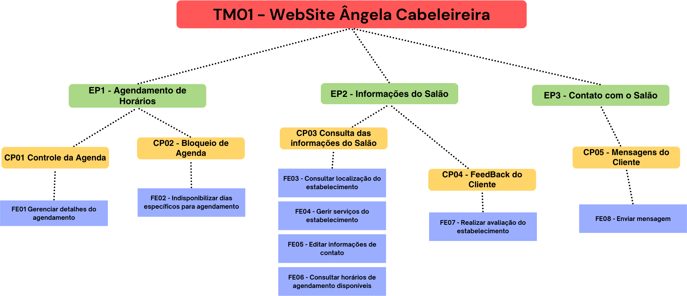

# Backlog do Produto

## Requisitos Funcionais

Estrutura do Backlog:

<table border=1 style='border-collapse:collapse;table-layout:fixed;'>
 <col>
 <col>
 <col>
 <col>
 <tr>
  <th colspan=4 align="center">TM01 - WebSite Ângela Cabeleireira</th>
 </tr>
 <tr>
  <th align="center" style='vertical-align:middle;'>ÉPICOS</th>
  <th align="center" style='vertical-align:middle;'>CAPACIDADES</th>
  <th align="center" style='vertical-align:middle;'>FEATURES</th>
  <th align="center" style='vertical-align:middle;'>USER STORIES</th>
 </tr>
 <!-- ÉPICO 01 -->
 <tr>
  <td rowspan=5 style="vertical-align: middle;">EP01</td>
  <td rowspan=4 style="vertical-align: middle;">CP01 - Controle da Agenda</td>
  <td rowspan=4 style="vertical-align: middle;">FE01 - Gerenciar detalhes do agendamento</td>
  <td>US01 - Eu como Usuário** quero poder agendar um horário, para que eu possa usufruir de um serviço do salão</td>
 </tr>
 <tr>
  <td>US02 - Eu como Usuário quero poder editar um agendamento prévio, para que eu possa mudar a data ou o serviço</td>
 </tr>
 <tr>
  <td>US03 - Eu como Usuário quero poder cancelar um agendamento, para que eu possa liberar um espaço na agenda do salão</td>
 </tr>
 <tr>
  <td>US04 - Eu como Usuário quero poder verificar os meus agendamentos para que eu possa acompanhar os dias e horários marcados</td>
 </tr>
 <tr>
  <td style="vertical-align: middle;">CP02 - Bloqueio de Agenda</td>
  <td style="vertical-align: middle;">FE02 - Indisponibilizar dias específicos para agendamento</td>
  <td>US05 - Eu como Administradora quero poder bloquear certos dias da agenda, para que eu possa impossibilitar qualquer agendamento naquele dia</td>
 </tr>
 <!-- ÉPICO 02 -->
 <tr>
  <td rowspan=7 style="vertical-align: middle;">EP02</td>
  <td rowspan=6 style="vertical-align: middle;">CP03 - Consulta das informações do Salão</td>
  <td style="vertical-align: middle;">FE03 - Consultar localização do estabelecimento</td>
  <td>US06 - Eu como Cliente quero poder calcular a rota da minha localização atual até o salão, para que eu possa ser atendido</td>
 </tr>
 <tr>
  <td rowspan=3 style="vertical-align: middle;">FE04 - Gerir serviços do estabelecimento</td>
  <td>US07 - Eu como Administradora quero poder adicionar um novo serviço, para que eu possa disponibilizar aos clientes</td>
 </tr>
 <tr>
  <td>US08 - Eu como Administradora quero poder editar um serviço já existente, para que eu possa atualizar suas infomações</td>
 </tr>
 <tr>
  <td>US09 - Eu como Administradora quero poder deletar um serviço já existente, para que deixe de ser uma opção para o cliente</td>
 </tr>
 <tr>
  <td style="vertical-align: middle;">FE05 - Editar informações de contato</td>
  <td>US10 - Eu como Administradora quero poder editar as informações de contato do salão, para que eu possa atualizá-las para os clientes</td>
 </tr>
 <tr>
  <td style="vertical-align: middle;">FE06 - Consultar horários de agendamento disponíveis</td>
  <td>US11 - Eu como Usuário quero poder consultar os agendamentos para que eu possa ver atendimentos marcados, e quais dias estão livres</td>
 </tr>
 <tr>
  <td style="vertical-align: middle;">CP04 - FeedBack do Cliente</td>
  <td style="vertical-align: middle;">FE07 - Realizar avaliação do estabelecimento</td>
  <td>US12 - Eu como Cliente quero poder dar minha própria avaliação, para que eu possa contribuir para a reputação do salão</td>
 </tr>
 <!-- ÉPICO 03 -->
 <tr>
  <td rowspan=2 style="vertical-align: middle;">EP03</td>
  <td rowspan=2 style="vertical-align: middle;">CP05 - Mensagens do Cliente</td>
  <td rowspan=2 style="vertical-align: middle;">FE08 - Enviar mensagem</td>
  <td>US13 - Eu como Cliente quero poder enviar uma mensagem via WhatsApp para o salão, para que eu possa me comunicar com a responsável</td>
 </tr>
 <tr>
   <td>US14 - Eu como Cliente quero poder enviar uma mensagem via Email para o salão, para que eu possa me comunicar com a responsável</td>
 </tr>
</table>

## Declarações de Histórias de Usuário (US) e critérios de aceitação

<!-- TODO: Quando tivermos CA's definidos, adicionar nova coluna para declará-los aqui -->

| Título | Declaração | 
| :----- | ---------- |
| **[US01]** | Eu como Usuário** quero poder agendar um horário, para que eu possa usufruir de um serviço do salão |
| **[US02]** | Eu como Usuário quero poder editar um agendamento prévio, para que eu possa mudar a data ou o serviço |
| **[US03]** | Eu como Usuário quero poder cancelar um agendamento, para que eu possa liberar um espaço na agenda do salão |
| **[US04]** | Eu como Usuário quero poder verificar os meus agendamentos para que eu possa acompanhar os dias e horários marcados |
| **[US05]** | Eu como Administradora quero poder bloquear certos dias da agenda, para que eu possa impossibilitar qualquer agendamento naquele dia |
| **[US06]** | Eu como Cliente quero poder calcular a rota da minha localização atual até o salão, para que eu possa ser atendido |
| **[US07]** | Eu como Administradora quero poder adicionar um novo serviço, para que eu possa disponibilizar aos clientes |
| **[US08]** | Eu como Administradora quero poder editar um serviço já existente, para que eu possa atualizar suas infomações |
| **[US09]** | Eu como Administradora quero poder deletar um serviço já existente, para que deixe de ser uma opção para o cliente |
| **[US10]** | Eu como Administradora quero poder editar as informações de contato do salão, para que eu possa atualizá-las para os clientes |
| **[US11]** | Eu como Usuário quero poder consultar os agendamentos para que eu possa ver atendimentos marcados, e quais dias estão livres |
| **[US12]** | Eu como Cliente quero poder dar minha própria avaliação, para que eu possa contribuir para a reputação do salão | 
| **[US13]** | Eu como Cliente quero poder enviar uma mensagem via WhatsApp para o salão, para que eu possa me comunicar com a responsável | 
| **[US14]** | Eu como Cliente quero poder enviar uma mensagem via Email para o salão, para que eu possa me comunicar com a responsável |

****Usuário = Administradora e Clientes**

## Requisitos Não Funcionais

| Número | Tipo            | Declaração |
| :----: | --------------- | ---------- |
| RNF01  | Design          | O produto deverá seguir a identidade visual do salão (paleta de cores, logomarca, banners) |
| RNF02  | Suportabilidade | Deve ser compatível com os principais navegadores Web em suas versões mais recentes (Chrome, Edge, Opera, Safari, FireFox) |
| RNF03  | Usabilidade     | O site deve ser responsivo a diferentes tamanhos de tela e dispositivos |
| RNF04  | Acessibilidade  | Deve ser acessível para usuários com dificuldades visuais, seguindo as diretrizes de acessibilidade da web (WCAG) |
| RNF05  | Navegabilidade  | Seguir o plano de navegação de telas estabelecido |
| RNF06  | Informações     | O site deve conter as informações de contato, localização, postagens do Instagram e avaliações |

<!-- TODO: definir estratégia de priorização e aplicar no backlog; Definir MVP1 e MVP2 com base na priorização. -->
## Critérios de priorização

Utilizaremos os seguintes critérios de priorização:

### Valor de Negócio

(Business Value) Significa quanto é a contribuição para o produto final, inclui impacto financeiro, satisfação de cliente e benefícios para o negócio. Varia de 1 a 4, da seguinte forma:

<ol>
    <li>A US fornece um valor mínimo de negócio, ou seja, a funcionalidade resolve apenas uma pequena fração do problema.</li>
    <li>A US fornece um valor razoável de negócio, ou seja, a funcionalidade propõe resolver uma parte do problema.</li>
    <li>A US fornece um alto valor de negócio, ou seja, a funcionalidade resolve boa parte do problema.</li>
    <li>A US fornece um valor considerável de negócio, ou seja, a funcionalidade é indispensável para a solução do problema.</li>
</ol>

### Dificuldade

(Difficulty) Significa a dificuldade técnica e operacional de desenvolver uma funcionalidade. Varia de 1 a 3, da seguinte forma:

<ol>
    <li>A US apresenta um alto grau de dificuldade técnica, ou seja, requer um maior esforço para desenvolver a funcionalidade e uma maior competência</li>
    <li>A US apresenta um médio grau de dificuldade técnica, ou seja, a funcionalidade não é tão difícil de ser implementada, porém requer certa atenção</li>
    <li>A US apresenta um baixo grau de dificuldade técnica, ou seja, não é necessário tanto esforço para desenvolver a funcionalidade, com uma competência baixa, ou mediana é possível fazer</li>
</ol>

A pontuação final dos critérios de priorização, será uma simples soma de cada resultado por épico:  
`vn + d = p`
<table border=0 style='border-collapse:collapse;'>
 <col span=5>
 <tr>
  <td></td>
  <td></td>
  <td>Valor de Negócio</td>
  <td>Dificuldade</td>
  <td>Pontuação</td>
 </tr>
 <tr>
  <td>EP01</td>
  <td>Agendamento de horários</td>
  <td align=center>4</td>
  <td align=center>1</td>
  <td align=center>5</td>
 </tr>
 <tr>
  <td>EP02</td>
  <td>Informações do Salão</td>
  <td align=center>2</td>
  <td align=center>3</td>
  <td align=center>5</td>
 </tr>
 <tr>
  <td>EP03</td>
  <td>Contato com o Salão</td>
  <td align=center>2</td>
  <td align=center>2</td>
  <td align=center>4</td>
 </tr>
</table>

O mesmo método será aplicado para cada US:  
`vn + d = p`
<table border=0 style='border-collapse:collapse;'>
 <col span=5>
 <tr>
  <td></td>
  <td></td>
  <td>Valor de Negócio</td>
  <td>Dificuldade</td>
  <td>Pontuação</td>
 </tr>
 <tr>
  <td>US01</td>
  <td>Agendar Horário</td>
  <td align=center>4</td>
  <td align=center>1</td>
  <td align=center>5</td>
 </tr>
 <tr>
  <td>US02</td>
  <td>Editar Agendamento</td>
  <td align=center>3</td>
  <td align=center>1</td>
  <td align=center>4</td>
 </tr>
 <tr>
  <td>US03</td>
  <td>Cancelar Agendamento</td>
  <td align=center>3</td>
  <td align=center>1</td>
  <td align=center>4</td>
 </tr>
 <tr>
  <td>US04</td>
  <td>Verificar Agendamento</td>
  <td align=center>3</td>
  <td align=center>1</td>
  <td align=center>4</td>
 </tr>
 <tr>
  <td>US05</td>
  <td>Bloquear Agenda</td>
  <td align=center>3</td>
  <td align=center>1</td>
  <td align=center>4</td>
 </tr>
 <tr>
  <td>US06</td>
  <td>Calcular Rota</td>
  <td align=center>2</td>
  <td align=center>2</td>
  <td align=center>4</td>
 </tr>
 <tr>
  <td>US07</td>
  <td>Adicionar Serviços</td>
  <td align=center>3</td>
  <td align=center>3</td>
  <td align=center>6</td>
 </tr>
 <tr>
  <td>US08</td>
  <td>Editar Serviço</td>
  <td align=center>3</td>
  <td align=center>3</td>
  <td align=center>6</td>
 </tr>
 <tr>
  <td>US09</td>
  <td>Deletar Serviço</td>
  <td align=center>3</td>
  <td align=center>3</td>
  <td align=center>6</td>
 </tr>
 <tr>
  <td>US10</td>
  <td>Editar Contato</td>
  <td align=center>3</td>
  <td align=center>3</td>
  <td align=center>6</td>
 </tr>
 <tr>
  <td>US11</td>
  <td>Consultar Agendamentos</td>
  <td align=center>4</td>
  <td align=center>1</td>
  <td align=center>5</td>
 </tr>
 <tr>
  <td>US12</td>
  <td>Realizar Avaliação</td>
  <td align=center>2</td>
  <td align=center>1</td>
  <td align=center>3</td>
 </tr>
 <tr>
  <td>US13</td>
  <td>Enviar WhatsApp</td>
  <td align=center>1</td>
  <td align=center>3</td>
  <td align=center>4</td>
 </tr>
 <tr>
  <td>US14</td>
  <td>Enviar Email</td>
  <td align=center>1</td>
  <td align=center>3</td>
  <td align=center>4</td>
 </tr>
</table>

## Minimum Viable Products (MVP's)

### MVP1

<table border=0 style='border-collapse:collapse;'>
 <col span=5>
 <tr>
  <td></td>
  <td></td>
  <td>Valor de Negócio</td>
  <td>Dificuldade</td>
  <td>Pontuação</td>
 </tr>
 <tr>
  <td>US01</td>
  <td>Agendar Horário</td>
  <td align=center>4</td>
  <td align=center>1</td>
  <td align=center>5</td>
 </tr>
 <tr>
  <td>US02</td>
  <td>Editar Agendamento</td>
  <td align=center>3</td>
  <td align=center>1</td>
  <td align=center>4</td>
 </tr>
 <tr>
  <td>US03</td>
  <td>Cancelar Agendamento</td>
  <td align=center>3</td>
  <td align=center>1</td>
  <td align=center>4</td>
 </tr>
 <tr>
  <td>US04</td>
  <td>Verificar Agendamento</td>
  <td align=center>3</td>
  <td align=center>1</td>
  <td align=center>4</td>
 </tr>
 <tr>
  <td>US05</td>
  <td>Bloquear Agenda</td>
  <td align=center>3</td>
  <td align=center>1</td>
  <td align=center>4</td>
 </tr>
 <tr>
  <td>US13</td>
  <td>Enviar WhatsApp</td>
  <td align=center>1</td>
  <td align=center>3</td>
  <td align=center>4</td>
 </tr>
 <tr>
  <td>US14</td>
  <td>Enviar Email</td>
  <td align=center>1</td>
  <td align=center>3</td>
  <td align=center>4</td>
 </tr>
</table>

### MVP2

<table border=0 style='border-collapse:collapse;'>
 <col span=5>
 <tr>
  <td></td>
  <td></td>
  <td>Valor de Negócio</td>
  <td>Dificuldade</td>
  <td>Pontuação</td>
 </tr>
 <tr>
  <td>US07</td>
  <td>Adicionar Serviços</td>
  <td align=center>3</td>
  <td align=center>3</td>
  <td align=center>6</td>
 </tr>
 <tr>
  <td>US08</td>
  <td>Editar Serviço</td>
  <td align=center>3</td>
  <td align=center>3</td>
  <td align=center>6</td>
 </tr>
 <tr>
  <td>US09</td>
  <td>Deletar Serviço</td>
  <td align=center>3</td>
  <td align=center>3</td>
  <td align=center>6</td>
 </tr>
 <tr>
  <td>US10</td>
  <td>Editar Contato</td>
  <td align=center>3</td>
  <td align=center>3</td>
  <td align=center>6</td>
 </tr>
 <tr>
  <td>US11</td>
  <td>Consultar Agendamentos</td>
  <td align=center>4</td>
  <td align=center>1</td>
  <td align=center>5</td>
 </tr>
 <tr>
  <td>US06</td>
  <td>Calcular Rota</td>
  <td align=center>2</td>
  <td align=center>2</td>
  <td align=center>4</td>
 </tr>
 <tr>
  <td>US12</td>
  <td>Realizar Avaliação</td>
  <td align=center>2</td>
  <td align=center>1</td>
  <td align=center>3</td>
 </tr>
</table>

## Alinhamento com os Objetivos do Projeto

Os objetivos indentificados do projeto são:  
Objetivo Principal:
<li>OP1 - Melhorar a gestão no quesito agendamento com a implementação
de uma agenda virtual</li>
Objetivos Secundários:
<li>OS1 - Aumentar a satisfação dos clientes do salão em 30% nos próximos
seis meses após a implementação</li>
<li>OS2 - Aumentar a base de clientes em 20% nos próximos seis meses após
a implementação</li>
<li>OS3 - Aumentar a taxa de retorno de clientes regulares em 25% nos
próximos seis meses após a implantação</li>
<li>OS4 - Diferenciar o salão de beleza no mercado</li>
<li>OS5 - Melhorar a gestão no quesito na disponibilização das informações
do salão</li>

Na tabela a seguir é apresentado quais USs de cada MVP estão alinhadas
com os objetivos do projeto

| Objetivo | Nome         | US's |
| :----: | --------------- | ---------- |
| OP01  | Melhorar Gestão dos Agendamentos  | MVP1 - US01, US02, US03, US04 e US05 |
| OS01  | Aumentar Satisfação dos Clientes | Todo o MVP1 e MVP2 - US11 |
| OS02  | Aumentar Base de Clientes    | MVP2 - US06, US12 |
| OS03 | Aumentar Taxa do Retorno   | MVP2 - US12 |
| OS04  | Destacar o Salão no Mercado  | Todo o MVP1 |
| OS05 | Melhorar Gestão das Informações  | MVP2 - US07, US08, US09 e US10 |

## Histórico de Revisão

| Data       | Versão |                                                          Descrição                                                            |    Autor     |
| :--------: | :----: | ----------------------------------------------------------------------------------------------------------------------------- | ------------ |
| 16/10/2023 | 1.0    | Declaração dos Requisitos Funcionais (de acordo com o framework SAFe) e dos RNF's                                             | Todos        |
| 22/10/2023 | 1.1    | Correção e Atualização do backlog de acordo com o SAFe   | Guilherme, Vinícius e Yves |
| 24/10/2023 | 1.2    | Correção do backlog de acordo feedbacks do professor   | Todos |
| 25/10/2023 | 1.3    | Atualização com os Critérios de Priorização, MVP's e Alinhamento   | Todos |