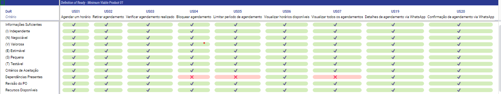

## Definition of Ready

Definition of Ready (DoR) é uma técnica da atividade de Verificação e Validação da Engenharia de Requisitos que basicamente são pré-requisitos de um backlog, para saber se ele está pronto para se iniciar o desenvolvimento.  
Tal definição auxilia a equipe, garantindo que os requisitos escolhidos para iteração estejam preparados e assim possibilitar um desenvolvimento mais organizado e eficiente.  
Para definir esses critérios, levamos em consideração o material disponibilizado pelo professor no Aprender 3:

<ul>
    <li> Informações Suficientes: Todas as informações necessárias para o desenvolvimento do requisito estão disponíveis: regras de negócio e protótipos validados pela Cliente. </li>
    <li> Estruturado em História de Usuário: Se o requisito segue a estrutura básica das USs, contendo uma persona, uma ação e um valor de negócio. </li>
    <li> Ser o INVEST: As USs precisam seguir os princípios do INVEST, garantindo que as histórias sejam devidamente estruturadas. </li>
    <li> Critérios de Aceitação: Se os requisitos estão com os critérios de aceitação detalhadamente documentados, com a especificação do que é esperado em cada um deles e devidamente validados. </li>
    <li> Dependências Presentes: Caso haja, elas devem ser identificadas, para que sejam contempladas na implementação e continuar com o desenvolvimento. </li>
    <li> Revisão do PO: O requisito foi avaliado pelo nosso PO, aquele que está mais próximo do Cliente, garantindo um alinhamento do que foi planejado por ambas as partes. </li>
</ul>  

DoR do MVP1:

## Definition of Done

Definition of Done (DoD) é uma técnica da atividade de Verificação e Validação da Engenharia de Requisitos que basicamente diz se uma tarefa, ou requisito está concluída. É um conjunto mínimo de critérios que precisam ser cumpridos antes da entrega.  
Para definir esses critérios, levamos em consideração o material disponibilizado pelo professor no Aprender 3.

<ul>
    <li> Adesão aos Critérios de Aceitação: A implementação da US está de acordo com os critérios de aceitação estabelecidos previamente. </li>
    <li> Funcionalidades Testadas: A cobertura dos testes deve ser de no mínimo 90%, da qual 100% dos testes devem passar. As funcionalidades devem conter tanto testes de entradas válidas quanto de entradas inválidas. </li>
    <li> Incremento do Produto: O requisito feito adiciona, mesmo que pequena, uma nova funcionalidade para o produto. </li>
    <li> Revisão de Código: O código de uma funcionalidade precisa ser revisado por outro desenvolvedor, que não trabalhou de forma efetiva na implementação. </li>
    <li> Padrões de Codificação Seguidos: O código está de acordo com os padrões estabelecidos pela equipe. </li>
</ul>

<!-- TODO: adicionar iframe do DoD aplicado ao MVP após sua conclusão -->

## Histórico de Revisão

|    Data    | Versão | Descrição                                                                          | Autor                      |
| :--------: | :----: | ---------------------------------------------------------------------------------- | -------------------------- |
| 06/11/2023 |  1.0   | Adicionados Definição de Preparado e Definição de Pronto                           | Todos                      |
| 16/11/2023 | 1.1 | Revisão e atualização de alguns critérios de DoR e DoD | Vinicius |
| 17/11/2023 | 1.2 | Retirando o Iframe e colocando print da tabela | Guilherme |
