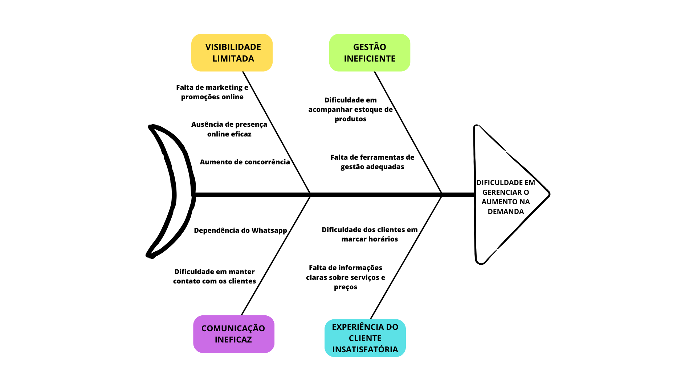

# Visão Geral do Produto

## O Problema
O problema está associado a um salão de beleza. A dona do salão é Angela, uma microempreendedora que enfrenta um aumento na demanda no negócio e que não possui nenhum sistema virtual ou online. Todo o serviço de gerenciamento é realizado manualmente por meio de uma agenda física. A seguir, o diagrama de espinha de peixe (Ishikawa) identificado pela equipe:

## Declaração de Posição do Produto

|               |                                     |
| :------------ | ----------------------------------- |
| Para          | Salão de beleza Angela Cabeleireira |
| Quem          | deseja melhorar a gestão do salão e a experiência do cliente, juntamente com a oportunidade de atender à demanda crescente e expandir o negócio. |
| O Angela Cabeleireira | é um website do campo de tecnologia da informação e serviços online. |
| Que           | oferece aos clientes a capacidade de marcar horários no salão de forma rápida e fácil, a qualquer hora e em qualquer lugar. E que oferece à Angela uma ferramenta de gestão eficaz que simplifica as operações no salão. |
| Ao contrário  | de outras plataformas de gestão de salão de beleza, como o Salon Iris e MINDBODY. |
| Nosso produto | se diferencia na integração abrangente de recursos que busca simplificar a gestão de uma forma direta e amigável. Além do foco na experiência do cliente, o produto é projetado especificamente para atender às necessidades da microempreendedora no setor de beleza. |    

## Objetivos do Produto

**Objetivo Principal:** Implementar uma agenda virtual no salão  Angela Cabeleireira, para melhorar a gestão no quesito agendamento.   
**Objetivos Secundários:** 
<ul>
    <li>Aumentar a satisfação dos clientes do salão em 30% nos próximos seis meses após a implementação. Será verificada a partir do acompanhamento de métricas de uso.</li>
    <li>Aumentar a base de clientes em 20% nos próximos seis meses após a implementação. Será verificada ao  analisar a frequência de clientes que realizaram uma agendamento online no salão.</li>
    <li>Aumentar a taxa de retorno de clientes regulares em 25% nos próximos seis meses após a implantação. Será verificada por meio da análise de registros de agendamento.</li>
    <li>Destacar o salão de beleza no mercado. Será verificado por meio do acompanhamento de métricas do número de visitas ao site.</li>
</ul>

## Tecnologias a serem utilizadas
- Frontend: HTML e CSS { width="24" } { width="24" }
- Backend: JavaScript, Node.js { width="24" } { width="24" } 
- Persistência de dados: N/A
- Testes e CI: Jest, GitHub Actions { width="24" } { width="24" } { width="24" }
- Documentação: GitHub Pages, Github, mkdocs material { width="24" } { width="24" } { width="24" }
- Ferramentas de IDE: VSCode, CodePen { width="24" } { width="24" }
- APIs: API Street View Static { width="24" }
- Comunicação da equipe: WhatsApp e Discord { width="24" } { width="24" }

## Histórico de Revisão

| Data       | Versão |                                                          Descrição                                                            |    Autor     |
| :--------: | :----: | ----------------------------------------------------------------------------------------------------------------------------- | ------------ |
| 10/09/2023 | 1.0    | Criação parcial da visão geral do produto: apresentação do problema, declaração de posição do produto, e objetivo do produto. | Yves Pimenta |
| 11/09/2023 | 1.1    | Revisão da declaração de posição do produto e do objetivo principal do produto.                                               | Yves Pimenta |
| 17/09/2023 | 1.2    | Definição das tecnologias a serem utilizadas.                                                                                 | Todos        |
| 22/11/2023 | 1.3    | Pequena atualização nas tecnologias para incluir Jest e Node.js.                                                   | Todos        |

