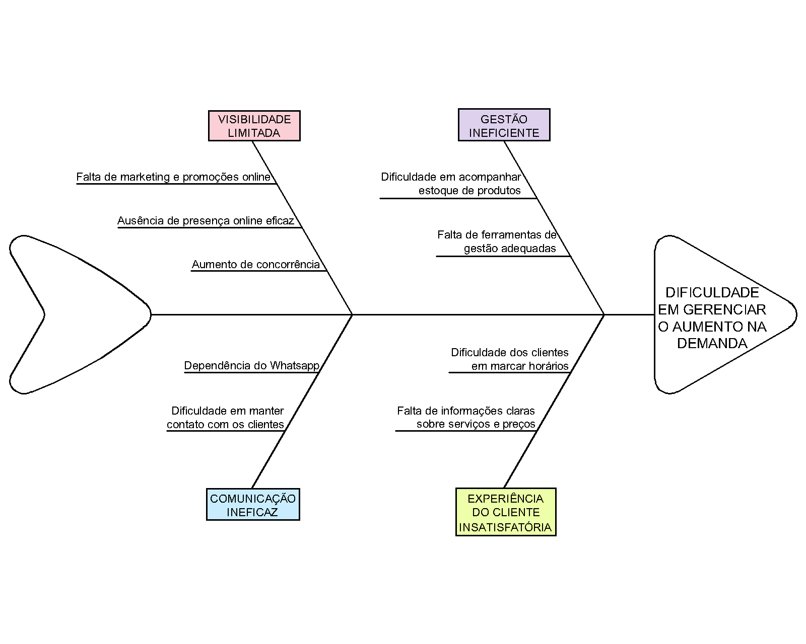

# Visão Geral do Produto

## O Problema
O problema do negócio está na dificuldade em gerenciar o aumento na demanda e na expansão do salão de beleza. A seguir, o diagrama de espinha de peixe (Ishikawa) identificado pela equipe:

## Declaração de Posição do Produto

|               |                                     |
| :------------ | ----------------------------------- |
| Para          | Salão de beleza Ângela Cabeleireira |
| Quem          | deseja melhorar a gestão do salão e a experiência do cliente, juntamente com a oportunidade de atender à demanda crescente e expandir o negócio. |
| O Ângela Cabeleireira | é um website do campo de tecnologia da informação e serviços online. |
| Que           | oferece aos clientes a capacidade de marcar horários no salão de forma rápida e fácil, a qualquer hora e em qualquer lugar. E que oferece à Ângela ou outros proprietários de salões de beleza uma ferramenta de gestão eficaz que simplifica as operações no salão. |
| Ao contrário  | de outras plataformas de gestão de salão de beleza, como o Salon Iris e MINDBODY. |
| Nosso produto | se diferencia na integração abrangente de recursos que busca simplificar a gestão de uma forma direta e amigável. Além do foco na experiência do cliente, o produto é projetado especificamente para atender às necessidades de microempreendedores no setor de beleza. |    

## Objetivos do Produto

O principal objetivo do projeto  Ângela Cabeleireira é melhorar significativamente a experiência dos clientes do salão, proporcionando conveniência, eficiência e qualidade. 
Os objetivos secundários incluem aumentar a satisfação do cliente, melhorar a gestão do salão, expandir o negócio, promover a fidelização de clientes e destacar o salão de beleza no mercado.

<!-- TODO: imagens não carregando no site, warning do mkdocs WARNING -  [02:51:41] "GET /VisaoProdutoEProjeto/visaoProduto/img/css.svg HTTP/1.1" code 404 -->
## Tecnologias a serem utilizadas
- Frontend: HTML e CSS  
- Backend: Javascript 
- Persistência de dados: N/A
- Testes e CI: Github Actions 
- Documentação: Gitpages, Github, mkdocs material  
- Ferramenta IDE: VSCode, CodePen  
- APIs: API Street View Static <figure markdown> { width="24" }</figure>
- Comunicação da equipe: Whatsapp e Discord  

<!-- TODO: logo svg do mkdocs:  <svg><path d="M12 8a3 3 0 0 0 3-3 3 3 0 0 0-3-3 3 3 0 0 0-3 3 3 3 0 0 0 3 3m0 3.54C9.64 9.35 6.5 8 3 8v11c3.5 0 6.64 1.35 9 3.54 2.36-2.19 5.5-3.54 9-3.54V8c-3.5 0-6.64 1.35-9 3.54Z"></path></svg> -->
<!-- ALTERNATIVAS DE IMAGEM #ONLYLIGHT #ONLYDARK DE ACORDO MODO ESCURO MODO CLARO -->
<!-- 
 -->

## Histórico de Revisão

| Data       | Versão |                                                          Descrição                                                            |    Autor     |
| :--------: | :----: | ----------------------------------------------------------------------------------------------------------------------------- | ------------ |
| 10/09/2023 | 1.0    | Criação parcial da visão geral do produto: apresentação do problema, declaração de posição do produto, e objetivo do produto. | Yves Pimenta |
| 11/09/2023 | 1.1    | Revisão da declaração de posição do produto e do objetivo principal do produto.                                               | Yves Pimenta |
| 17/09/2023 | 1.2    | Definição das tecnologias a serem utilizadas.                                                                                 | Todos        |
